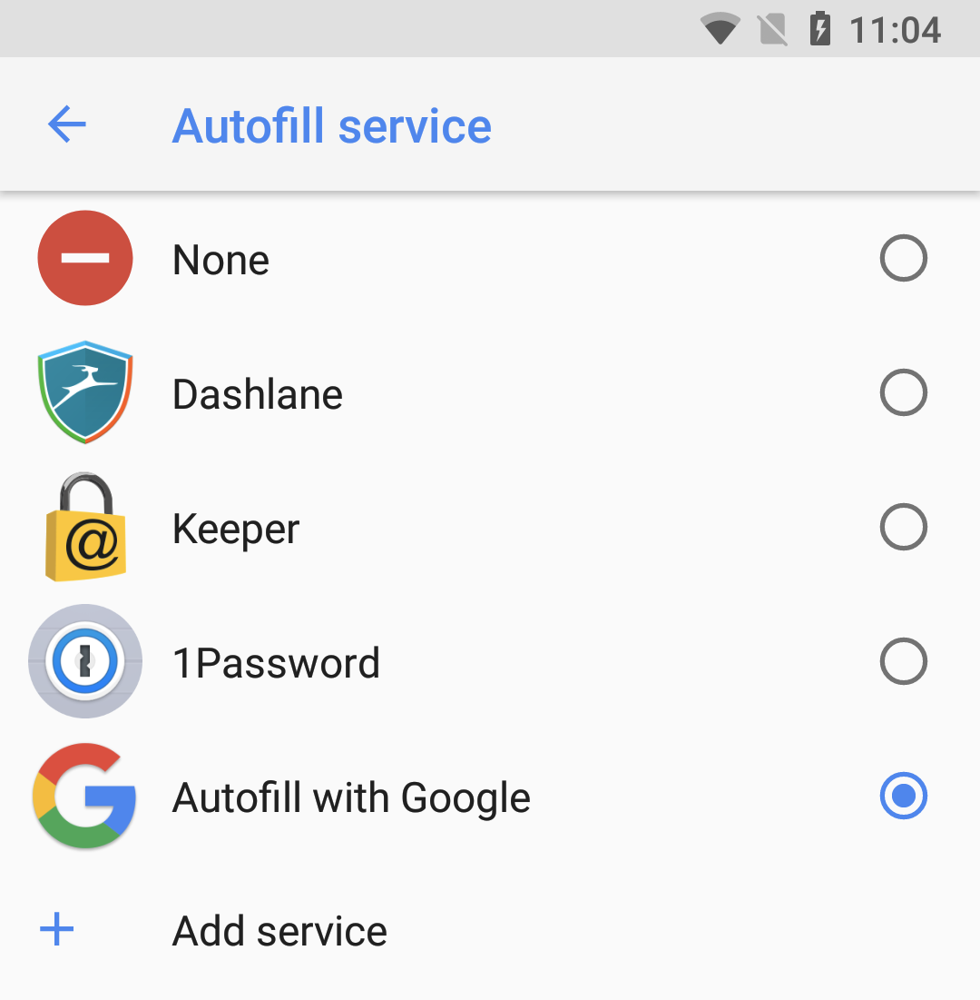
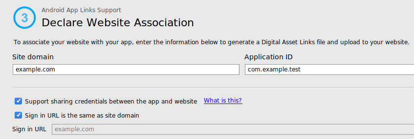

# 让你的Android应用程序准备支持Autofill

原标题：Getting your Android app ready for Autofill  
链接：[https://android-developers.googleblog.com/2017/11/getting-your-android-app-ready-for.html](https://android-developers.googleblog.com/2017/11/getting-your-android-app-ready-for.html)  
作者：Wojtek Kalicinski(Android开发者倡导者)，Akshay Kannan(Android身份验证产品经理)和Felipe Leme(Android框架软件工程师)  
翻译：[arjinmc](https://github.com/arjinmc)  

从Oreo开始，Autofill便于用户向应用程序提供信用卡，登录信息，地址和其他信息。现在，你的应用中的表单可以自动填入，用户不再需要记住复杂的密码或多次输入相同的信息。

用户可以选择多种Autofill服务（类似于今天的键盘）。默认情况下，我们在Google中添加了Autofill功能，但用户也可以选择他们选择的任何第三方自动填充应用。用户可以从Settings->System->Languages>Advanced->Autofill service进行管理。

  

## 现在可用的有哪些

今天，Google Autofill支持提交信用卡，地址，登录名，姓名和电话号码。首次登录或创建帐户时，Autofill功能还允许用户将新凭据保存到其帐户。如果你在你的应用中使用WebViews，那么许多应用都可以在登录和其他屏幕上使用WebViews，现在你的用户现在也可以受益于Autofill的支持，只要他们安装了Chrome 61或更高版本即可。

Autofill API向任何人开放以实现服务。我们正在积极与[1Password](https://support.1password.com/android-autofill/#set-up-autofill)， [Dashlane](https://blog.dashlane.com/introducing-dashlane-support-for-android-o-autofill-api/)，[Keeper](https://blog.keepersecurity.com/2017/09/06/android-o-customers-now-have-the-support-they-need-to-autofill-apps-with-keeperfill/)和[LastPass](https://blog.lastpass.com/2017/08/lastpass-public-beta-android-oreo.html/)合作 ，帮助他们实现在Android上的认证。我们将验证密码管理员并将其添加到Play商店中的一个策划部分，其中设置中的“Add Service(添加服务)”按钮将链接到该部分。如果你是密码管理员，想要获得认证，[请与我们联系](https://docs.google.com/forms/d/e/1FAIpQLScem3Xhk4991YKhX3YtPUZ7_YSuFZGacdH5r5yFO8lrSMQNqA/viewform?usp=sf_link)。

## 作为开发者需要做什么 

作为一名应用程序开发者，你可以利用这些新功能做一些简单的事情，并确保它能够在你的应用程序中运行：

### 测试你的应用程序并在需要的时候注释你的视图

在很多情况下，Aufofill功能可能在你的应用中无需任何工作。但为了确保一致的行为，我们建议提供明确的提示，告诉框架有关你的领域的内容。你可以使用[android:autofillHints 属性](https://developer.android.com/guide/topics/text/autofill.html#providing_hints_for_autofill)或[setAutofillHints()](https://developer.android.com/guide/topics/text/autofill.html#providing_hints_for_autofill)方法执行此操作。

同样，在你的应用程序中使用WebViews，你可以使用HTML[自动匹配属性](https://developers.google.com/web/updates/2015/06/checkout-faster-with-autofill)来提供有关字段的提示。只要你的设备上安装了Chrome 61或更高版本，Autofill功能就可以在WebView中使用。即使你的应用使用自定义View，也可以[定义允许Autofill功能的元数据](https://developer.android.com/guide/topics/text/autofill.html#custom_views_with_standard_view_structure)。

对于Autofill没有意义的视图（如验证码或消息撰写框），可以将视图明确标记为[IMPORTANT_FOR_AUTOFILL_NO](https://developer.android.com/guide/topics/text/autofill.html#mark_fields_as_important_for_autofill)（或 视图层次结构的根目录中的[IMPORTANT_FOR_AUTOFILL_NO_EXCLUDE_DESCENDANTS](https://developer.android.com/guide/topics/text/autofill.html#mark_fields_as_important_for_autofill)）。使用这个字段负责任地，并记住，用户可以总是绕过这长期按下EditText并在溢出菜单中选择“Autofill”。

### 加入你的网站和移动应用程序

使用Google Autofill可以在网站和移动应用上无缝共享登录信息 - 通过Chrome保存的密码也可以提供给本机应用。但为了实现这个目标，作为应用程序开发者，你必须明确声明你的网站与你的移动应用程序之间的关联。这涉及2个步骤：

#### 第1步：在yourdomain.com/.well-known/assetlinks.json上托管一个JSON文件

如果你以前使用过App Links或Google Smart Lock等技术，则可能听说过数字资产链接（DAL）文件。这是一个JSON文件放置在你的网站上的一个众所周知的位置，让你公开，其他应用程序或网站的公开声明。

你应该按照[Smart Lock for Passwords(密码智能锁)指南](https://developers.google.com/identity/smartlock-passwords/android/associate-apps-and-sites)获取有关如何在服务器上正确创建和托管DAL文件的信息。即使Smart Lock是将用户签入你的应用的更高级的方式，我们的Autofill服务使用相同的基础结构来验证应用网站关联。而且，由于DAL文件是公开的，因此第三方Autofill服务开发人员也可以使用关联信息来保护其实施。

#### 第2步：用相同的信息更新你的应用程序的清单

再次按照[Smart Lock for Passwords指南](https://developers.google.com/identity/smartlock-passwords/android/associate-apps-and-sites)进行操作，在“Declare the association in the Android app”下执行此操作。

 你需要使用asset_statements资源来更新应用的清单文件，该资源链接到你的assetlinks.json文件所在的URL。完成之后，你需要将更新后的应用程序提交到Play商店，并填写联盟提交表单，以便联系人上线。

当使用Android Studio 3.0时，App Links Assistant可以为你生成所有这些内容。当你打开DAL生成器工具（Tools -> App Links Assistant -> Open Digital Asset Links File Generator）时，只需确保启用标记为“支持在应用程序和网站之间共享凭据”的新复选框。

  

然后，点击“生成数字资产链接文件”，并将预览内容复制到你的服务器和你的应用程序托管的DAL文件。请记得确认所选的域名和证书是否正确。

## 未来的工作

Android中的自动填充功能还很早。无论你是使用Google的Autofill还是第三方密码管理器，我们都会继续进行一些重大投资，以改善体验。

我们的一些主要投资领域包括：

1. <strong>Google Autofil</strong>：我们希望提供一个很棒的体验，所以我们将所有的Oreo设备都包含在Google的Autofill中。我们不断改进现场检测和数据质量，并扩大对保存更多类型数据的支持。
2. <strong>WebView支持</strong>：我们引入了在Chrome 61中填充WebViews的初始支持，随着时间的推移，我们将继续测试，加强和改进此集成，所以如果你的应用程序使用WebView，你仍然可以从中受益功能。
3. <strong>第三方应用程序支持</strong>：我们正在与生态系统合作，确保应用程序按照Autofill框架的要求工作。我们敦促你作为开发人员在Android Oreo上提供你的应用程序，并确保在启用Autofill的情况下按预期工作。有关更多信息，请参阅我们关于[Autofill框架](https://developer.android.com/guide/topics/text/autofill.html)的完整文档。
如果你遇到任何问题或对我们如何提供更好的建议，[请给我们反馈](https://docs.google.com/forms/d/e/1FAIpQLScem3Xhk4991YKhX3YtPUZ7_YSuFZGacdH5r5yFO8lrSMQNqA/viewform?usp=sf_link)。