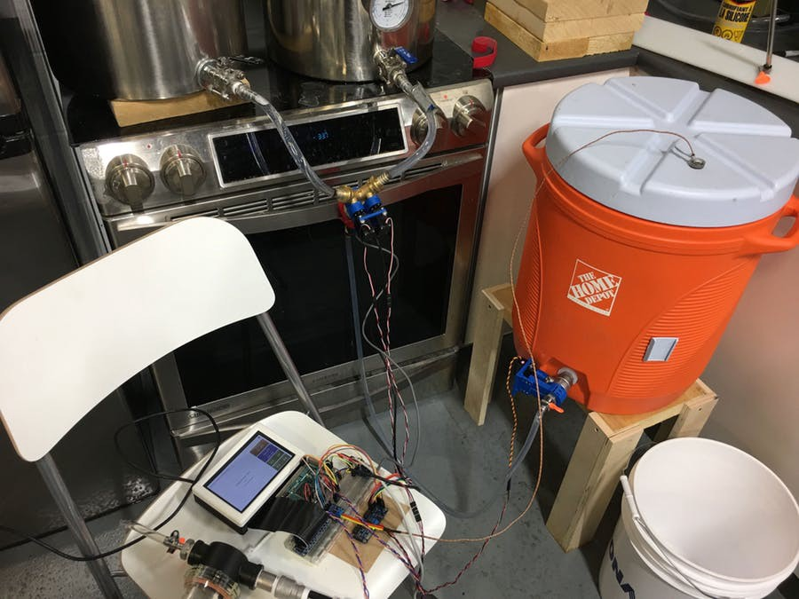
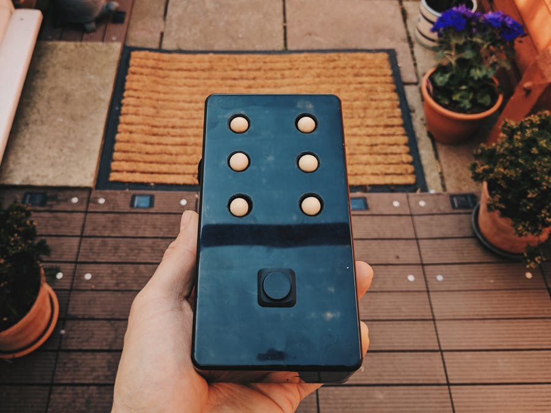

# Android Things大赛获奖者

原标题：Android Things Contest Winners  
链接：[https://android-developers.googleblog.com/2017/11/android-things-contest-winners.html](https://android-developers.googleblog.com/2017/11/android-things-contest-winners.html)  
作者：[Dave Smith](https://google.com/+DaveSmithDev) (由IoT(物联网)开发者倡导者)  
翻译：[arjinmc](https://github.com/arjinmc)  

早在九月份，我们工作在[Hackster.io](https://android-developers.googleblog.com/2017/09/android-things-hackster-contest.html)，鼓励开发者社区使用Android Things构建智能互联设备，并将他们的项目发布到[Android Things开发者挑战赛](https://www.hackster.io/contests/Google)。目标是展示交钥匙硬件和功能强大的SDK的结合，用于大规模构建和维护设备。

感谢所有参与比赛的人，并提交了一个项目或想法。参赛者超过1100人，参赛作品超过350件。在这个小组中，我们选择了三名获胜者。每个获奖者将得到[Dragon Innovation](https://www.dragoninnovation.com/)的支持和工具，将他们的概念发展成商业产品。加入我们，祝贺下列厂商！

<strong>最佳企业项目</strong>： [分布式空气质量监测](https://www.hackster.io/james-puderer/distributed-air-quality-monitoring-using-taxis-69647e)

制作人：James Puderer

使用Android Things，Google Cloud IoT Core和出租车构造成的监控街道级的空气质量检测器。

该项目展示了Android Things如何轻松构建与Google云端平台提供的各种服务相集成的设备，以实现强大的数据收集和分析。这是一个智能的端到端解决方案，可以显示对问题领域以及技术的理解。

  

<strong>最佳创业项目</strong>： [BrewCentral](https://www.hackster.io/iot-design-shop/brewcentral-great-tasting-all-grain-brewing-for-everyone-d7660a)

制作人：[Trent Shumay](https://www.hackster.io/shum)和[Steven Pridie](https://www.hackster.io/spridie)  

酿造美好的啤酒是艺术，科学和仪式的平衡。BrewCentral系统使任何人都可以进行全谷物酿造！

BrewCentral将具有触摸功能的UI和Android Things的决策计算能力的实时PID控制器配对。其结果是精确地控制在酿造周期期间获得可重复结果所需的时间，温度和流速的系统。计划的基于云计算的酿造配方的增强将为整个酿造社区提供连接体验。

  

<strong>最佳物联网项目</strong>： [BrailleBox - 盲文新闻阅读器](https://www.hackster.io/hitherejoe/braillebox-braille-news-reader-e86060)

制作人：[Joe Birch](https://www.hackster.io/hitherejoe)

BrailleBox是一个硬件的小块，使盲人阅读最新的盲文新闻文章。

这个项目是利用物联网产生社会影响的一个很好的例子。目前的概念验证将文章从新闻馈送传递到盲文键盘，但是这个项目有可能利用设备上的机器学习将来自物理世界的额外输入转换成盲文结果。

  

<strong>荣誉奖</strong>

社区提交了一些令人兴奋的比赛项目，只能选择三个获奖者非常困难。以下是我们最喜欢的一些没有被选中的项目：

* [Andro Cart](https://www.hackster.io/avinash-m-m/andro-cart-f05111)：由Android Things提供支持的购物车设备。旨在帮助分散销售点（POS）计费。
* [SIGHT: For the Blind（视角：为盲人）](https://www.hackster.io/foxlab/sight-for-the-blind-c1e1b9)：一双智能眼镜，由Android Things和TensorFlow提供支持。
* [Industrial IoT Gateway（工业物联网网关)](https://www.hackster.io/mhanuel/industrial-iot-gateway-based-on-android-things-c680d1)：基于Android Things的物联网世界的智能工业网关。
* [哨兵](https://www.hackster.io/oscarsalguero/sentinel-8234b3)：第一款基于Android Things的半智能型家庭安全机器人。
* [字时钟](https://www.hackster.io/daniele-bonaldo/android-things-word-clock-46cc14)：一个创造性的读取时间，由Android的东西。通过附近的API或Google智能助理来控制它。

我们鼓励大家查阅[Google Hackster社区](https://www.hackster.io/google/products/android-things?sort=trending)中的所有新项目，并提交自己的项目！你也可以在Google+上加入[Google物联网开发者社区](https://g.co/iotdev)，这是获取更新，提出问题和讨论想法的绝佳资源。我们期待着看到你们构建的项目！

