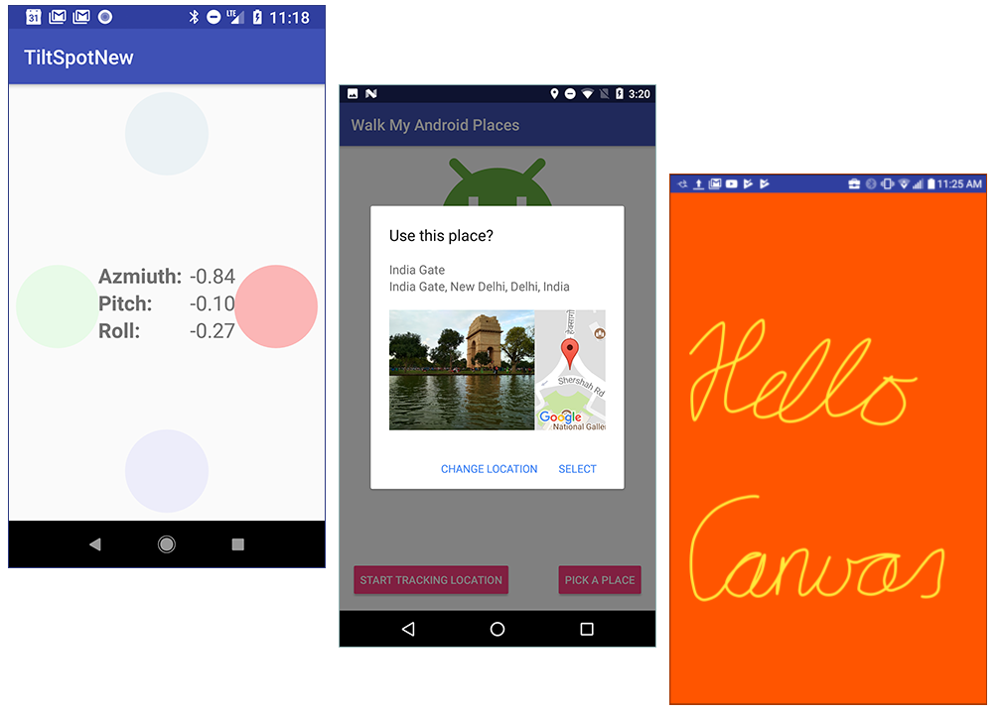

# 我们的新课程：深入Android开发

原标题：Delve deeper into Android development with our new course!  
链接：[https://android-developers.googleblog.com/2017/11/delve-deeper-into-android-development.html](https://android-developers.googleblog.com/2017/11/delve-deeper-into-android-development.html)  
作者：Jocelyn Becker (Google Developer Training高级项目经理)  
翻译：[arjinmc](https://github.com/arjinmc)  

如果你了解构建Android应用程序的基础知识并深入研究，请参阅Google开发者培训团队构建的新的[高级Android开发](http://developers.google.com/training/courses/android-advanced)课程。

你想学习如何使Fragment，为你的应用程序添加小部件，并微调你的应用程序的性能？通过本地化和无障碍功能让你的应用程序适用于不同的用户群？在你的应用中使用传感器？如何创建自定义View，直接画面和运行动画？

我们新课程中的每一课都将带领你构建一个应用程序，演示一个高级概念，从将地图合并到你的应用程序到使用SurfaceView在主UI线程之外进行绘制。

本课程面向已经了解构建Android应用程序基础知识的有经验的Java程序员。这是我们的[Android开发者基础课程](https://developers.google.com/training/courses/android-fundamentals)的后续课程。本课程旨在作为教师指导的培训课程进行教学。但是，所有的资料都是在线发布的，并且可供任何想要了解Android开发的更高级概念的人使用。

我们已经发布了详细的书面[教程](https://google-developer-training.gitbooks.io/android-developer-advanced-course-practicals/content/)，[概念指南](https://google-developer-training.gitbooks.io/android-developer-advanced-course-concepts/content/)，幻灯片套件，最重要的是，在[GitHub中的应用程序宝库](https://github.com/google-developer-training/android-advanced)。你可以在[developers.google.com/training/android-advanced](https://developers.google.com/training/courses/android-advanced)找到所有链接。

世界各地的教育机构都被邀请使用这门课程来教你的学生。欢迎（鼓励）个人开发者通过教程来自学。

每节课都提出了一个不同的高级课题，你可以独立于每个课程来教授或学习每个课题。

  

在学习如何使用传感器时，构建应用程序，将位置添加到应用程序，然后直接绘制到Canvas上。以及更多！

新课程涵盖：

* 使用Fragment
* 构建小部件
* 使用传感器
* 测量和改进应用程序性能
* 本地化你的应用程序
* 使你的应用程序可访问
* 添加位置，地点和地图到你的应用程序
* 创建自定义View
* 画到Canvas
* 从主线程绘制到SurfaceView
* 运行动画

请访问[developers.google.com/training/android-advanced](https://developers.google.com/training/courses/android-advanced)了解详情。