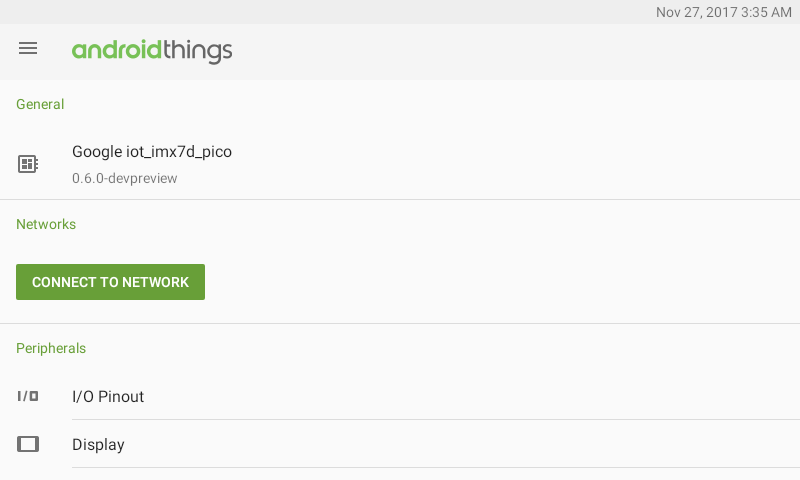
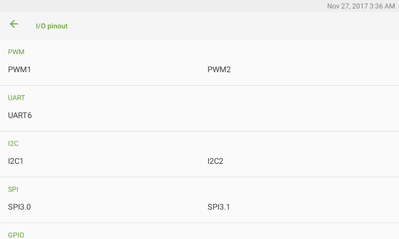

# Android Things开发者预览版6

原标题：Android Things Developer Preview 6  
链接：[https://android-developers.googleblog.com/2017/11/android-things-developer-preview-6.html](https://android-developers.googleblog.com/2017/11/android-things-developer-preview-6.html)  
作者：[Wayne Piekarski](https://google.com/+WaynePiekarski) (物联网开发者倡导者)  
翻译：[arjinmc](https://github.com/arjinmc)    

下一个版本Android Things开发者预览版6（DP6）在这里,有许多新功能和bug修复。Android Things是Google的平台，支持Android Developers创建物联网（IoT）设备，支持视频和音频处理以及使用TensorFlow进行机载机器学习等强大应用。有关新功能的具体信息，请访问[发布说明](https://developer.android.com/things/preview/releases.html)。以下是DP6中的一些亮点。

## 物联网启动器

DP6包括一个新的物联网启动器，允许用户查看设备的当前状态并使用触摸屏或USB输入设备更改设置。诸如配置WiFi，查找构建ID和检查更新等设置现在可以交互式地完成，使得它更容易上手。当没有其他开发者提供[IOT_LAUNCHER](https://developer.android.com/things/sdk/index.html#home_activity_support)Acitivty时，这个启动器是可见的。


## 图形加速默认值

  

Android的东西使用开源的[SwiftShader](https://github.com/google/swiftshader)库，基于CPU的OpenGL ES API的实现。这使得跨所有平台的通用OpenGL支持，即使是那些没有GPU硬件的平台。但是，如果直接对帧缓冲区进行绘制，并且不使用OpenGL仿真，则许多简单的2D UI渲染速度会更快。在DP6中，默认情况下禁用OpenGL渲染，以确保大多数应用程序以最快的UI运行。如果你需要的3D渲染，网页视图，或TextureView OpenGL支持，则明确地根据[文档](https://developer.android.com/guide/topics/graphics/hardware-accel.html)在你的AndroidManifest.xml启动它：

```code
<activity

    ...
    android:hardwareAccelerated="true">
```

## API 27和Google Play服务

DP6现在基于最新的Android 8.1开发者预览版，API级别为27.现在，大多数标准Android样本都在DP6上工作。例如， 使用Camera2 API和TextureView 的[Camera2Basic](https://github.com/googlesamples/android-Camera2Basic)示例现在可以在基于NXP和Raspberry Pi的设备上（hardwareAccelerated标志设置为true）工作。Google Play服务已更新为支持SDK 11.6版，支持所有[最新功能](https://developers.google.com/android/guides/releases)。

## 命令行快速启动工具

我们从开发者那里听说，使用fastboot刷新和配置电路板可能是件乏味的事情，所以[Android Things Console](https://partner.android.com/things/console/#/tools)现在带来了一种新的，更简单的闪存设备镜像方式。[android-things-setup-utility](https://partner.android.com/things/console/#/tools)现在不提供手动使用fastboot和adb命令，现在提供了一个新的交互式命令行 。使用此工具可以轻松开始使用Android Things，并自动执行下载和刷新过程。

## Android的东西控制台更新

DP6引入了将用于即将发布的产品的新分区方案。由于新的分区布局，无线更新（OTA）系统无法更新现有的DP5.1或更早版本的设备。开发者需要去[Android Things控制台](https://partner.android.com/things/console)，并下载并刷新一个新的DP6版本。控制台用户界面也已更改为DP6功能，并且只允许你创建基于DP6的新版本。如果你有更旧的现有版本，它们仍然可以下载，但不会支持OTA更新。鼓励开发者将所有工作转到DP6。

## GPIO引脚命名

启动时显示的交互式物联网启动器现在包含一个I / O引脚分区，你可以在其中找到所有引脚的标签。i.MX7使用的引脚命名已经更改，你应该更新你的代码以使用这个新的命名约定。请参阅[i.MX7文档](https://developer.android.com/things/hardware/imx7d-pico-io.html)以获取引脚名称的完整列表。

  

## 设置和设备更新API

新的API已添加到Android的东西，控制本地设备和设备[更新](https://developer.android.com/things/sdk/apis/update.html)的[配置](https://developer.android.com/things/sdk/apis/settings.html)。[UpdateManager](https://developer.android.com/things/reference/com/google/android/things/update/UpdateManager.html)可以 让开发者控制何时可以执行更新和重新启动，确保设备在需要时可供用户使用。[DeviceManager](https://developer.android.com/things/reference/com/google/android/things/device/DeviceManager.html)控制工厂重置，重启和设备区域设置。也提供API的设置，如[ScreenManager](https://developer.android.com/things/reference/com/google/android/things/device/ScreenManager.html)来控制屏幕，[TimeManager](https://developer.android.com/things/reference/com/google/android/things/device/TimeManager.html)来控制时钟和时区。

## 外设命令行工具

我们现在提供一个命令行工具[pio](https://developer.android.com/things/sdk/pio/pio-cli.html)，让开发者通过adb外壳访问Peripheral API。开发者可以从adb外壳交互地测试GPIO，PWM，UART，I2C，SPI和将来的接口，这对于调试和自动化测试非常有用。

## 反馈

DP6包括对平台的重大改变和改进。请通过提交[bug报告](https://code.google.com/p/android/issues/entry?template=Android%20Things%20bug%20report)和[功能需求](https://code.google.com/p/android/issues/entry?template=Android%20Things%20feature%20request)向我们发送你的反馈，以及在[Stack Overflow](http://stackoverflow.com/questions/tagged/android-things)提出的任何问题。要开始使用DP6，请使用[Android Things Console](https://partner.android.com/things/console)来下载系统映像并刷新现有设备，或者使用[android-things-setup-utility](https://partner.android.com/things/console/#/tools)。有关更改的更多信息可在[发布说明](https://developer.android.com/things/preview/releases.html)中找到。你也可以加入Google+的[Google物联网开发者社区](https://g.co/iotdev)，这是获取更新和讨论想法的好资源。另外，我们有我们新的[hackster.io社区](https://hackster.io/google)，每个人都可以分享他们建造的有趣项目。我们期待看到你用Android的东西建立你的东西！