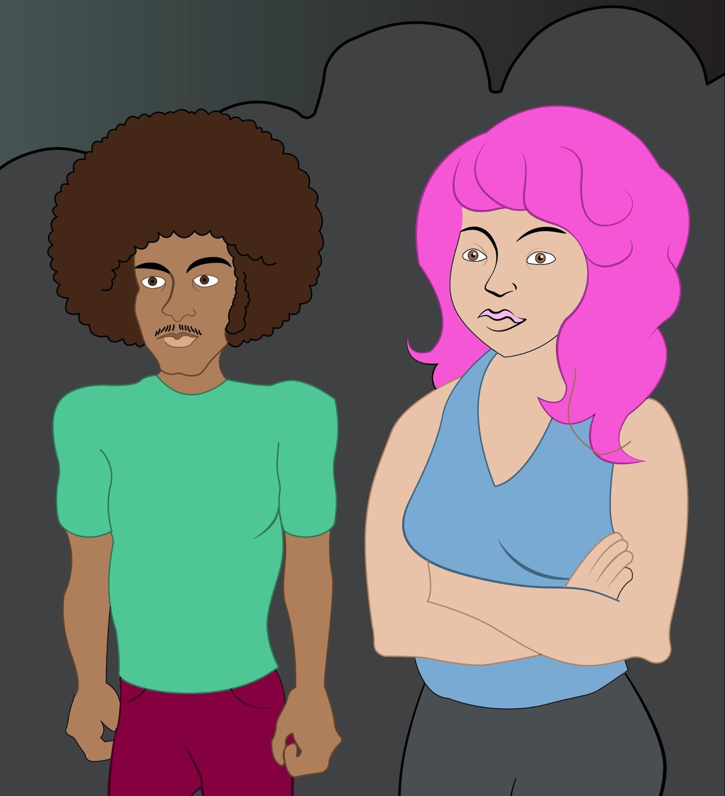
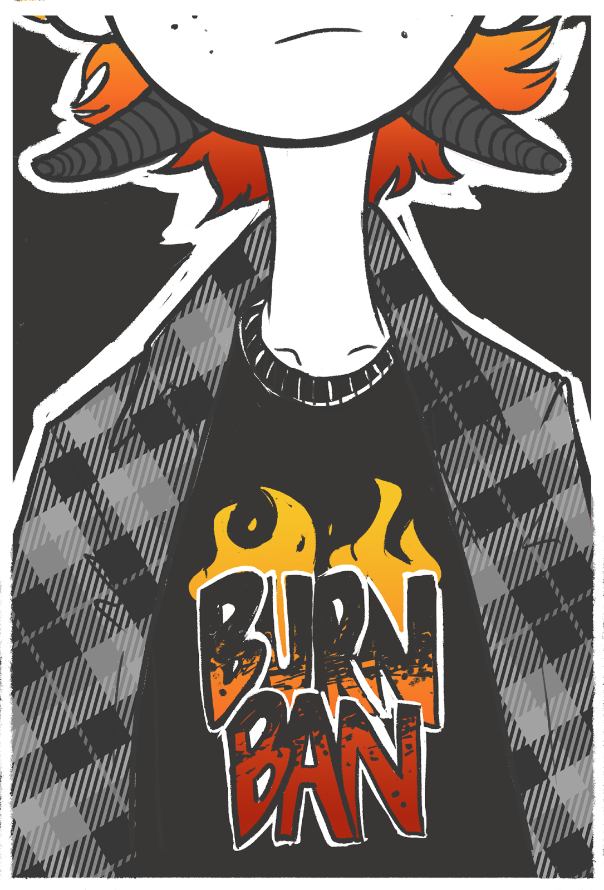

# Google和Ideas United宣布Infinite Deviation：游戏程序获奖者

原标题：Google and Ideas United Announce Infinite Deviation: Games Program Winners  
链接：[https://android-developers.googleblog.com/2017/11/google-and-ideas-united-announce.html](https://android-developers.googleblog.com/2017/11/google-and-ideas-united-announce.html)  
作者：Kate Brennan , Mathilde Cohen Solal (Google Play) ,Daraiha Greene (CS in Media)
翻译：[arjinmc](https://github.com/arjinmc)  

Google Play致力于赋予游戏中新的和现有的声音。今年早些时候，我们主办了独立游戏节并且赞助了女孩制作游戏[夏令营](https://plus.google.com/u/0/+GoogleDevelopers/posts/fH3NMC6gSRT)。我们还[宣布了](https://android-developers.googleblog.com/2017/09/google-and-ideas-united-launch-program.html)Infinite Deviation(无限偏差)和Google Play之间的合作。

[Infinite Deviation](http://infinitedeviation.com/)是由Google Computer Science(谷歌计算机科学)（CS）在Media和[Ideas United](http://ideasunited.com/)创建的一个计划，旨在解决计算机科学中的代表性问题。 Google Play和Ideas United之间的合作将Infinite Deviation计划带入了游戏[Infinite Deviation：游戏](http://infinitedeviation.com/games)。该计划邀请来自各个不同背景的游戏设计师推介原创的移动游戏理念，与代表性不足的观众产生共鸣。

今天，我们很高兴地宣布为Infinite Deviation：游戏开发计划选择了三支队伍。

行业专家组成的专家小组审查了申请并选择了前三个创意。评审小组包括Colleen Macklin（PETLab创始人兼联合总监），Jeremy Vanhoozer（植物大战僵尸高级创意总监），Molly Proffitt（Ker-Chunk Games首席执行官），Shirin Laor-Raz Salemnia（PlayWerks创始人兼首席执行官） ）和Sarah Thomson（全球BD主管，Indies，Google）。这些评委为每个提交的评分打分并提供了个人反馈，最高得分的三项比赛进入了进一步的发展阶段。

以下是我们将在未来六个月内资助并支持发展的三场比赛：

## Historic Gay Bar Tycoon

Mo Cohen & Maria Del Castillo Infantas - Queermo Games

Historic Gay Bar Tycoon(历史性的同性恋酒吧大亨)（名字待定）在20世纪20年代用一个全新的同志酒吧开始。这个游戏探索了LGBT历史上的角色扮演。你的酒吧会在革命，流行病和约会应用程序的兴起中幸存下来吗？

  

Queermo Games几乎就是这样一个小小的独立游戏开发团队，试图制作更多的LGBT游戏。方便，他们也是隔壁的邻居。Maria是一个处理艺术和音乐的奇怪的拉丁人，Mo是一个非二元的犹太人，他解决了编程和写作问题。他们一起在另一个长期项目“酷儿探秘”（Queer Quest）和他们的好友Hagen合作。

## Burn Ban

Harrison Barton＆Morgan Rowe - Pride Interactive

Burn Ban是一个交互式的视觉小说，你在其中扮演一个精神病患者奇怪的女孩Twig的角色。在亲密的朋友的死亡之后，她出现了破坏性的倾向，她被送到了Sisquoc营，这是一个误导学生的避暑胜地。在参加了几天的营地之后，她的死朋友的在线社交媒体页面又神秘地开始张贴，而Twig和朋友们正在确定帖子背后的奥秘。

  

Pride Interactive目前由两名开发人员Harrison Barton和Morgan Rowe组成。 Pride Interactive是一个学生游戏团队，现在正在继续开发独立的项目。Pride互动努力通过游戏处理严肃的主题和多元化的性格驱动的叙述来进一步完成他们在这个行业创造更多元化的环境的使命。

## Ghost in the Graveyard

Adnan Agha，Vivian Allum和Armand Silvani - Ghost Stories

幽灵在墓地是一个故事驱动的移动神秘游戏，你窥探你失踪的兄弟的旧手机，试图找到他。 “只要有电话，你能找到失踪的人吗？”

  

“鬼故事”是来自纽约市的三名成员，他们的使命是创造与玩家联系的真实而独特的体验。该团队由首席设计师兼程序员Vivian，艺术家兼作家Armand以及程序员兼常驻幽灵Adnan组成。他们之前已经向Xbox One发布了一个学校项目，并且很高兴能够与Infinite Deviation合作发布到Google Play。

你可以在[InfiniteDeviation.com/Games](http://infinitedeviation.com/games)找到有关该计划的更多信息。祝贺三位获奖者，并感谢所有进入竞赛的人们不断的努力，推动游戏设计的界限，为业界提供独特的声音。