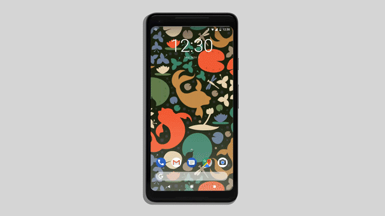

# 驱动更好的Pixel设备

原标题：Making Pixel better for Drivers  
链接：[https://android-developers.googleblog.com/2017/11/making-pixel-better-for-drivers.html](https://android-developers.googleblog.com/2017/11/making-pixel-better-for-drivers.html)  
作者：Marc Stogaitis , Tajinder Gadh(软件工程师)  
翻译：[arjinmc](https://github.com/arjinmc)  

  

驱动是我们日常活动的重要组成部分。所以在Google，我们花了很多时间思考如何使我们的用户更安全地使用Android设备。我们如何防止分心驾驶，共同建立一个开放的生态系统，以实现安全第一的智能手机体验。

最近我们在新发布的Pixel 2代设备上推出了“请勿打扰”。一旦启用，驾驶免打扰会在驾驶时自动将你的设备置于请勿打扰模式。在这种模式下，任何传入的信息和通知都会被静音，而你仍然可以使用连接的车载蓝牙接收来电，导航指示和语音交互。该产品旨在限制驾驶期间的分心，同时以最小阻碍方式不妨碍用户继续使用导航或其他类似的应用程序。

在幕后，它使用AI供电的设备上的[Activity识别](https://developers.google.com/location-context/activity-recognition/)功能，通过多个传感器，蓝牙和WiFi的低功率信号来检测人们何时驾驶。Activity识别使用Android Sensor Hub来确保低延迟，低功耗和准确的驾驶检测。

这是我们旅程的下一步，但我们还远远没有完成。明年年初，我们将推出“Activity识别过渡API”，这与驾驶免打扰使用的Api相同，可以打造无分散的驾驶体验。

我们非常感谢反馈意见，随着产品的不断发展，我们将继续倾听你们的反馈意见。

如果你有关于设置驾驶免打扰的问题，请查看我们的[帮助中心](https://support.google.com/pixelphone/answer/6111295)。