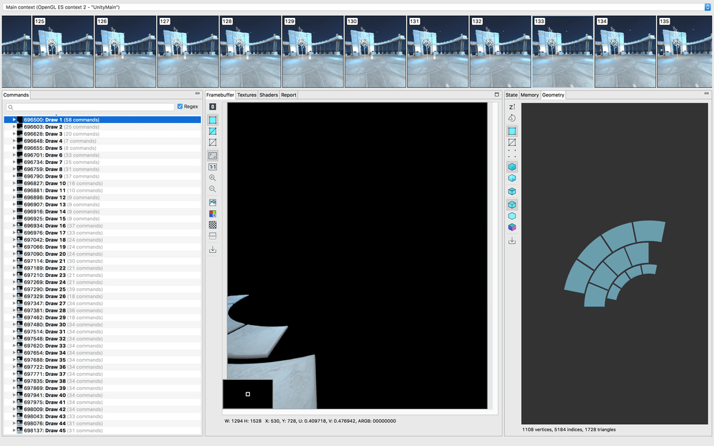
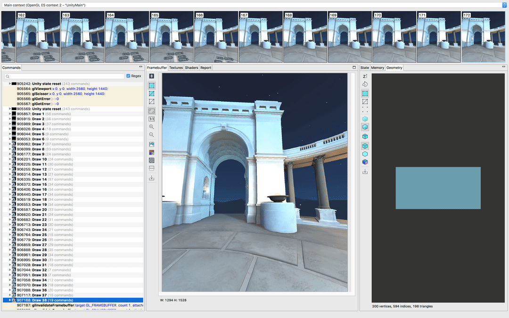

# 使用GAPID诊断和了解应用程序的GPU行为

原标题：Diagnose and understand your app's GPU behavior with GAPID  
链接：[https://android-developers.googleblog.com/2017/12/diagnose-and-understand-your-apps-gpu_13.html](https://android-developers.googleblog.com/2017/12/diagnose-and-understand-your-apps-gpu_13.html)  
作者：Andrew Woloszyn (软件工程师)  
翻译：[arjinmc](https://github.com/arjinmc)  

开发3D是复杂的。无论你使用本地图形API还是使用你最喜欢的游戏引擎，都有成千上万的图形命令必须完美结合，才能在你的手机，台式机或VR耳机上制作精美的3D图像。

[GAPID（图形API调试器）](https://developers.google.com/vr/tools/gapid)是一个新的工具，可以帮助开发者诊断他们的应用程序的渲染和性能问题。使用GAPID，你可以捕获你的应用程序的一个跟踪，逐一通过每个图形命令。这使你可以直观地了解最终映像的构建方式，并隔离有问题的调用，从而减少了通过反复试验调试的时间。

GAPID支持Android上的OpenGL ES，Android上的Vulkan，Windows和Linux。

  
<small>在调试中，一次绘制一个调用</small>

GAPID不仅可以诊断使用渲染命令问题，还可以作为运行快速实验的工具，并立即查看这些更改会如何影响所呈现的帧。

以下是GAPID可帮助你挑出和解决应用程序问题的几个示例：

## GPU在做什么？

  
<small>为什么不出现我的文字？</small>

使用图形API可能会遇到意想不到的结果，无论是空白屏幕，倒三角形还是缺少网格，都会令人沮丧。作为离线调试器，GAPID可以让你追踪这些应用程序，然后检查调用。你可以通过查看帧缓冲区确切地查明哪个命令产生了不正确的结果，并检查当时的状态以帮助你诊断问题。

## 如果我做了X，会发生什么？

  
<small>使用GAPID编辑着色器代码</small>

即使一个程序按照预期工作，有时你也想尝试。GAPID允许你随意修改API调用和着色器，因此你可以测试以下内容：

* 如果我在这个物体上使用了不同的纹理呢？
* 如果我在这个着色器中改变了bloom的计算呢？

使用GAPID，现在可以迭代应用程序的外观，而无需重新编译应用程序或重新构建资源。

无论你是使用Vulkan构建一款令人惊叹的新型桌面游戏，还是在Android上体验精彩绝伦的虚拟现实体验，我们都希望GAPID能为你节省时间和无奈，并帮助你充分利用GPU。要开始使用GAPID，看看它是多么强大，[下载它](https://github.com/google/gapid/releases)，在你喜欢的应用程序[捕抓一个跟踪](https://google.github.io/gapid/tutorials/capturetrace)！