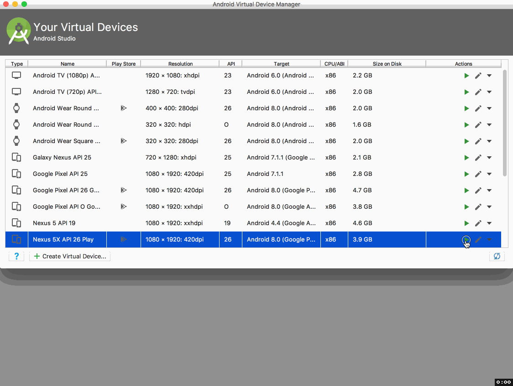
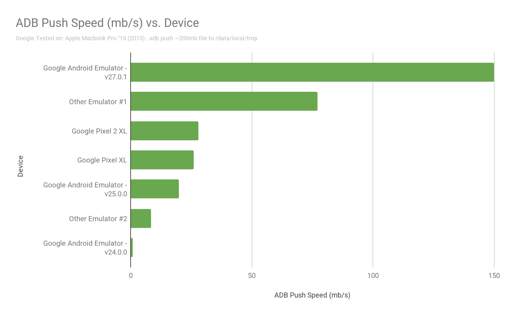
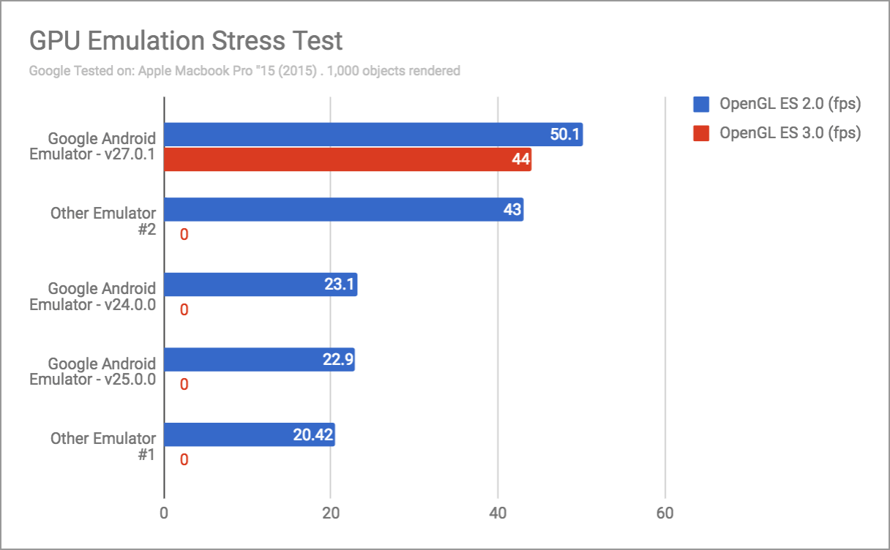

# Android模拟器的快速启动和主要功能

原标题：Quick Boot & the Top Features in the Android Emulator  
链接：[https://android-developers.googleblog.com/2017/12/quick-boot-top-features-in-android.html](https://android-developers.googleblog.com/2017/12/quick-boot-top-features-in-android.html)  
作者：[Jamal Eason](https://www.google.com/+JamalEason) (Android产品经理)  
翻译：[arjinmc](https://github.com/arjinmc)  

今天，我们很高兴地宣布Android模拟器的快速启动。使用快速启动，你可以在6秒内启动Android模拟器。快速启动通过快照模拟器会话，使你可以在几秒钟内重新加载。“快速启动”首先在Canary更新频道中与Android Studio 3.0一起发布，我们很高兴今天能够以稳定的更新版本发布该功能。

除了这个新功能之外，我们还想强调一些最近发布的功能。自从两年前完成了Android模拟器的改造 以来，我们一直致力于提高速度，稳定性和增加一系列丰富的功能，以加速你的应用开发和测试。随着所有最近的变化，绝对值得升级到最新版本的Android模拟器今天使用它。

## 主要5个功能

* <strong>快速启动</strong> - 今天作为一个稳定的功能发布，快速启动允许你在6秒内恢复你的Android模拟器会话。首次使用Android模拟器启动Android模拟设备（AVD）时，必须执行冷启动（就像启动设备一样），但后续启动速度很快，系统将恢复到关闭状态模拟器最后（类似于唤醒设备）。我们通过彻底重新设计传统的模拟器快照架构来完成这项工作，以处理虚拟传感器和GPU加速。无需额外的设置，因为从Android模拟器v27.0.2开始默认启用快速启动。

  
<small>在Android模拟器中快速启动</small>

* <strong>Android CTS兼容性</strong> - 每次发布Android SDK，我们确保Android模拟器已经准备好满足你的应用程序开发需求，从测试与Android KitKat的向后兼容性到集成最新的开发者预览API。为了提高模拟器系统映像的产品质量和可靠性，我们现在针对Android Nougat（API 24）和更高版本的Android系统映像版本进行限定，这是 Android官方Android物理设备必须通过的相同测试套件（[Android Compatibility Test Suite](https://source.android.com/compatibility/)，CTS）。

* <strong>Google Play支持</strong> - 我们知道很多应用开发者使用Google Play服务，而且在Android模拟器系统映像中保持最新的服务可能非常困难。为了解决这个问题，我们现在提供包含Play商店应用的Android系统映像版本。Google Play图片以Android Nougat（API 24）开头。借助这些新的模拟器映像，你可以通过模拟器中的Play商店应用更新Google Play服务，就像在Android设备上一样。另外，你现在可以使用Google Play商店测试端到端的安装，更新和购买流程。

* <strong>性能改进</strong> - 使模拟器快速高效是我们团队的一个持续目标。我们不断研究在你的开发机器上运行模拟器的性能影响，特别是内存使用情况。使用最新版本的Android模拟器，我们现在可以根据需要分配内存，而不是将内存分配和固定到AVD中定义的最大内存大小。为此，我们攻到适用于Linux（KVM）和MacOS本机管理程序®（Hypervisor.Framework），以及增强型英特尔® HAXM（V6.2.1及更高版本）的Microsoft ® 的Windows ®，它采用了新的按需存储分配。

此外，在过去的几个版本中，我们改进了CPU和I / O性能，同时增强了GPU性能，包括OpenGL ES 3.0支持。看一下像ADB推送这样的常见任务，突出了Android CPU和I / O管道的改进：

  
<strong>ADB推动与Android模拟器的速度比较</strong>

对于GPU性能，我们创建了一个示例[GPU模拟压力测试应用程序](https://github.com/google/gpu-emulation-stress-test)来衡量一段时间以来的改进。我们发现最新的模拟器可以渲染比以前更高的帧速率，而且它是少数几个可以根据Android规范准确呈现OpenGL ES 3.0的模拟器之一。

  
<strong>GPU模拟器压力测试 - Android应用程序</strong>

  
<strong>Android模拟器的GPU模拟器压力测试</strong>

## 更多功能

除了这些主要功能之外，还有一大堆我们在去年添加到Android模拟器中的附加功能，你可能不知道：

* <strong>Wi-Fi支持</strong> - 从API 24系统映像开始，你可以创建一个连接到虚拟蜂窝网络和虚拟Wi-Fi接入点的AVD。
* <strong>Google Cast支持</strong> - 使用Google Play系统图片时，你可以将屏幕和音频内容投射到同一Wi-Fi网络上的Chromecast设备。
* <strong>拖放APK和文件</strong> - 只需拖动一个APK到Android模拟器窗口触发应用程序安装。你也可以拖动任何其他数据文件，并在Android模拟器的/Downloads文件夹中找到它。
* <strong>主机复制和粘贴</strong> - 你可以在Android模拟器和开发机器之间复制和粘贴文本。
* <strong>虚拟2手指夹捏和缩放</strong> -当使用像谷歌地图应用程序进行交互，按住Ctrl键（在Microsoft ® 的Windows ®或Linux）或⌘（在MacOS ®），并用手指覆盖在屏幕上出现与捏和帮助缩放操作。
* <strong>GPS位置</strong> - 在Android模拟器的位置选项卡下手动选择一个GPS点或一组GPS点。
* <strong>虚拟传感器</strong> - 在扩展控制面板中有一个专门的页面，支持Android模拟器中的传感器，包括加速度，旋转，接近度等等。
* <strong>WebCam支持</strong> - 你可以使用网络摄像头或笔记本电脑内置摄像头作为AVD中的虚拟相机。在AVD管理器的“高级设置”页面中验证你的AVD摄像机设置。
* <strong>主机键盘</strong> - 你可以使用真实的键盘将文本输入到Android虚拟设备中。
* <strong>虚拟短信和电话呼叫</strong> - 在扩展控制面板中，你可以触发虚拟短信或电话来测试具有电话依赖性的应用程序。
* <strong>屏幕缩放</strong> - 在主工具栏上，单击放大镜图标进入缩放模式，然后选择要检查的屏幕区域。
* <strong>窗口大小调整</strong> - 只需拖动Android模拟器窗口的一个角落即可更改为所需的大小。
* <strong>网络代理支持</strong> - 转到“代理”选项卡下的“设置”页面，为Android模拟器会话添加自定义HTTP代理。
* <strong>错误报告</strong> - 你可以使用扩展控制面板中的错误报告部分快速生成应用程序的错误报告，与你的团队分享或向Google发送反馈。

在[模拟器文档](https://developer.android.com/studio/run/emulator.html)中了解有关Android模拟器的更多信息。

## 入门

所有这些功能和改进都可以通过Android Emulator v27.0.2 +进行下载和使用，你可以通过Android Studio中的SDK Manager获取。为获得快速体验，我们建议你创建并运行x86版本的模拟器系统映像，并安装最新的Android模拟器，英特尔®HAXM（如果适用）和图形驱动程序。

我们感谢你们希望看到的任何问题或功能反馈给我们。如果你发现bug，问题或有功能请求，请随时[提出问题](https://developer.android.com/studio/report-bugs.html#emulator-bugs)。我们绝对没有止境，但是我们希望你对目前为止的改进感到兴奋。