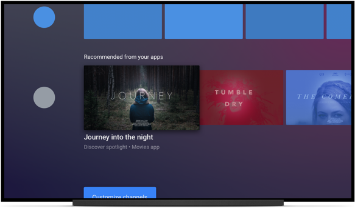

# 逐步淘汰Android电视上的传统方案

原标题：Phasing out legacy recommendations on Android TV  
链接：[https://android-developers.googleblog.com/2017/12/phasing-out-legacy-recommendations-on.html](https://android-developers.googleblog.com/2017/12/phasing-out-legacy-recommendations-on.html)  
作者：Bejamin Baxter (开发者程序工程师)
翻译：[arjinmc](https://github.com/arjinmc)  

在2017年Google I / O大会上，我们[宣布](https://android-developers.googleblog.com/2017/05/welcome-to-your-new-home-on-android-tv.html)重新设计Android TV的主屏幕。我们扩展了推荐行概念，以便每个应用程序可以在主屏幕上拥有自己的行（或多行）内容。自新主屏幕发布以来，我们已经在各种应用程序中增加了Android Oreo新推荐渠道的采用。

随着越来越多的应用使用新频道提供高质量的方案，Android O[现在的主屏幕中的传统方案](https://developer.android.com/training/tv/discovery/recommendations-row.html)将在明年逐步淘汰。

目前，当应用程序使用[传统通知API](https://developer.android.com/training/tv/discovery/recommendations-row.html#build)创建通知时，内容将被添加到该应用程序的频道。如果从Android N（或更低版本）升级时推荐使用内容，该频道可能已经存在。如果没有该应用的频道，它会自动为你生成。无论哪种情况，用户都不能从频道中添加或删除节目，但可以移动，隐藏和显示频道。当应用程序开始使用新的API来添加自己的频道时，系统将删除自动生成的频道，并且应用程序接管对其内容的显示的控制。

在接下来的一年里，我们将逐步淘汰渠道的自动生成。相反，产生多种渠道，为每个应用传统方案，我们将插入一个频道的所有传统的方案。此频道将显示在频道列表的底部。用户可以移动或删除它。当用户升级到Android O时，Android N（及以下）的先前推荐行成为主屏幕底部的频道。

  

如果你还没有更新应用程序以将内容发布到主屏幕上的新频道，请查看我们的[文档](https://developer.android.com/training/tv/discovery/recommendations-channel.html)，[codelab](https://codelabs.developers.google.com/codelabs/tv-channels-programs/index.html)和[示例](https://github.com/googlesamples/leanback-homescreen-channels)以开始使用。

我们期待越来越多的应用程序利用主屏幕上的新变化。我们非常乐意听取你们的反馈，因此请访问[G+上的Android TV开发者社区](https://plus.google.com/communities/112881895888889393129)，分享你的想法和主义。