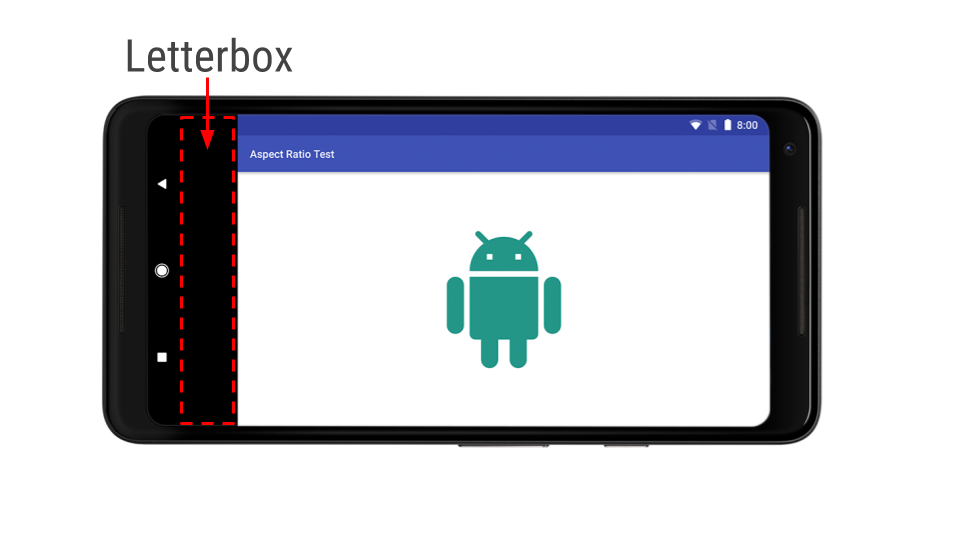

# 调整你的应用程序和游戏适配宽屏设备

原标题：Tuning your apps and games for long screen devices  
链接：[https://android-developers.googleblog.com/2017/12/tuning-your-apps-and-games-for-long.html](https://android-developers.googleblog.com/2017/12/tuning-your-apps-and-games-for-long.html)  
作者：Fred Chung (开发者倡导者)  
翻译：[arjinmc](https://github.com/arjinmc)  

近几个月来，手机制造商越来越倾向于推出长宽比（长度超过16：9）的新设备，其中许多设备还具有圆角。这证明了Android生态系统的广度和选择。像素2 XL和华为Mate 10 Pro只是许多例子中的两个。这些屏幕特征可以给用户带来非常身临其境的体验，他们注意到没有利用这些新设备的长宽比屏幕的应用程序和游戏。因此开发者对这些屏幕设计进行优化是非常重要的。我们来看看Android操作系统提供的相关支持。

## 优化宽屏的长宽比例

大多数使用标准UI小部件的应用程序可能会在这些设备上超出屏幕。 [Android文档](https://developer.android.google.cn/guide/practices/screens_support.html)详细介绍了灵活处理多种屏幕尺寸的技巧。但是，由于某些宽高比的错误假设，某些带有自定义用户界面的游戏和应用程序可能会遇到问题。我们正在分享开发者面临的一些典型问题，所以你可以关注那些与你有关的问题：

* <strong>屏幕的某些部分被裁剪</strong>。这使受影响的区域中的任何图形或UI元素看起来不完整。
* <strong>触摸目标与UI元素（例如按钮）相抵消</strong>。用户可能会对看似交互的UI元素感到困惑。
* 对于圆角设备上的全屏模式，任何<strong>非常接近边角的UI元素都可能位于弯曲的可视角度区域之外</strong>。试想一下，如果一个商业应用程序的“购买”按钮部分阻碍？我们建议引用[Material Design指南](https://material.io/guidelines/layout/metrics-keylines.html#metrics-keylines-keylines-spacing)通过在布局中留下16dp边距来。

如果响应式用户界面确实不适合你的情况，作为最后的手段，声明明确的最大支持高宽比如下。在宽高比较宽的设备上，应用程序将显示为以letterbox填充的兼容模式。请记住，某些设备型号为用户强制应用程序进入全屏兼容模式提供了重载，所以请务必在这些情况下进行测试！

目标API 26或更高：使用<i>android:maxAspectRatio</i>属性。

定位API 25或更低：使用<i>android.max_aspect</i>元数据。 请注意，只有你的活动不支持，才会考虑最大宽高比值<i>resizableActivity</i>。 请参阅[文档](https://developer.android.google.cn/guide/practices/screens_support.html#MaxAspectRatio)的细节。

当声明的最大纵横比小于设备的屏幕时，letterbox系统显示一个应用程序。

## 考虑使用并行的Activity

  

长宽比的设备可以实现更多的多窗口用例，从而提高用户的工作效率。从Android 7.0开始，该平台为开发人员提供了在支持的设备上实现多窗口以及在活动之间执行数据拖放的标准方法。详情请参阅[文档](https://developer.android.com/guide/topics/ui/multi-window.html#configuring)。

测试至关重要。如果你无法访问这些长屏幕设备之一，请务必在模拟器上进行测试，使其具有足够的屏幕尺寸和分辨率的硬件属性，这些属性在[模拟器文档](https://developer.android.com/studio/run/managing-avds.html#hpproperties)中进行了说明。

我们知道你想用长屏幕设备取悦你的用户。只需几个步骤，你就可以确保你的应用程序和游戏充分利用这些设备！