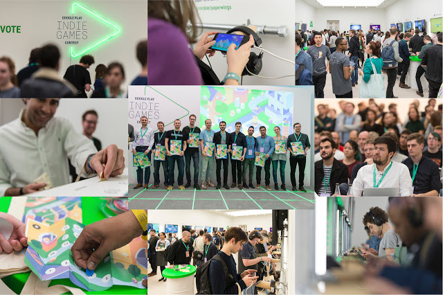
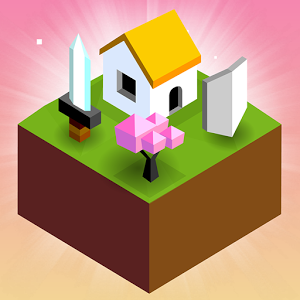
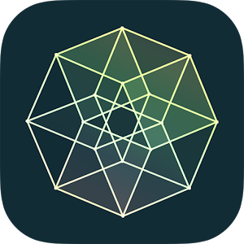
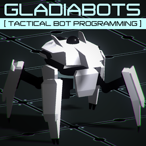
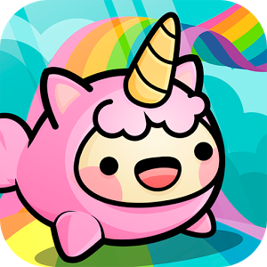
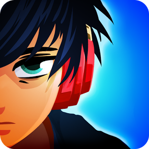
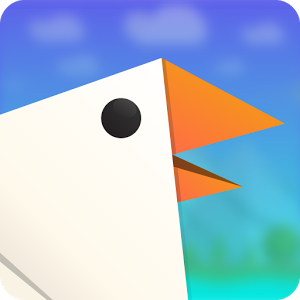
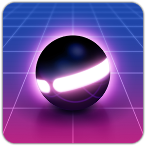
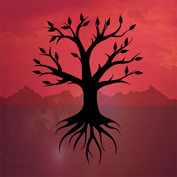

# Google Play欧洲独立游戏比赛获奖名单

原标题：And the winners of the Google Play Indie Games Contest in Europe are...  
链接：[https://android-developers.googleblog.com/2017/02/and-winners-of-google-play-indie-games.html](https://android-developers.googleblog.com/2017/02/and-winners-of-google-play-indie-games.html)  
作者：Matteo Vallone (Google Play游戏事业部门）
翻译：[arjinmc](https://github.com/arjinmc)  

今天，在伦敦萨奇画廊，我们主办了欧洲首个[Google Play独立游戏大赛](https://events.withgoogle.com/indie-games-contest-europe/)的最后一场活动。来自12个国家的20名决赛入围者中，[有近1000名来自游戏玩家](https://android-developers.googleblog.com/2017/01/meet-20-finalists-of-google-play-indie-games-contest.html)，行业专家和新闻界的游戏玩家。根据与会者和Google Play团队的投票选出，在[行业专家陪审团](https://events.withgoogle.com/indie-games-contest-europe/jury/)面前选出十强最佳获奖者。

  
<small>请继续关注更多图片和活动视频。 
不要犹豫，加入我们，祝贺获奖者！  
</small>

## 大奖得主&Unity获奖者： 
  
[Reigns](https://play.google.com/store/apps/details?id=com.devolver.reigns&e=-EnableAppDetailsPageRedesign)，来自英国的Nerial  
你是国王 对于每个决定，您只有两个选择。生存权力的行使和你的顾问的疯狂...只要你可以。

## 赛跑者：
  
[The Battle of Polytopia](https://play.google.com/store/apps/details?id=air.com.midjiwan.polytopia&e=-EnableAppDetailsPageRedesign)，来自瑞典的Midjiwan AB
基于回合的战略冒险。这是一场关于统治世界，打击邪恶的AI部落，发现新的土地和掌握新技术的游戏。

  
[Causality]()，来自英国的Loju  
这是关于操纵时间，改变事件顺序和改变每个级别的结果的一个难题，以帮助一群宇航员找到一条安全的路线。 

活动参加者和Google Play小组选择的其他热门游戏有： 

  
[Blind Drive](https://play.google.com/store/apps/details?id=com.LoFiPeople.BlindDrive&e=-EnableAppDetailsPageRedesign)，来自以色列的Lo-Fi People  
你正在驾驶蒙住眼睛，因为一个神秘的声音给你电话上的自杀命令。生存的冲浪车只使用你的听力来指导你。

  
[Gladiabots](https://play.google.com/store/apps/details?id=com.GFX47.Gladiabots&e=-EnableAppDetailsPageRedesign)，来自法国的GFX47  
一个有竞争力的战术游戏，您可以在其中设计机器人小组的AI。使用自己的策略，在线优化，争取排行榜的顶端。

  
[Happy Hop: Kawaii Jump](https://play.google.com/store/apps/details?id=com.platonicgames.hop&e=-EnableAppDetailsPageRedesign)，来自西班牙的Platonic Games  
这不仅仅是一个原始的一口无尽的料斗，它也是最可爱的一个。曾经想过彩虹最后的是什么？那将是快乐的一天。

  
[Lost in Harmony]()，来自法国的Digixart娱乐公司  
体验音乐以新的方式，结合节奏的敲击和舞蹈演员经历两次令人难忘的旅程与Kaito和MIRAI

  
[Paper Wings](https://play.google.com/store/apps/details?id=com.filgames.soar&e=-EnableAppDetailsPageRedesign)，来自土耳其的Fil Games  
一个快节奏的街机游戏，让你控制一只折纸鸟。避免危险，并收集落下的硬币，以保持你的纸鸟活着。

  
[Pinout](https://play.google.com/store/apps/details?id=com.mediocre.pinout&e=-EnableAppDetailsPageRedesign)，来自瑞典的Mediocre  
一个惊人的弹珠街机经验：在连续的旅程中，通过这个峡谷的脉动灯和悸动的复古波浪搏击。

  
[Rusty Lake: Roots](https://play.google.com/store/apps/details?id=air.com.RustyLake.RustyLakeRoots&e=-EnableAppDetailsPageRedesign)，来自荷兰的Rusty Lake  
当他在花园里种植一种特殊的种子时，詹姆斯·范德博姆的生活剧烈变化。通过解锁生命之树中的肖像来扩大你的血统。

## 查看奖品
这次比赛的奖品旨在帮助获奖者展示自己的艺术，并在Android和Google Play上拓展业务，包括： 

* YouTube影响力比赛高达10万欧元
* Google Play上的高级展示位置
* Google I / O 2017门票和其他顶级行业活动
* 促销我们的频道
* 最好的Unity游戏的特别奖
* 还有[更多](https://events.withgoogle.com/indie-games-contest-europe/prizes/)！ 

## 下一步是什么？ 
独立游戏开发者的这一周还没有结束。明天我们将在全球独立游戏开发商主办[独立游戏研讨会](https://events.withgoogle.com/indie-games-workshop-london/)，在欧洲，中东和非洲地区的新的Google办公室在国王十字。

看到这个颁奖典礼的热枕真的很有启发性，独特游戏的质量和创造力在合格的欧洲国家开发。我们期待在2017年底为你提供新版本的比赛。