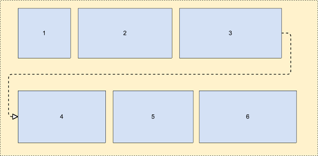
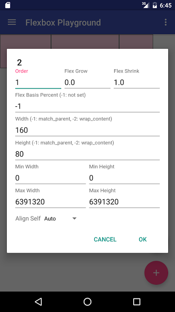
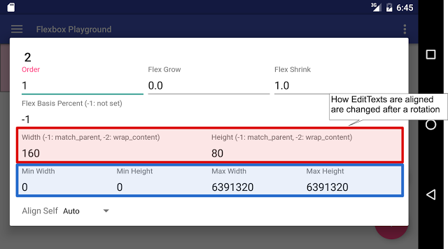
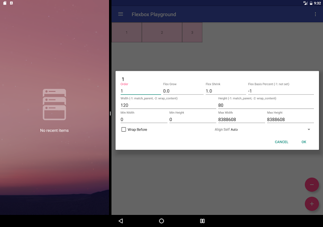
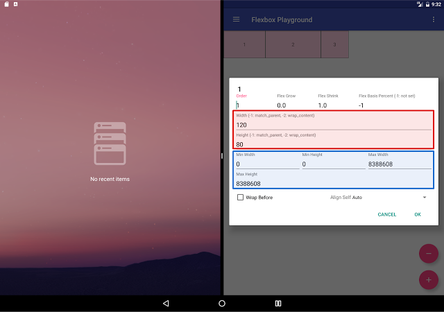
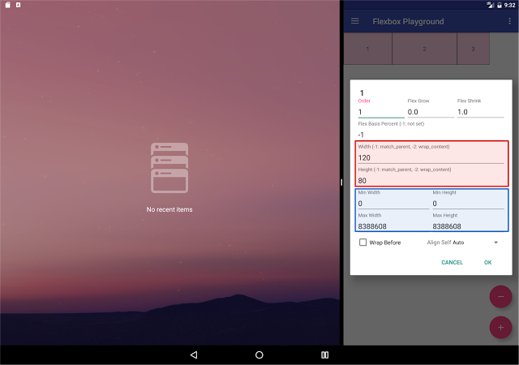
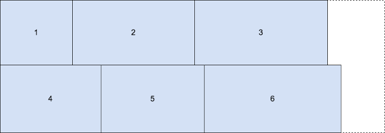
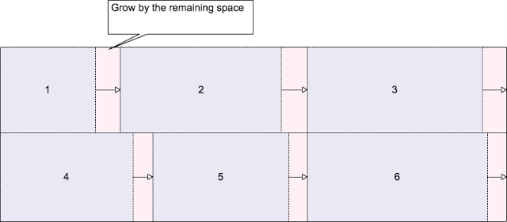

# 使用FlexboxLayout创建灵活的布局

原标题：Build flexible layouts with FlexboxLayout  
链接：[https://android-developers.googleblog.com/2017/02/build-flexible-layouts-with.html](https://android-developers.googleblog.com/2017/02/build-flexible-layouts-with.html)  
作者：Takeshi Hagikura (开发者程序工程师)  
翻译：[arjinmc](https://github.com/arjinmc)  

去年，Google I / O发布了[ConstraintLayout](https://developer.android.com/training/constraint-layout/index.html)，它使你能够在维护平面视图层次结构的同时构建复杂的布局。它也在Android Studio的[可视化布局编辑器](https://developer.android.com/training/constraint-layout/index.html)中完全支持。

同时，我们开源的[FlexboxLayout](https://github.com/google/flexbox-layout)将[CSS Flexible Layout模块](https://www.w3.org/TR/css-flexbox-1/)的相同功能移植到Android。这里有一些 FlexboxLayout特别有效的情况。

<small>FlexboxLayout</small>可以解释为高级LinearLayout，因为这两个布局都会顺序对齐其子视图。<small>FlexboxLayout</small>与LinearLayout之间的显著差异是<small>FlexboxLayout</small>有包装的特性。

那就是说，如果你加入了属性<strong>flexWrap="wrap"</strong>,如果在当前行的左边没有足够的空间给下一个view时，<small>FlexboxLayout</small>会自动加一行，如下图所示。

  

## 各种屏幕尺寸的布局

考虑到这个特点，让我们来看一下你想要依次放置视图，但如果可用空间发生变化（由于设备因素，方向更改或多窗口模式下的窗口调整大小），则可以将它们移动到新行。

  
Nexus 5X竖屏

  
Nexus 5X横屏

  
Pixel C启用多窗口模式，左侧分隔线。

  
Pixel C启用多窗口模式，分频线在中间。

  
Pixel C启用多窗口模式，右侧分隔线。

你需要定义多个DP-bucket布局（如layout-600dp，layout-720dp，layout-1020dp），以处理诸如LinearLayout或者传统布局的各种屏幕尺寸RelativeLayout。但是上面的对话框是用一个单独的<small>FlexboxLayout</small>。

该示例中使用的技术是flexWrap="wrap"如上所述设置，

```java
<com .google.android.flexbox.flexboxlayout 
     android:layout_width="match_parent" 
     android:layout_height="wrap_content" 
     app:flexwrap="wrap">
```

那么您可以获得以下布局，其中子视图与新行对齐，而不是溢出其父对象。

  

我想强调的另一种技术是将<small>layout_flexGrow</small>属性设置为 单个子view。这有助于在剩余空间时改善最终布局的外观。该 <small>layout_flexGrow</small>属性的作用类似于其中LinearLayout的layout_weight属性。这意味着 FlexboxLayout根据<small>layout_flexGrow</small>在同一行中为每个孩子设置的值分配剩余空间。

在下面的示例中，它假定每个孩子的<small>layout_flexGrow</small>
属性设置为1，所以可用空间将均匀分布到它们中。

```java
<android .support.design.widget.TextInputLayout
    android:layout_width="100dp"
    android:layout_height="wrap_content" 
    app:layout_flexgrow="1">
``` 

  
您可以在GitHub存储库中查看完整的[布局xml](https://github.com/google/flexbox-layout/blob/master/app/src/main/res/layout/fragment_flex_item_edit.xml)文件。

##RecyclerView集成 

另一个优点<small>FlexboxLayout</small>是可以与[RecyclerView](https://developer.android.com/reference/android/support/v7/widget/RecyclerView.html)集成。随着最新版本的[Alpha版本](https://github.com/google/flexbox-layout/blob/master/RecyclerView.md)的<small>FlexboxLayoutManager</small>扩展<small>RecyclerView.LayoutManager</small>，现在你可以以更多的内存高效的方式在可滚动容器中使用Flexbox功能。

请注意，你仍然可以实现滚动Flexbox的容器<small>FlexboxLayout</small>包裹着 ScrollView。但是，如果布局中包含的项目数量较大，则可能会遇到jankiness甚至OutOfMemoryError，因为<small>FlexboxLayout</small>用户滚动时不会将视图回收到屏幕上的视图。

（如果你想详细了解RecyclerView的详细信息，你可以检查出从Android的UI工具包的团队，如视频[1](https://www.youtube.com/watch?v=LqBlYJTfLP4)，[2](https://www.youtube.com/watch?v=KhLVD6iiZQs)）

一个真实世界的例子，其中<small>RecyclerView</small>集成是非常有用的是对于像谷歌照片应用程序或新闻应用程序的应用程序，都期望大量物品而需要处理各种物品宽度。 

在<small>FlexboxLayout</small>的存储库中可以找到一个[例子程序](https://github.com/google/flexbox-layout/tree/dev_recyclerview/demo-cat-gallery)。你可以在存储库中看到，每个图像显示<small>RecyclerView</small>的宽度不同。但是通过将<small>flexWrap</small>设置设置为wrap，

```java
FlexboxLayoutManager layoutManager = new FlexboxLayoutManager();
layoutManager.setFlexWrap(FlexWrap.WRAP);
```

并给每一个孩子设置<small>flexGrow</small>（如你所看到的，你可以通过配置的属性<small>FlexboxLayoutManager</small>和<small>FlexboxLayoutManager.LayoutParams</small>设置孩子的属性，而不是从XML配置）属性。

```java
void bindTo(Drawable drawable) {
    mImageView.setImageDrawable(drawable);
    ViewGroup.LayoutParams lp = mImageView.getLayoutParams();
    if (lp instanceof FlexboxLayoutManager.LayoutParams) {
    FlexboxLayoutManager.LayoutParams flexboxLp = 
        (FlexboxLayoutManager.LayoutParams) mImageView.getLayoutParams();
    flexboxLp.setFlexGrow(1.0f);
    }
}
```

  
无论屏幕方向如何，你都可以很好地看到每个图像在布局中很合适。

如果你想查看完整的FlexboxLayout示例，可以查看：

* [游乐场演示应用程序](https://github.com/google/flexbox-layout/tree/dev_recyclerview/demo-playground) - 使用<small>FlexboxLayout</small>和<small>FlexboxLayoutManager</small>。
* [猫图库演示应用程序](https://github.com/google/flexbox-layout/tree/dev_recyclerview/demo-cat-gallery) - 使用<small>FlexboxLayoutManager</small>

##下一步是什么？

查看其他属性的完整[文档](https://github.com/google/flexbox-layout)，以构建针对你的需求量身定制的灵活布局。如果你发现任何问题或功能请求，我们很乐意听到你的反馈，请在[GitHub信息库中提出问题](https://github.com/google/flexbox-layout/issues)。