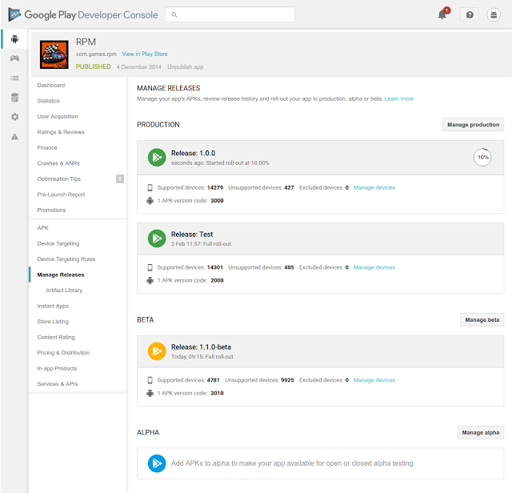
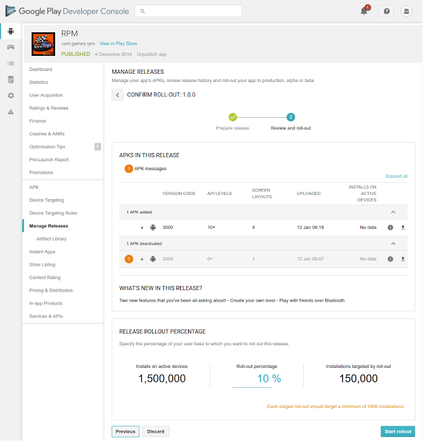

# 使用Google Play开发者控制台自信地发布你的app

原标题：Publish your app with confidence from the Google Play Developer Console  
链接：[https://android-developers.googleblog.com/2017/02/publish-your-app-with-confidence-from.html](https://android-developers.googleblog.com/2017/02/publish-your-app-with-confidence-from.html)  
作者：Kobi Glick （Google Play产品经理)  
翻译：[arjinmc](https://github.com/arjinmc)  

发布一个新的应用程序或应用程序更新，是每个开发者的重要和令人兴奋的里程碑。为了使过程更流畅，更可追踪，我们宣布推出一种新的在Google Play上发布应用程序的新方法。这些变化会给你更大的信心来管理你的应用程序版本的能力通过一个新的<strong>发布</strong>页面在[谷歌Play开发者控制台](https://g.co/play/developerconsole)。

[视频介绍](https://youtu.be/qGoCF0Et_CU)

## 管理你的应用更新与清晰和控制
新的管理版本页面是你上传应用的alpha，beta和生产版本的地方。从这里可以看到重要信息和所有发行版本的轨迹。

  
<small>新的管理版本页面</small>

##更容易管理已有和新发布的功能
发布应用程序或更新是一大步，每个开发人员都希望有信心来应对。为了帮助，我们添加了两个新功能。

首先，我们添加了一个验证步骤，在发布之前突出显示潜在的问题。在你确认新应用程序的滚动之前，将出现新的“review and rollout”页面，并标记是否存在验证错误或警告。这个新的流程将使应用程序发布过程更容易，特别是对于使用多APK的应用程序。它还提供新的信息; 例如，在你向应用程序添加新权限的情况下，系统将高亮显示。

  

其次，在发布流程中执行和跟踪分段滚动现在更为简单。通过分阶段推出，你可以将更新发布给越来越多的用户，让你有机会在影响整个用户群之前抓住并解决任何问题。

如果你想查看发布的历史记录，现在可以对其进行细微的跟踪并下载以前的APK。

最后，我们在管理版本下添加了一个新的智能库，你可以在其中找到有助于管理版本的所有文件。

## 立即开始使用新的管理版本页面
你可以在开发者控制台中访问新的管理版本页面。有关详细信息，请访问[Google Play开发者帮助中心](https://support.google.com/googleplay/android-developer/answer/7159011)。通过这些更改，我们可以帮助你发布，跟踪和管理你的应用程序，同时对Google Play有信心。