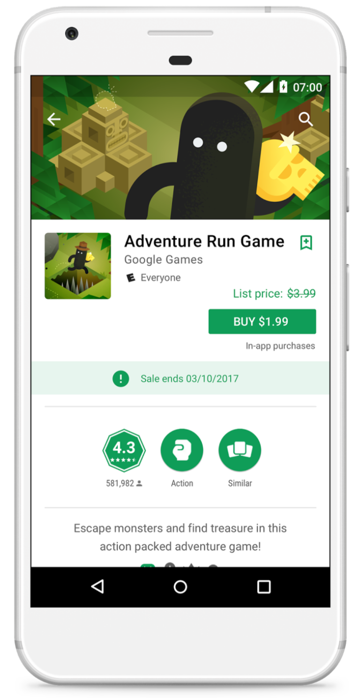
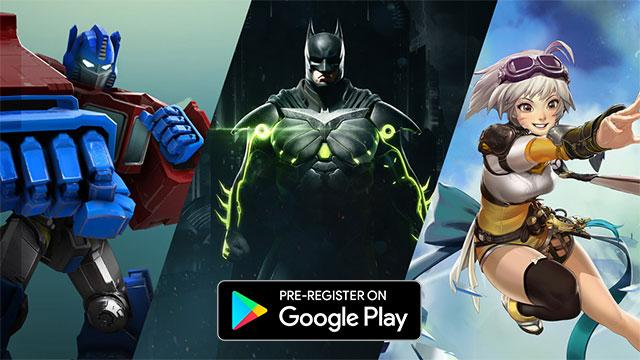

# 欢迎参加2017年游戏开发者大会的Google开发者日

原标题：Welcome to Google Developer Day at Game Developer Conference 2017  
链接：[https://android-developers.googleblog.com/2017/02/welcome-to-google-developer-day-at-game.html](https://android-developers.googleblog.com/2017/02/welcome-to-google-developer-day-at-game.html)  
作者：Paul Bankhead (Google Play产品市场总监)  
翻译：[arjinmc](https://github.com/arjinmc)  

移动游戏比以往更受欢迎。在过去一年中，我们看到了突破性的热潮，包括[Pokemon GO](https://play.google.com/store/apps/details?id=com.nianticlabs.pokemongo&hl=en_GB)，[Star Wars: Galaxy of Heroes](https://play.google.com/store/apps/details?id=com.ea.game.starwarscapital_row&hl=en_GB)，[Clash Royale](https://play.google.com/store/apps/details?id=com.supercell.clashroyale&hl=en_GB)和[Reigns](https://play.google.com/store/apps/details?id=com.devolver.reigns&hl=en_GB)在Google Play上推出新的高品质游戏体验。世界各地的游戏玩家也能够比以往任何时候都更方便地访问Google Play，帮助开发者吸引更多的用户并拓展业务。在2016年，近3亿新用户（30天活跃）的用户采用来自印度，巴西和印度尼西亚等新兴市场的Android设备。去年，有超过1亿新用户可以访问本地相关的付款方式（如直接运营商帐单或礼品卡），帮助全球更多人在Google Play上访问和购买自己喜欢的应用和游戏。

我们还专注于抛光我们的软件和硬件产品，以改善Android上的整体游戏体验。发布的[Android N](https://developer.android.com/about/versions/nougat/android-7.0.html)提供高性能的实时3D图形与Vulkan API和推出[Pixel](https://vr.google.com/daydream/phones/)手机提供身临其境的移动VR量身打造的第一白日梦做好准备的设备。在其他地方，[Firebase](https://firebase.google.com/docs/games/setup)的扩展提供了工具和基础架构，以支持开发人员在游戏的整个生命周期中，包括实时分析，推送通知，存储和广告等功能。为了简化整合，Firebase现在完全可用于C ++和Unity开发者。

## 新功能帮助你在GOOGLE PLAY上取得成功

<strong>今天，在游戏开发者大会期间的年度[开发者日](https://events.withgoogle.com/google-developer-day-at-gdc-2017-1/)，我们推出了新工具来改善Google Play的整体发现，特别是支持开发高质量和吸引人的游戏的开发者。</strong>

  

* <strong>通过参与度来促进高品质的体验，而不仅仅是安装</strong>：借助Google Play上各种各样的游戏，很多情况下，伟大的游戏不能获得他们应有的知名度和关注度。最近，我们已经开始调整我们的算法来优化用户参与度，而不仅仅是下载。这是我们奖励质量的方法之一，游戏意味着通过粘性（强烈的参与度和保留度量）来推广标题，以及像传统的高星级评级一样的传统措施。
* <strong>通过删除线定价提供销售和增加优质游戏的购买</strong>：从今天开始，Google Play开发者控制台可以使用删除线定价，开发商可以在付费应用和游戏上运行自己的价格促销活动，从而提高意识和转换。在我们的试用阶段，开发商不仅在升级期间看到了3x-20x的升级升级，一旦销售结束，他们也保持了不错的梯子。
* <strong>通过编辑页面更多地策划高质量的游戏</strong>：我们再强调质量游戏的另一个方法是通过本月晚些时候发布的Play商店的新的社论页面。这些页面允许我们的编辑手动选择在Android上展示最佳游戏体验的游戏。它们允许用户通过对诸如史诗RPG和顶级赛车游戏等主题的编辑评论来探索不同的游戏风格和流派。

## 在GOOGLE播放的最近的游戏
<strong>在我们的开发者日，我们还向与会者们深入分析了今年晚些时候来到Google Play的一些高保真游戏。包括主要工作室到独立的标题，甚至两个新的VR标题，每个玩家都有一些东西！</strong>

  

## 可在Google Play上预注册
* [TRANSFORMERS: Forged to Fight](https://play.google.com/store/apps/collection/promotion_30027cc_gdc_hifi_ctp)：由Kabam伪造的战斗是一个新的高清晰度，动作型手机游戏，沉浸在世界之中。该游戏将特色正宗的变形金刚“超过满足眼睛”的动作，允许玩家与Optimus Prime，Megatron和许多其他受欢迎的机器人和欺骗者在惊人的3D环境中进行接触。该游戏将于2017年4月5日在全球推出。
* [Battle Breakers](https://play.google.com/store/apps/collection/promotion_30027cc_gdc_hifi_ctp)是由虚幻引擎4提供动力的史诗游戏的一种新的狂热战术角色扮演游戏。一个充满活力的幻想科幻漫画冒险，战斗破坏者让你从数百名独特英雄招募并建立一个梦想团队，与你一起战斗怪物收回王国，一次休息！
* [Injustice 2](https://play.google.com/store/apps/collection/promotion_30027cc_gdc_hifi_ctp)让你引导你的超级英雄和恶棍的稳定胜利。扩大命运游戏不公正：神在我们中间，不公正2提供了全新的角色，令人兴奋的新模式，以及NetherRealm工作室的外观和战斗风格。五月份，无法正确使用Google Play for Android设备。

## 即将推出
* <strong>Virtual Rabbids</strong>是Ubisoft Montpellier与布加勒斯特合作开发的首款针对移动开发的VR Rabbid体验。今年春天可以在Daydream中使用，玩家会发现自己处于一些最岌岌可危的情况，因为他们拯救地球。
* <strong>Beartopia</strong>是Spry Fox合作的多人游戏。结交朋友，携手共同发展，共同发展。

今天下午，我们将举办一系列[亮灯讲座](https://events.withgoogle.com/google-developer-day-at-gdc-2017-1/lightning-talks/)，分享启动成功的VR和AR游戏，搭配Firebase，在游戏中实现机器学习等功能。[访问我们的网站](https://events.withgoogle.com/google-developer-day-at-gdc-2017-1/)了解更多信息和Google开发者日程。对于那些不能亲自参会的人，[观看live直播](https://events.withgoogle.com/google-developer-day-at-gdc-2017-1/live-stream/)！

这只是我们2017年计划的开始。我们希望你可以利用这些工具来改善游戏，吸引用户，增加业务和收入。

