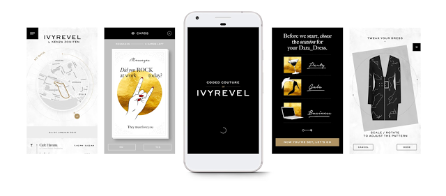
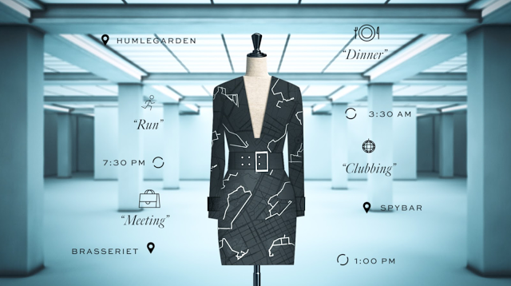

# 时尚通过Google Awareness API进行数字升级

原标题：Fashion gets a digital upgrade with the Google Awareness API  
链接：[https://android-developers.googleblog.com/2017/02/fashion-gets-digital-upgrade-with.html](https://android-developers.googleblog.com/2017/02/fashion-gets-digital-upgrade-with.html)  
作者：Jeremy Brook (the ZOO 社区创意企业合伙人)  
翻译：[arjinmc](https://github.com/arjinmc)  

去年[夏天](https://android-developers.googleblog.com/2016/06/create-intelligent-context-aware-apps.html)，我们首次 通过Google Play服务向所有开发人员提供了[Awareness API](https://developers.google.com/awareness/)，提供强大而统一的感应平台，使应用程序能够了解用户环境的各个方面。通过使用上下文信号（如位置，身体活动，天气和附近信标）的组合，开发者可以更好地了解用户的个性化，并提供更具吸引力和定制化的移动应用体验。

在明显的情况下，我们已经看到了API的一些很好的实现方式，例如在邻里购买新屋或者在开始慢跑时推荐音乐播放列表。在纽约时装周，我们探索了Awareness API的其他创意整合，并与H＆M集团的数字时装商店[Ivyrevel](http://www.ivyrevel.com/us/home)及其时尚技术实验室合作，将时装数字时代带入“数码连衣裙”，这是一款完全基于用户的上下文信号。

  

目前正在开发中，Android应用程序专门在平台中使用[Snapshot API](https://developers.google.com/awareness/android-api/snapshot-api-overview)，以便他们的许可被动地监控每个用户的日常活动和生活方式。你经常在哪里吃晚餐或和朋友一起出去玩？他们是休闲还是正式的聚会？当你在外面时平常的天气是什么？在一个星期的过程之后，用户的上下文信号被传递通过一个算法，创建一个数字定制的连衣裙设计供用户购买。

  

Android应用程序正处于封闭的Alpha阶段，目前正在由选定的全球风格影响者进行测试，包括Ivyrevel的联合创始人[Kenza Zouiten](https://www.youtube.com/user/KenzaZouitenOfficial)。如果你想有一个真正的“量身定做”的数字体验，公开发布之前[在这里](http://codedcouture.com/)注册，参加该应用的未来审判。
