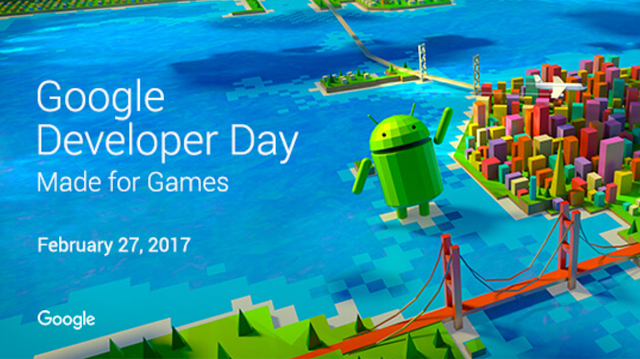

# 准备参加GDC 2017年的Google开发者日

原标题：Get ready for Google Developer Day at GDC 2017  
链接：[https://android-developers.googleblog.com/2017/02/get-ready-for-google-developer-day-at.html](https://android-developers.googleblog.com/2017/02/get-ready-for-google-developer-day-at.html)  
作者：Noah Falstein（Google的首席游戏设计师）  
翻译：[arjinmc](https://github.com/arjinmc)  

由游戏开发者大会（GDC）于二月二十七日（星期一）开始，每年举办一次[Google开发者日](https://events.withgoogle.com/google-developer-day-at-gdc-2017-1/)。加入我们，我们展示了新的设备，平台和工具如何帮助开发者构建成功的业务，并推动Android上的移动游戏的极限。

  

期待包括Google Play，Daydream VR，Firebase，Cloud Platform，机器学习，营利等多种主题的令人兴奋的公告，最佳实践和技巧。下午，我们将主持小组讨论开发人员关于手机游戏的经验，建立蓬勃发展的社区，以及探索成为独立开发商的成功与挑战。

访问我们的网站了解更多信息和[Google开发者日的日程](https://events.withgoogle.com/google-developer-day-at-gdc-2017-1/schedule/)。这些活动是官方游戏开发者大会的一部分，所以你需要通过参加。对于那些不能亲身体验的人，请于[2月27日星期一上午10点](https://www.google.com/calendar/render?action=TEMPLATE&text=Google+Developer+Day+at+GDC+2017&dates=20170227T180000Z/20170228T000000Z&ctz=America/Los_Angeles&details=For+details:+https://events.withgoogle.com/google-developer-day-at-gdc-2017-1/)从YouTube 观看[直播](https://www.youtube.com/watch?v=gv5Bd3YswXw)。
