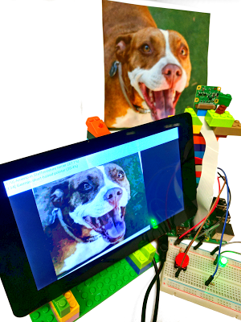

# Android Things开发者预览2

原标题：Android Things Developer Preview 2  
链接：[https://android-developers.googleblog.com/2017/02/android-things-developer-preview-2.html](https://android-developers.googleblog.com/2017/02/android-things-developer-preview-2.html)  
作者：Wayne Piekarski (IoT开发者倡导者)  
翻译：[arjinmc](https://github.com/arjinmc)  

今天，我们发布了Android Things的开发者预览2（DP2），为平台带来了新的功能和bug修复。我们致力于定期向开发者提供更新，并且旨在每六至八周推出新的预览版本。Android Things是搭载Android功能的物联网（IoT）产品的全面解决方案。现在，任何Android开发者都可以使用Android API和Google服务快速构建智能设备，同时保持高度安全性，直接从Google获得更新。它包括熟悉的工具，如Android Studio，Android软件开发工具包（SDK），Google Play服务和Google Cloud Platform。Android Things支持系统模块（SoM）架构，

## 新功能和bug修复

得益于开发者预览1的开发人员反馈，我们现在已经将USB Audio添加到Intel Edison和Raspberry Pi 3的硬件抽象层（HAL）上。NXP Pico已经包含对设备上音频的直接支持。我们还解决了与外设I / O（PIO）相关的许多bug。其他功能请求（如蓝牙支持）是已知问题，并且团队正在积极地修复这些问题。我们增加了对英特尔焦耳平台的支持，该平台在我们的阵容中提供了最多的计算能力。

## 本地I / O和用户驱动程序
有许多开发人员使用本机C或C ++代码开发IoT软件，而Android Things支持标准的Android NDK。我们现在已经发布了一个库来提供[Peripheral API](https://developer.android.com/things/sdk/pio/index.html)（PIO）的本地访问权限，因此开发人员可以轻松使用现有的本机代码。该[文档](https://developer.android.com/things/sdk/pio/native.html)解释了新的API，该[示例](https://github.com/androidthings/sample-nativepio)提供了如何使用它的演示。

Android Things DP1提供的一个重要的新功能是支持[用户驱动程序](https://developer.android.com/things/sdk/drivers/index.html)。开发者可以在其APK中创建用户驱动程序，然后将其绑定到框架。例如，你的驱动程序代码可以读取GPIO引脚并触发常规的Android KeyEvent，或通过串行端口读取外部GPS，并将其输入到Android位置API。这允许任何应用程序将硬件事件注入到框架中，而不需要定制Linux内核或HAL。我们维护用于各种通用硬件接口（如传感器，按钮和显示器）的用户驱动程序[库](https://developer.android.com/things/sdk/driver-library.html)。开发者也可以创建自己的驱动程序，并与社区分享。

## TensorFlow for Android Things

Android Things最有趣的功能之一是能够轻松部署机器学习和计算机视觉。我们创建了一个非常需要的[示例](https://github.com/androidthings/sample-tensorflow-imageclassifier)，显示如何在Android Things设备上使用[TensorFlow](https://www.tensorflow.org/)。该示例演示了访问相机，执行对象识别和图像分类，并使用文本到语音（TTS）说出结果。为ARM和x86预先构建的早期访问TensorFlow推理库提供了你可以轻松地将TensorFlow添加到任何Android应用程序，只需在build.gradle文件中单行。

  
TensorFlow[示例](https://github.com/androidthings/sample-tensorflow-imageclassifier)在Raspberry Pi 3使用相机识别狗的品种(美国斯塔福德郡梗犬)

## 反馈

感谢所有为之前的开发者预览提交反馈的开发者们。请继续通过提交[bug报告](https://code.google.com/p/android/issues/entry?template=Android%20Things%20bug%20report)和[功能需求](https://code.google.com/p/android/issues/entry?template=Android%20Things%20feature%20request)向我们发送反馈，并在[stackoverflow](http://stackoverflow.com/questions/tagged/android-things)上提出任何问题。要下载Developer Preview 2的图片，请访问Android Things [下载](https://developer.android.com/things/preview/download.html)页面，并在[发布说明](https://developer.android.com/things/preview/releases.html)中找到更改。你还可以在Google+上加入[Google的IoT Developers社区](https://g.co/iotdev)，这是一个很好的资源，可以跟上最新的和讨论的想法，超过2900个新成员。