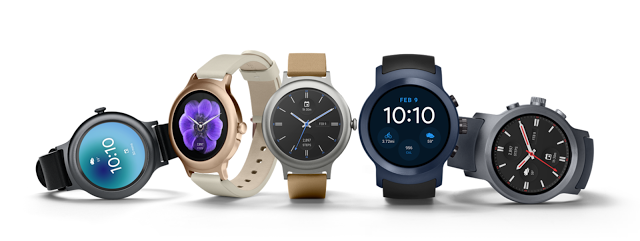

# Android Wear 2.0的新硬件功能在这里！

原标题：Android Wear 2.0 is here with new hardware features!  
链接：[https://android-developers.googleblog.com/2017/02/AndroidWear2.html](https://android-developers.googleblog.com/2017/02/AndroidWear2.html)  
作者：Hoi Lam (Android Wear首席开发者倡导者）  
翻译：[arjinmc](https://github.com/arjinmc)  

  

今天，我们发布Android Wear 2.0的最终SDK。在这个版本中，我们增加了对[昨天宣布的新硬件功能](https://blog.google/products/android-wear/android-wear-20-make-most-every-minute/)的支持。如果你还没有这样做，那么现在是[发布应用程序](https://developer.android.com/wear/preview/features/app-distribution.html)的时候了，以便不要错过明天的消费者硬件。

在整个开发者预览程序中，你们已经给了我们很多建设性的反馈以及错误报告。再次感谢你们！

<strong>Android Wear 2.0回顾</strong>
[视频链接](https://youtu.be/-F-llkD6cQY)

自从我们在2014年推出Wear以来，Android Wear 2.0是我们最大的更新，它拥有众多平台和开发人员的增强功能。一些亮点包括：

* [Android Wear的Material Design](https://www.google.com/design/spec-wear/) - 新的系统用户界面和设计指南，具有较暗的调色板，垂直布局和可视化组件，如WearableRecyclerView和WearableNavigationDrawer。我们还通过新的MessagingStyle丰富的通知风格和内联操作，增强了手表上的通知。
* [表盘复杂化](https://developer.android.com/training/wearables/watch-faces/complications.html) - 复杂化是表盘上显示不同时间信息的区域。应用程序可以通过创建一个<i>ComplicationProviderService</i>向表盘提供数据，并且表盘可以以适合手表面设计的样式呈现此数据。
* [独立的Android Wear应用和iOS支持](https://developer.android.com/training/wearables/apps/standalone-apps.html) - 现在可以通过观看Google Play商店直接将Apps下载到Wear设备。此外，这些应用程序可以直接访问互联网，而无需依赖手机应用程序。这意味着应用程序现在可以在与iOS设备配对的Android Wear设备上运行。

<strong>新的硬件支持</strong>

Android Wear 2.0的前两款手表为用户提供了更多与智能手表进行互动的方式。在最终的SDK中，我们为物理[按钮位置](https://developer.android.com/training/wearables/ui/multi-function.html)和[轮流输入](https://developer.android.com/training/wearables/ui/rotary-input.html)添加了API支持。目前，开发商将需要新的LG Watch Style或LG Watch Sport来测试这些新功能; 然而，我们正在努力将这些新的硬件功能添加到模拟器中。敬请关注更新！SDK还包括一些其他最终的bug修复，例如在可穿戴动作抽屉中支持三个以上的项目。

<strong>应用审核更改</strong>

现在，Android Wear 2.0已经开始实施，我们很快就会更新[Android Wear应用质量](https://developer.android.com/distribute/essentials/quality/wear.html)审核流程，并进行了两个重要更改。首先，增强Android Wear的手机应用通知将不再适合传递评论。其次，很快就要求你上传与Android Wear 2.0兼容的手表APK。只有通过这些条件的应用程序才能在手机中的Play商店中获得徽章，并符合Android Wear应用的顶级图表显示资格。这些更改将确保为用户提供更一致的体验，并允许我们为你简化审核流程。

<strong>旅程不止于此！</strong>

Android Wear 2.0开发者预览的持续时间比原来计划的更长，但是我们认为额外的时间在很大程度上得到了回报。再次感谢你们的投入和耐心。你们帮助我们实现了比我们自己实现的更高质量的门槛。

我们将Android Wear 2.0开发人员预览文档集成到[Wear开发者文档主站](https://developer.android.com/wear/index.html)中，我们继续保留[预览设备的工厂映像](https://developer.android.com/wear/index.html)的链接。对于开发者相关的错误，请继续在Android Wear开发人员社区中[提交开发者bug报告](https://code.google.com/p/android/issues/entry?template=Android%20Wear%20bug%20report)或发表评论。 从Android Wear团队：再次感谢你们的反馈和支持！