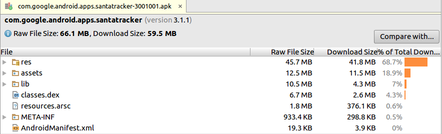
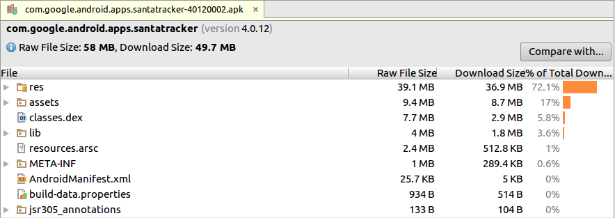

# 给圣诞老人追踪器app瘦身

原标题：Getting Santa Tracker Into Shape  
链接：[https://android-developers.googleblog.com/2017/03/getting-santa-tracker-into-shape.html](https://android-developers.googleblog.com/2017/03/getting-santa-tracker-into-shape.html)  
作者：Sam Stern (开发程序工程师)
翻译：[arjinmc](https://github.com/arjinmc)  

在Google里使用圣诞老人追踪器是假期传统。除了为世界各地数百万用户带来季节性的喜悦之外，它是应用开发中最新的API和技术的这个app的年度测试。这就是为什么每年应用程序的[全部开源](https://github.com/google/santa-tracker-android)在Github上发布的原因。

在2016年，圣诞老人团队挑战向应用程序引入新内容，同时使其更小，更高效。在这篇文章中，你可以在捡到关于更加细致，更快速的的道路。

## APK膨胀

圣诞老人追踪器多年来一直在增长，包括超过十几种游戏和互动场景的视觉和音频资源。2015年，SantaTracker（圣诞老人追踪器）APK的大小为66.1 MB。

Android Studio APK分析器是一个很好的工具，可以调查什么使2015年的应用程序如此之大。

  

首先，虽然APK的大小是66.1 MB，我们看到下载大小是59.5MB！大部分的大小在资源文件夹中，但资源和本机库贡献了一个相当大的一块。

2016年的应用程序包含了2015年应用中的所有内容，同时添加了四款全新游戏。起初，我们假设使应用程序更小，而添加所有这些将是不可能的，但（泄漏者留心！）这里是2016年的最终结果：

  

即使增加了四个新游戏和视觉刷新，该应用的下载大小现在已经接近10MB。本节的其余部分将探讨我们如何做到。

### 使用APK拆分在Google Play上支持多种APK

2015年的应用程序添加了Google的[Fun推进实验室](https://github.com/google/pienoon)团队的“Snowdown（下雪）”游戏。这个游戏是用C ++编写的，所以它被包含在Santa Tracker作为一个本机库。该团队向我们提供了armv5，armv7和x86架构的编译库。每个版本约3.5MB，加起来可以在2015年APK 的lib 条目中看到的10.5MB 。

由于每个设备只使用这些架构之一，所以可以删除三分之二的本地库来节省空间 - 这里的权衡是我们将发布多个APK。Android Gradle构建系统具有原生支持，可以为每个体系结构（ABI）构建一个APK，只需在应用程序的build.gradle 文件中配置几行：
```java
ext.abiList = ['armeabi', 'armeabi-v7a', 'x86']
android {
    
    // ...
    splits {
        abi {
            // Enable ABI splits
            enable true
            // Include the three architectures that we support for snowdown
            reset()
            include(*abiList)
            // Also build a "universal" APK that will run on any device
            universalApk true
        }
    }
}
```
 一旦拆分启用，每个拆分需要被赋予唯一的版本代码，以便它们可以共存在Play商店中：

```java
// Generate unique versionCodes for each APK variant: ZXYYSSSSS
//   Z is the Major version number
//   X is the Minor version number
//   YY is the Patch version number
//   SSSS is information about the split (default to 0000)
// Any new variations get added to the front
import com.android.build.OutputFile;
android.applicationVariants.all { variant ->
    variant.outputs.each { output ->
        // Shift abi over by 8 digits
        def abiFilter = output.getFilter(OutputFile.ABI)
        int abiVersionCode = (abiList.indexOf(abiFilter) + 1)
        // Merge all version codes
        output.versionCodeOverride = variant.mergedFlavor.versionCode + abiVersionCode
    }
}
```

在最新版本的Santa Tracker(圣诞老人追踪器)中，我们分别发布了armv5，armv7和x86的版本。随着这种变化，10.5MB的本地库被减少到大约4MB每个变体，而不会失去任何功能。

### 优化图像

大多数Santa Tracker APK是图像资源。每个游戏都有数百个图像，每个图像都有多种尺寸可供不同的屏幕密度使用。几乎所有这些图像都是PNG，所以在过去的几年中，我们对所有文件运行了PNGCrush，并确定我们的工作已经完成。我们在2016年获悉，在无损PNG压缩方面取得了进步，Google的[zopfli](https://github.com/google/zopfli)工具目前是最先进的技术。

通过在所有PNG资源上运行zopflipng ，我们无损地将大多数图像的大小减少了10％，有些减少了30％。这使得在整个应用程序中几乎减少了5MB的大小，而不牺牲任何质量。例如，这个圣诞老人的形象从10KB无损地减少到只有7KB。不要打扰找出差异，这里没有！

之前（10.2KB）| 之后（7.4KB）
------|------
  |   

### 未使用的资源

在Santa Tracker工作时，工程师不断重构应用程序，添加和删除了前几年的逻辑和UI。虽然代码审查和linting有助于找到未使用的代码，未使用的资源更容易被忽略。另外还没有ProGuard的资源，所以我们无法通过我们的工具链保存，未使用的图像和其他资源经常潜入应用程序。

Android Studio可以帮助您找到可能会使APK膨胀尚未使用的资源。通过单击<b>Analyze</b> > <b>Run Inspection by Name</b> > <b>Unused Resources</b> Android Studio将识别未被任何已知的代码路径使用的资源。重要的是首先消除所有未使用的代码，死代码“使用”的资源不会被检测为未使用。

在使用Android Studio的有用工具进行了几个周期的分析之后，我们可以找到数十个未使用的文件，并从应用程序中消除了更多的MB资源。

## 内存使用情况
圣诞老人追踪器在世界各地受欢迎，并拥有数千种独特的Android设备。这些设备中的许多都是几岁，拥有512MB内存或更少的RAM，所以我们历来在我们的游戏中遇到了<small>OutOfMemoryErrors</small>。

虽然上述优化使得我们的PNG在磁盘上更小，但是当加载到Bitmap中时，它们的内存占用空间不变。由于圣诞老人追踪中的每个游戏装载了数十张图像，我们很快进入危险的记忆区域。

在2015年，我们十大崩溃中有六个是跟内存相关的。由于下面的优化（和其他），我们将内存崩溃从前十名中移出。

### 图像加载后退
当初始化在追踪圣诞老人的比赛我们经常加载所有的<small>位图</small>所需的第一个场景到内存中，这样的游戏也能流畅运行。天真的方法看起来像这样：

```java
private LruCache<Integer, Drawable> mMemoryCache;
private BitmapFactory.Options mOptions;
public void init() {
  // Initialize the cache
  mMemoryCache = new LruCache<Integer, Drawable>(240);
  // Start with no Bitmap sampling
  mOptions = new BitmapFactory.Options();
  mOptions.inSampleSize = 1;
}
public void loadBitmap(@DrawableRes int id) {
    // Load bitmap
    Bitmap bmp = BitmapFactory.decodeResource(getResources(), id, mOptions);
    BitmapDrawable bitmapDrawable = new BitmapDrawable(getResources(), bmp);
    
    // Add to cache
    mMemoryCache.put(id, bitmapDrawable);
}
```
然而如果我们没有足够的RAM将Bitmap加载到内存中，则<small>decodeResource</small>函数将抛出<small>OutOfMemoryError</small>。为了解决这个问题，我们抓住这些错误，然后尝试以更高的采样率重新加载所有图像（每次缩放2倍）：

```java
private static final int MAX_DOWNSAMPLING_ATTEMPTS = 3;
private int mDownsamplingAttempts = 0;
private Bitmap tryLoadBitmap(@DrawableRes int id) throws Exception {
    try {
        return BitmapFactory.decodeResource(getResources(), id, mOptions);
    } catch (OutOfMemoryError oom) {
        if (mDownSamplingAttempts < MAX_DOWNSAMPLING_ATTEMPTS) {
            // Increase our sampling by a factor of 2
            mOptions.inSampleSize *= 2;
            mDownSamplingAttempts++;
        }
    }
    throw new Exception("Failed to load resource ID: " + resourceId);
}
```

使用这种技术，低内存设备现在将看到更多的像素化图形，但是通过使这种折衷，我们几乎完全消除了Bitmap加载中的内存错误。

### 透明像素

如上所述，磁盘上的图像大小不是使用多少内存的良好指标。一个明显的例子是具有大透明区域的图像。PNG可以将这些区域压缩到接近零磁盘大小，但每个透明像素仍然需要相同的RAM。

例如在“Dasher Dancer”游戏中，动画由一系列1280x720 PNG帧组成。许多这些框架由透明度主导，因为动画对象离开了屏幕。我们写了一个脚本来修剪所有的透明空间，并记录一个“[偏移量](https://github.com/google/santa-tracker-android/tree/master/dasherdancer/src/main/java/com/google/android/apps/santatracker/dasherdancer/ResourceOffsets.java)”来显示每个框架，以使整体看起来仍然是1280x720。在一个测试中，这将游戏的运行时RAM的使用量减少了60MB！而现在我们并没有浪费透明像素的内存，所以我们需要较少的缩小比例，并且可以在低内存设备上使用更高分辨率的图像。

## 附加探索
除了上述的主要优化之外，我们还探讨了其他一些途径，使应用程序越来越小，成功程度不同。
### 闪屏屏幕
2015年应用程序转移到材料设计美学，游戏从“卡”的中央列表启动。我们注意到，一半的游戏会导致卡片的“波纹”效应在发布时变得笨拙，但是我们找不到根本原因，无法解决问题。

当在2016版本的应用程序上工作时，我们决定修复游戏的jank发布。经过几个小时的调查，我们意识到，只有游戏固定在横屏方向上，引发了推杆。掉落的框架是由于强制取向改变。为了创建平滑的用户体验，我们在启动器活动和游戏活动之间引入了[闪屏](https://github.com/google/santa-tracker-android/tree/master/common/src/main/java/com/google/android/apps/santatracker/games/SplashActivity.java)。启动屏幕将检测当前设备方向和播放正在加载的游戏所需的方向，并在运行时自动旋转以匹配。这样就可以立即消除游戏中引发的任何明显的冲击，使整个应用程序感觉更加顺畅。

### SVG

当我们最初承担减少资源规模的任务时，使用SVG图像似乎是一个明显的优化。矢量图像显着更小，只需要包含一次来支持多个密度。由于“圣诞老人跟踪”中的“平扁”美学，我们甚至可以将许多PNG转换为小型SVG，而不会造成质量损失。然而，加载这些SVG对于较慢的设备是完全不切实际的，根据路径复杂性，它们将比PNG慢几十倍或几百倍。

最后，我们决定按照[推荐](https://developer.android.com/studio/write/vector-asset-studio.html)限制矢量图像大小为200x200 dp，并且仅在应用程序中使用SVG作为小图标，而不是大型图形或游戏资产。

## 结论
当我们开始构建圣诞老人追踪系统2016时，我们遇到了一个艰巨的问题：如何让应用更小更快，同时增添令人兴奋的新内容？上述优化是通过不断挑战彼此，以更少的方式进行更多的挖掘，并在每次改变时考虑到资源的限制。最终，我们能够逐渐使圣诞老人追踪器应用程序像以前一样健康。我们的下一个工作将帮助Mr. Claus[减轻额外的cookie重量](https://www.youtube.com/watch?v=zE_D9Vd69aw)。