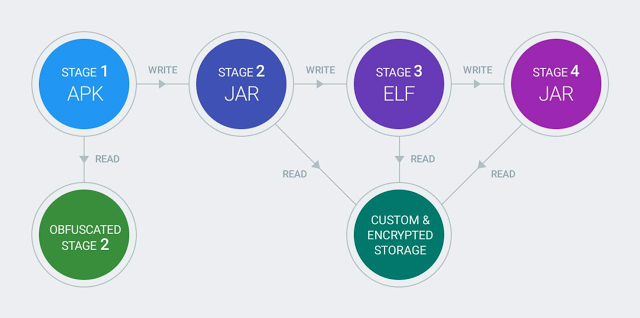

# 检测和消除Chamois，Android上的欺诈僵尸网络

原标题：Detecting and eliminating Chamois, a fraud botnet on Android  
链接：[https://android-developers.googleblog.com/2017/03/detecting-and-eliminating-chamois-fraud.html](https://android-developers.googleblog.com/2017/03/detecting-and-eliminating-chamois-fraud.html)  
作者：Bernhard Grill, Megan Ruthven, Xin Zhao (软件安全工程师)  
翻译：[arjinmc](https://github.com/arjinmc)  

  

Google努力保护各种设备和环境中的用户。这项工作的一部分涉及保护用户免遭[潜在有害应用](https://blog.google/topics/safety-security/shielding-you-potentially-harmful-applications/)（PHAs），这一方面使我们有机会观察针对我们生态系统的各种类型的威胁。例如，我们的安全团队最近发现并捍卫了我们的广告和Android系统的用户，针对我们命名为Chamois的新PHA家族。

Chamois是一个Android PHA系列，能够：

* 通过在广告中具有欺骗性图形的广告弹出窗口<b>生成无效流量</b>
* 执行<b>人工应用推广</b>通过自动安装应用程序在后台
* 通过发送[高级短信](https://en.wikipedia.org/wiki/Short_Message_Service#Premium-rated_short_messages)来执行<b>电话欺诈</b>
* 下载并执行其他插件

## 干扰广告生态系统

我们在例行的广告通讯质量评估中检测到了Chamois。我们分析了基于Chamois的恶意应用程序，发现他们采用了几种方法来避免检测，并试图通过显示欺骗性图形来欺骗用户点击广告。这有时导致下载其他发生短信欺诈的应用程序。所以我们使用[Verify Apps(验证应用程序)](https://support.google.com/accounts/answer/2812853?hl=en)阻止了Chamois应用程序家族   ，并且踢出了试图游戏我们的广告系统的坏角色。

我们以前的广告欺诈应用程序的经验使我们的团队能够迅速采取行动来保护我们的广告客户和Android用户。由于恶意应用没有出现在设备的应用列表中，大多数用户将无法看到或已知卸载不需要的应用。这就是为什么Google的[Verify Apps(验证应用程序)](https://support.google.com/accounts/answer/2812853?hl=en)非常有价值，因为它可以帮助用户发现PHA并将其删除。

## 在Chamois的敞篷下

Chamois是迄今为止在Android上看到的最大的PHA家族之一，并通过多个渠道分发。据我们所知，Google是第一个公开识别和追踪Chamois。

Chamois有许多功能使其不寻常，包括：
* <b>多阶段有效载荷</b>：其代码使用不同的文件格式在4个不同阶段执行，如图所示。

  

这个多阶段过程使得立即识别为PHA这个家庭中的应用程序变得更加复杂，因为这些层必须先剥离以达到恶意部分。然而，谷歌的管道并没有被欺骗，因为它们旨在正确地解决这些情况。

* <b>自我保护</b>：Chamois试图使用模糊和反分析技术来避开检测，但是我们的系统能够对付它们并相应地检测应用程序。
* <b>自定义加密存储</b>：该系列使用自定义的加密文件存储，用于其配置文件和需要更深入分析以了解PHA的附加代码。
* <b>尺寸</b>：我们的安全团队筛选了超过10万行的看似专业的开发人员编写的复杂代码。由于APK的庞大尺寸，需要一些时间来详细了解Chamois。

## Google打击PHA的方法

验证应用程序通过在下载时被确定为PHA的应用程序时警告它们，从而保护用户免受已知的PHA的攻击，并且还允许用户卸载应用程序（如果已安装）。此外，验证应用程序会监视Android生态系统的异常状态，并调查其发现的状态。它还通过设备上的行为分析来帮助查找未知的PHA。例如，由Chamois下载的许多应用程序被DOI得分手高度评级。我们已经在验证应用中实施了规则，以保护用户免受Chamois。

Google继续大力投资于Android及其广告系统的反滥用技术，我们为许多团队在幕后对抗像Chamois的PHA恶意程序的工作感到自豪。

我们希望本摘要能够深入了解Android僵尸网络日益复杂的情况。要了解有关Google反PHA工作的更多信息，并进一步改善其对用户，设备和广告系统的风险，请随时关注即将推出的“Android Security 2016年度回顾”报告。