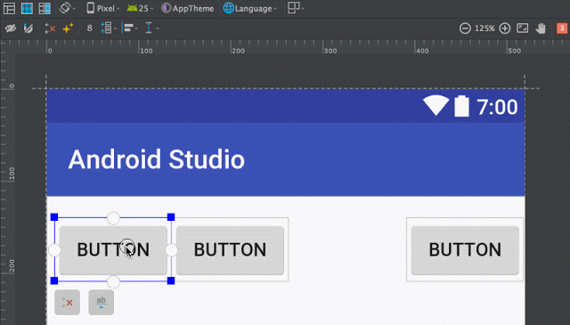
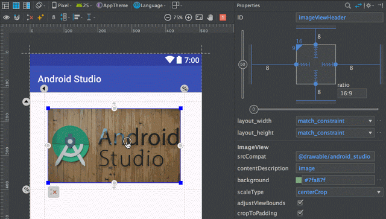
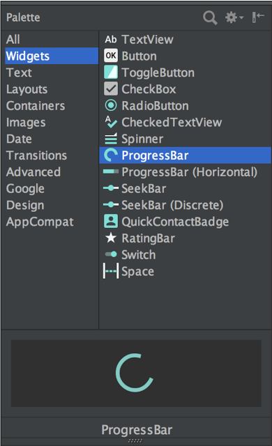
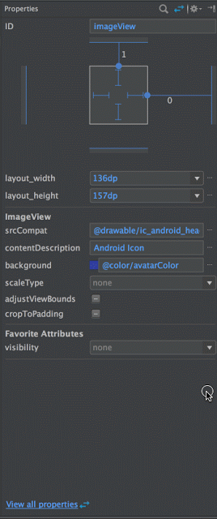
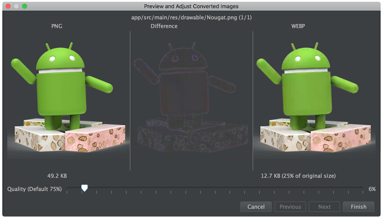
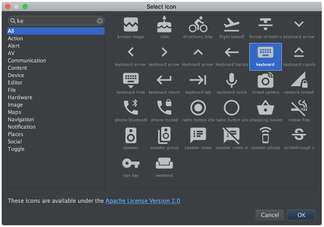
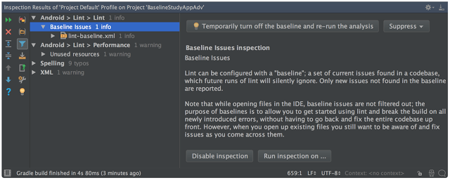
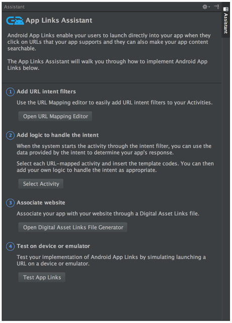
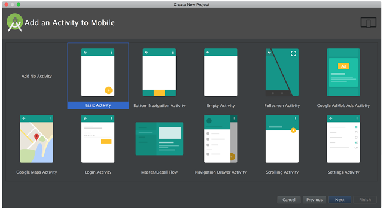
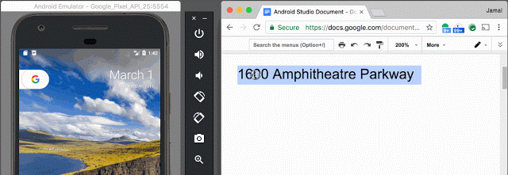

# Android Studio 2.3

原标题：Android Studio 2.3  
链接：[https://android-developers.googleblog.com/2017/03/android-studio-2-3.html](https://android-developers.googleblog.com/2017/03/android-studio-2-3.html)  
作者：Jamal Eason (Android产品经理)  
翻译：[arjinmc](https://github.com/arjinmc)  

Android Studio 2.3 今天可以[下载](https://developer.android.com/studio/index.html)。该版本的重点是整个IDE的质量改进。我们感谢你们迄今为止所有的反馈。我们致力于继续投资于为世界各地数以百万计的Android应用开发人员提供Android Studio快速无缝的功能。

我们对Android Studio 2.3中的质量改进感到非常兴奋，但你们将在本版本中发现一组集成到开发流程的每个阶段的新功能。在设计应用程序时，利用更新后的[WebP支持](https://developer.android.com/studio/write/convert-webp.html)你的应用程序图像，查看更新了[ConstraintLayout](https://developer.android.com/training/constraint-layout/index.html)库支持和在[布局编辑器](https://developer.android.com/studio/write/layout-editor.html)中和窗口小部件调色板。当你在开发中，Android Studio有一个新的[App Link Assistant(app关联助手)](https://developer.android.com/studio/write/app-link-indexing.html)，可帮助你在应用程序中构建和统一查看你的URI。在构建和部署应用程序时，使用更新的运行按钮可以获得更直观和可靠的[Instant Run(即时运行)](https://developer.android.com/studio/run/index.html#instant-run)体验。最后，在使用Android模拟器测试你的应用程序时，你现在可以正确的复制和粘贴文本支持。

[视频介绍链接](https://youtu.be/VFyKclKBGf0)
<small>Android Studio 2.3的新功能</small>

有关我们在质量改进Android Studio 2.3上添加的功能的更多详细信息，请查看以下新功能的列表：

## 建立

* <b>即时运行改进和UI更改</b>： 作为我们关注质量的一部分，我们对Android Studio 2.3中的Instant Run进行了一些重大更改，使功能更可靠。<b>运行</b>操作现在将始终导致应用程序重新启动，以反映可能需要重新启动的代码中的更改，并且 新的“应用更改” 操作将尝试在应用程序继续运行时交换代码。潜在的实施方式已经发生了重大变化，从而提高了可靠性，我们还消除了启用Instant Run的应用程序的启动滞后。[了解详情](https://developer.android.com/studio/run/index.html#instant-run)。

  
<small>新的即时运行按钮操作</small>

* <b>构建缓存</b>：默认情况下在Android Studio 2.2中引入但禁用，构建缓存是一种底层构建优化，可在Android Studio中更快地构建。通过缓存分解的AAR和预映射的外部库，新的构建缓存导致更快的清理构建。这是一个用户范围的构建缓存，现在默认情况下使用Android Studio 2.3打开。[了解详情](http://d.android.com/studio/build/build-cache.html)。

## 设计
* <b>限制布局中的链接和比例支持</b>：Android Studio 2.3包括稳定版本[ConstraintLayout](https://developer.android.com/reference/android/support/constraint/ConstraintLayout.html),用此版本<small>ConstraintLayout</small>, 你现在可以将两个或更多的Android视图双向链接在一起形成一个组。当你想要将两个视图放在一起但希望将它们分散在空白空间时，这是有帮助的。 [了解详情](https://developer.android.com/training/constraint-layout/index.html#constrain-chain)。

  
<small>ConstraintLayout布局</small>

<small>ConstraintLayout</small>还支持比率，当你希望在包含布局扩展和收缩时保持小部件的宽高比时有用。[详细了解](http://d.android.com/training/constraint-layout/index.html#ratio)比率。另外，链和链<small>ConstraintLayout</small>都可以支持使用[ConstraintSet API](https://developer.android.com/reference/android/support/constraint/ConstraintSet.html)进行编程创建。

  
<small>ConstraintLayout的比率</small>

* <b>布局编辑器调色板</b>：在更新的布局编辑器中窗口小部件调色板允许你搜索，排序和过滤以查找布局的小部件，此外还可以在拖动到设计面板之前预览窗口小部件。[了解详情](https://developer.android.com/studio/write/layout-editor.html)。

  
<small>布局编辑器小部件选项板</small>

* <b>布局收藏夹</b>： 你现在可以在更新的布局编辑器属性面板中保存每个窗口小部件的喜爱属性。只需将高级面板中的属性设置为星号，它将显示在收藏夹部分下。[了解详情](https://developer.android.com/studio/write/layout-editor.html#edit-properties)。

  
<small>布局编辑器属性面板中的喜爱属性</small>

* <b>WebP支持</b>：为了帮助你在APK中节省空间，Android Studio现在可以从项目中的PNG资产生成WebP图像。WebP无损格式比PNG[小25％](https://developers.google.com/speed/webp/docs/webp_lossless_alpha_study#results)。使用Android Studio 2.3，你有一个新的向导将PNG转换为无损的WebP，还允许你检查有损的WebP编码。右键单击任何非启动器PNG文件以转换为WebP。如果你需要编辑图像，还可以右键单击项目中的任何WebP文件以转换回PNG。[了解详情](https://developer.android.com/studio/write/convert-webp.html)。

  
<small>WebP图像转换向导</small>

* <b>材料图标向导更新</b>：更新的矢量素材向导支持搜索和过滤，并加上每个图标资产的标签。[了解详情](https://developer.android.com/studio/write/vector-asset-studio.html#materialicon)。

  
<small>矢量资产向导</small>

## 发展
* <b>Lint Baseline</b>：使用Android Studio 2.3，你可以将未解析的lint警告设置为项目中的基准。从这一点来看，Lint只会报告新的问题。如果你的应用程序中有许多遗留的lint问题，那么这很有帮助，但只想重点解决新问题。 了解更多关于Lint基线和本版本中添加的[新Lint检查和注释](https://developer.android.com/studio/releases/index.html)。

  
<small>Lint Baseline支持</small>

* <b>App Links助手</b>：Android Studio支持Android应用程序链接在你的应用程序现在更容易。新的App Links Assistant允许你轻松地为你的网址创建新的意图过滤器，通过数字资产链接文件声明你的应用程序的网站关联，并测试你的Android App Links支持。要访问App Link点击Tools → App Link Assistant。[了解详情](https://developer.android.com/studio/write/app-link-indexing.html)。

  
<small>App Links助手</small>

* <b>模板更新</b>：默认情况下所有[模板](https://developer.android.com/studio/projects/templates.html)用的是RelativeLayout，现在使用的Android Studio 2.3中包含的[ConstraintLayout](https://developer.android.com/training/constraint-layout/index.html)。了解有关模板和约束布局的更多信息。我们还添加了一个新的底部导航Activity模板，其实现了底部导航Material Design[指南](https://material.io/guidelines/components/bottom-navigation.html)。

  
<small>新建项目向导模板</small>

* <b>IntelliJ平台更新</b>：Android Studio 2.3包括IntelliJ 2016.2版本，其具有增强功能，例如更新的检查窗口和通知系统。[了解详情](https://www.jetbrains.com/idea/whatsnew/#v2016-2)。

## 测试
* <b>Android模拟器复制和粘贴</b>：回到热门需求，我们将复制和粘贴功能添加到最新的模拟器（v25.3.1）。我们在Android模拟器和主机操作系统之间拥有一个共享剪贴板，这将允许你在两个环境之间复制文本。复制和粘贴使用x86 Google API仿真器系统映像API Level 19（Android 4.4 - Kitkat）及更高版本。

  
<small>在Android模拟器中复制和粘贴支持</small>

* <b>Android模拟器命令行工具</b>：从Android SDK工具25.3开始，我们<b>emulator</b>将SDK Tools文件夹移动到单独的模拟器目录中，并且已经使用独立avdmanager替代“<small>android avd</small>”命令。以前的命令行参数<small>emulator</small>和“<small>android avd</small>”将与更新的工具一起使用。我们还添加了<small>emulator</small>命令的位置重定向。但是，如果通过命令行直接创建Android虚拟设备（AVD），则应更新任何相应的脚本。如果你通过Android Studio 2.3使用Android模拟器，这些更改不会影响你的工作流程。[了解详情](https://developer.android.com/studio/releases/sdk-tools.html)。

总结，Android Studio 2.3包括这些新功能和更多：

## 开发

* [Link BaseLine](https://developer.android.com/studio/write/lint.html#snapshot)
* [更新了Lint Checks＆Annotations](https://developer.android.com/studio/releases/index.html)
* [App Link Assistant](https://developer.android.com/studio/write/app-link-indexing.html)
* [模板](https://developer.android.com/studio/projects/templates.html)中默认Constraint Layout 
* [Intellij平台更新2016.2](https://www.jetbrains.com/idea/whatsnew/#v2016-2)

## 构建

* [即时运行UI更改](https://developer.android.com/studio/run/index.html#instant-run)
* [构建缓存](https://developer.android.com/studio/build/build-cache.html)

## 设计

* Constraint Layout的[布局链条](https://developer.android.com/training/constraint-layout/index.html#constrain-chain)和[比率](https://developer.android.com/training/constraint-layout/index.html#ratio)
* [布局编辑器中的小部件调色板](https://developer.android.com/studio/write/layout-editor.html)
* [收藏夹在属性检查器](https://developer.android.com/studio/write/layout-editor.html#edit-properties)
* [WebP支持](https://developer.android.com/studio/write/convert-webp.html)
* [搜索物料图标向导](https://developer.android.com/studio/write/vector-asset-studio.html#materialicon)

## 测试

* [模拟器的复制和粘贴](https://developer.android.com/studio/run/emulator.html)
* [模拟器的命令行工具](https://developer.android.com/studio/releases/sdk-tools.html)
* 
通过查看发行说明了解有关Android Studio 2.3的[更多信息](https://developer.android.com/studio/releases/index.html)。

## 入门
### 下载
如果你使用的是先前版本的Android Studio，你可以从导航菜单（Help→Check for Update[Windows / Linux]，Android Studio→Check for Update[OS X]）检查稳定通道的更新。你也可以从官方[下载页面](https://developer.android.com/studio/index.html)下载Android Studio 2.3 。为了利用Android Studio中的所有新功能和改进功能，你还应该将当前应用程序项目中的Android Gradle插件版本更新为2.3.0。

我们感谢你的任何反馈意见，如果你希望看到的问题或功能，在我们的[Google+专页](https://plus.google.com/103342515830390186255)或[Twitter](http://www.twitter.com/androidstudio)上与我们联系 - Android Studio开发小组。
