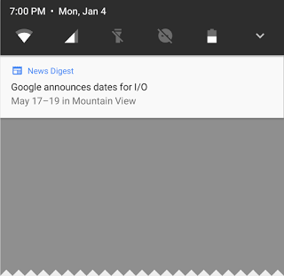
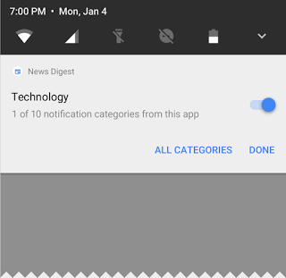

# 我的天啊，Android O开发者预览版在这里

原标题：O-MG, the Developer Preview of Android O is here!  
链接：[https://android-developers.googleblog.com/2017/03/first-preview-of-android-o.html](https://android-developers.googleblog.com/2017/03/first-preview-of-android-o.html)  
作者：Dave Burke (工程副总裁)  
翻译：[arjinmc](https://github.com/arjinmc)  

自2008年第一次推出以来，Android项目对应用开发人员和设备制造商以及用户当然充满活力的生态系统提供了不可思议的反馈。最近，我们一直在努力改进我们的工程流程，以便我们能够更早地，更公开地与我们的合作伙伴分享我们的工作。

所以，今天，我很高兴分享下一个版本的操作系统的第一个Android O的[开发者预览](http://developer.android.com/preview)。通常的注意事项适用：这是早期的，有更多的功能来了，还有很多稳定和性能前进我们。但它是启动:)。

在接下来的几个月中，我们将发布更新的开发者预览，我们将在5月份对[Google I/O大会](https://events.google.com/io/)的所有Android的东西进行深入的探索。在此期间，我们希望你对尝试新功能的反馈，当然也可以在新操作系统上测试你的应用。

## O的新功能

Android O引入了许多在你的应用程序中使用的新功能和API。这里只是一些新的东西，你可以开始尝试在这第一个开发者预览：

<b>背景限制</b>：基于我们在Nougat开始的工作，Android O将提高用户的电池寿命和设备的互动性能放在首位。为了实现这一点，我们已经在三个主要方面对隐含广播，后台服务和位置更新在后台对自己的应用程序进行了额外的自动限制。这些更改将使你更容易创建对用户设备和电池影响最小的应用程序。背景限制是Android的一个重大变化，所以我们希望每个开发人员都熟悉它们。有关详细信息，请查看有关[后台执行限制](https://developer.android.com/preview/features/background.html)和[后台位置限制](https://developer.android.com/preview/features/background-location-limits.html)的文档。

<b>通知渠道</b>： Android O还引入[通知渠道](https://developer.android.com/preview/features/notification-channels.html)，这是通知内容的新应用定义类别。渠道让开发者能够对用户对不同类型的通知进行细粒度的控制 - 用户可以单独阻止或更改每个渠道的行为，而不是一起管理所有应用的通知。

  
<small>通知渠道可让用户控制你的应用的通知类别</small>

Android O还会将新的视觉效果和分组添加到通知中，使用户可以更轻松地查看发送消息或正在浏览通知屏幕时发生的情况。

<b>Autofill APIs</b>: Android用户已经以来大量的密码管理器去自动填写登录和重复的信息，这样设置app或者转移信息更佳容易。现在我们通过系统兼容自动填写把这个工作变得更简单地穿梭在这个生态系统。用户可以选择一个自动填写的app，类似他们选择输入法。自动填写app会存储并安全保护用户信息，像地址，用户名，甚至密码。对于那些提供自动填写的app，我们[新增了一些api](https://developer.android.com/preview/features/autofill.html)实现了自动填写服务。

<b>PIP手机和新窗口功能</b>：[画中画（PIP）](https://developer.android.com/preview/api-overview.html#opip)显示现在可以在手机和平​​板电脑上使用，因此用户可以在接听聊天或打车的同时继续观看视频。应用程序可以将自己置于PiP模式，从恢复或系统支持的暂停状态 - 你可以指定宽高比和一组自定义交互（如播放/暂停）。其他新的窗口功能包括一个[新的应用程序覆盖窗口](https://developer.android.com/preview/behavior-changes.html?#cwt)，用于使用应用程序而不是系统警报窗口，以及支持在远程显示器上启动活动的[多显示器支持](https://developer.android.com/preview/api-overview.html#mds)。

<b>XML中的字体资源</b>：[字体](https://developer.android.com/preview/features/working-with-fonts.html)现在是Android O中完全支持的资源类型。应用程序现在可以使用XML布局中的字体，以及在XML中定义字体系列 - 声明字体样式和比重以及字体文件。

<b>自适应图标</b>：为了帮助你更好地与设备UI集成，现在可以根据设备选择的掩码创建系统以不同形状显示的[自适应图标](https://developer.android.com/preview/features/adaptive-icons.html)。系统还会与图标进行动画交互，并在启动器，快捷方式，设置，共享对话框和概览屏幕中使用它们。

  
<small>自适应图标以不同的设备型号显示各种形状。</small>

<b>适用于应用的宽色域颜色</b>：成像应用程序的Android开发人员现在可以利用具有广域色彩显示的新设备。要显示宽色域图像，应用程序将需要在其清单（每个Activity）中启用一个标志，并使用嵌入式广泛的颜色配置文件（AdobeRGB，Pro Photo RGB，DCI-P3等）加载位图。

<b>连接</b>：为了最终的音频保真度，Android O现在还支持高品质的蓝牙音频编解码器，如[LDAC编解码器](https://www.sony.net/Products/LDAC/)。我们还添加了新的Wi-Fi功能，如Wi-Fi Aware，以前称为邻居意识网络（NAN）。在具有适当硬件的设备上，应用程序和附近的设备可以通过Wi-Fi发现并通过互联网接入点进行通信。我们正在与我们的硬件合作伙伴一起尽快将Wi-Fi Aware技术带入设备。

电信框架正在继承[ConnectionService API](https://developer.android.com/reference/android/telecom/ConnectionService.html)，使第三方调用应用程序与系统UI集成，并与其他音频应用程序无缝运行。例如，应用程序可以在不同类型的UI（如汽车头单元）中显示和控制其呼叫。

<b>键盘导航</b>：随着Chrome操作系统和其他大尺寸的Google Play应用的出现，我们看到这些应用程序中键盘导航功能的复苏。在Android O中，我们专注于为“箭头”和“选项卡”导航构建更可靠，可预测的模型，从而帮助开发人员和最终用户。

<b>用于Pro Audio的AAudio API</b>： AAudio是一种新的本机API，专为需要高性能，低延迟音频的应用而设计。使用AAudio的应用程序通过流读取和写入数据。在开发者预览版中，我们发布了这个新API的早期版本，以获得你的反馈。

<b>WebView增强功能</b>：在Android Nougat中，我们为WebView引入了可选的多进程模式，将Web内容的处理移动到一个独立的进程中。在Android O中，我们默认启用多进程模式，并添加一个[API来让你的应用程序处理错误和崩溃](https://developer.android.com/preview/features/managing-webview.html)，以提高安全性并提高应用程序的稳定性。作为进一步的安全措施，你现在可以选择使用应用程序的WebView对象通过[Google安全浏览验证](https://developer.android.com/preview/features/managing-webview.html#gsb)网址。

<b>Java 8语言API和运行时优化</b>： Android现在支持几种新的Java语言API，包括新的java.time API。此外，Android Runtime比以往任何时候都更快，在某些应用程序基准上可以提高到两倍。

<b>合作伙伴平台贡献</b>：硬件制造商和硅片合作伙伴已经在O版本中加速了Android平台的修复和增强。例如，索尼已经贡献了超过30个功能增强功能，包括[LDAC编解码器](https://www.sony.net/Products/LDAC/)和250个错误修复程序到Android O.

## 开始几个简单的步骤

首先，<b>使你的应用程序兼容</b>，让你的用户无缝过渡到Android O。只需下载[设备系统映像](https://developer.android.com/preview/download.html)或仿真器系统映像，安装你当前的应用程序并进行测试 - 应用程序应该运行并且看起来不错，并且正确处理[行为更改](https://developer.android.com/preview/behavior-changes.html)。完成任何必要的更新后，我们建议你立即发布到Google Play，而无需更改应用的平台定位。

## 搭建Android O

准备好后，<b>深入了解O</b>，了解你可以利用应用程序的所有内容。有关[预览的时间轴](https://developer.android.com/preview/overview.html)，[行为更改](https://developer.android.com/preview/behavior-changes.html)，[新API](https://developer.android.com/preview/api-overview.html)和[支持资源](https://developer.android.com/preview/feedback.html)的详细信息，请访问[O Developer Preview网站](https://developer.android.com/preview/index.html)。

规划你的应用程序如何支持[后台限制](https://developer.android.com/preview/features/background.html)和[其他更改](https://developer.android.com/preview/behavior-changes.html#o-apps)。尝试一些在你的应用程序中的强大的新功能- [通知渠道](https://developer.android.com/preview/features/notification-channels.html)，[PIP](https://developer.android.com/preview/api-overview.html#opip)，[自适应图标](https://developer.android.com/preview/features/adaptive-icons.html)，[字体资源的XML](https://developer.android.com/preview/features/working-with-fonts.html)，[自动调整大小TextView](https://developer.android.com/preview/features/autosizing-textview.html)，和[其他许多人](https://developer.android.com/preview/api-overview.html)。为了更轻松地探索Android O中的新API，我们将[API差异报告](https://developer.android.com/sdk/api_diff/o-dp1/changes.html)与[Android O API指南](https://developer.android.com/reference/packages.html)一起引入了线上。

最新的canary版[Android Studio 2.4](https://developer.android.com/studio/preview/)包含了新功能，可帮助你开始使用Android O。你可以从Android Studio内部下载并设置O预览SDK，然后使用Android O的[XML字体资源](https://developer.android.com/preview/features/working-with-fonts.html)，并在Layout Editor中[自动调整TextView](https://developer.android.com/preview/features/autosizing-textview.html)。观看更多的Android O支持在未来几周内。

我们还发布了一个[alpha版本的26.0.0支持库](https://developer.android.com/topic/libraries/support-library/revisions.html)供你尝试。此版本添加了大量新的API，并将minSdkversion增加到14.有关详细信息，请参阅发行说明。

## 预览更新

O开发者预览包括一个更新的SDK与系统图像，用于在官方Android模拟器和Nexus 5X，Nexus 6P，Nexus Player，Pixel，Pixel XL和Pixel C设备上进行测试。如果你正在构建可穿戴设备，那么还有一个用于在Android O上测试Android Wear 2.0的模拟器。

我们计划在O Developer Preview中定期更新预览系统映像和SDK。此初始预览版本仅<b>供开发人员</b>使用，不适合日常或消费者使用，因此我们只能提供<b>手动下载和闪存</b>。[下载和说明在这里](https://developer.android.com/preview/download.html)。

随着我们更接近最终产品，我们将邀请消费者尝试一下，当时我们将通过Android Beta打开报名。请继续关注细节，但现在请注意，<b>Android测试版目前不支持Android O</b>。

## 给我们你的反馈

一如往常，你的反馈至关重要，请[让我们知道你的想法](https://developer.android.com/preview/feedback.html) - 我们越早听到你的反馈，我们可以整合更多的反馈。当你发现问题时，请[在这里报告](https://issuetracker.google.com/issues/new?component=190602&template=809005)。我们已经转移到一个更强大的工具，[问题跟踪器](https://issuetracker.google.com/)，它也在Google内部使用，以在产品开发过程中跟踪错误和功能请求。我们希望你会发现它[更容易使用](https://developers.google.com/issue-tracker/)。

