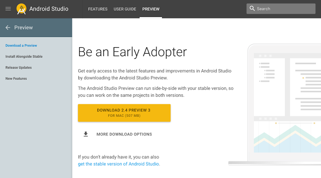

# 呼吁早期采用Android Studio预览版

原标题：Calling all early adopters for Android Studio previews  
链接：[https://android-developers.googleblog.com/2017/03/calling-all-early-adopters-for-android.html](https://android-developers.googleblog.com/2017/03/calling-all-early-adopters-for-android.html)  
作者：Scott Main (科技文作者)  
翻译：[arjinmc](https:github.com/arjinmc)  

如果你喜欢尝试[Android Studio](https://developer.android.com/studio/index.html)中的所有最新功能，并帮助我们使其成为更好的IDE，那么我们可以更轻松地使用[新网站](http://developer.android.com/studio/preview/index.html)下载早期预览版本  。在这里，你可以下载并保持最新的Android Studio预览和其他工具公告。

  

Android Studio预览可让你早日访问IDE各个方面的新功能，以及早期版本的其他工具，如Android模拟器和平台SDK预览。你可以并排安装多个版本的Android Studio，因此如果预览版本中的错误阻止了你的应用开发，你可以从稳定版本继续处理相同的项目。

上周刚刚推出[Android Studio 2.4](https://developer.android.com/studio/preview/)
的最新预览版，它包含了通过Android O Developer Preview支持开发的新功能。你可以从Android Studio内部下载并设置O预览SDK，然后使用Android O的XML字体资源，并在Layout Editor中自动调整TextView。

通过使用Android Studio预览构建你的应用程序，还帮助我们创建一个更好的Android Studio版本。[如果你遇到任何bug，我们想要收到你的来信](https://developer.android.com/studio/report-bugs.html)。

