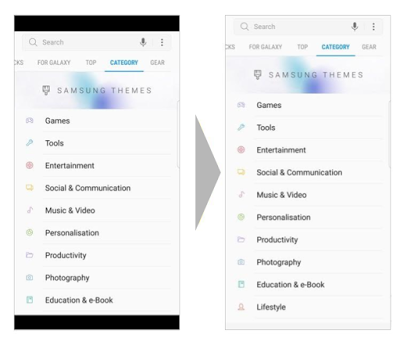

# 更新你的app适配较大横比的新Android旗舰设备

原标题：Update your app to take advantage of the larger aspect ratio on new Android flagship devices  
链接：[https://android-developers.googleblog.com/2017/03/update-your-app-to-take-advantage-of.html](https://android-developers.googleblog.com/2017/03/update-your-app-to-take-advantage-of.html)  
作者：Neto Marin（Google Play 开发者支持)
翻译：[arjinmc](https://github.com/arjinmc)  

为了向用户提供更具吸引力的视觉体验，许多Android OEM开发商正在尝试使用新的超宽屏智能手机。三星刚刚宣布推出新款旗舰设备，即[三星Galaxy S8](http://samsung.com/galaxys8)，采用全新的显示格式，宽高比为18.5：9。LG移动世界大会在今年早些时候推出了新的旗舰设备，即[LG G6](http://lg.com/us/g6)，屏幕长宽比为18：9。

  

<small>（左）在18.5：9设备上，最大纵横比设置为16：9的应用程序 </small>   
<small>（右）在18.5：9设备上，最大宽高比设置为或超过18.5：9的应用程序</small>

为了充分利用这些设备上更大的显示格式，你应该考虑增加应用程序的最大支持宽高比。要这样做，只需在应用程序的元素中声明一个元素：在[<application>](https://developer.android.com/guide/topics/manifest/application-element.html) 内加入一个[<meta-data>](https://developer.android.com/guide/topics/manifest/meta-data-element.html) 标签android.max_aspect
```java
<meta-data android:name="android.max_aspect"
    android:value="ratio_float"/>
```

其中，ratio_float是应用程序可以支持的最大宽高比，以十进制形式表示为（较长维度/较短维度）。

我们建议你设计应用程序以支持2.1或更高版本的宽高比。为此， 你可以将以下内容添加到[<application>](https://developer.android.com/guide/topics/manifest/application-element.html)标签中：
```java
<meta-data android:name="android.max_aspect" android:value="2.1" />
```

<b>注意</b>：如果你没有设置值，而[android:resizeableActivity](https://developer.android.com/guide/topics/ui/multi-window.html#configuring)不是true，则最大宽高比默认为1.86（大约16：9），你的应用程序将不会占用额外的屏幕空间。

随着越来越多的超宽屏Android设备（如Samsung Galaxy S8和LG G6）成为可用，你将有更多机会展示更多内容，并为你的应用创造更多吸引人的体验。

有关如何支持Android上的多个屏幕的详细信息，请访问这个页面[支持多种屏幕](https://developer.android.com/guide/practices/screens_support.html)。