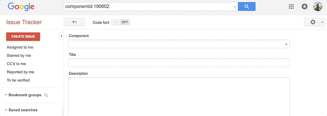

# AOSP开发者的新问题跟踪器

原标题：A New Issue Tracker for our AOSP Developers  
链接：[https://android-developers.googleblog.com/2017/04/a-new-issue-tracker-for-our-aosp.html](https://android-developers.googleblog.com/2017/04/a-new-issue-tracker-for-our-aosp.html)  
作者：Sandie Gong (开发者关系程序经理) & Chris Iremonger（Android技术程序经理）  
翻译：[arjinmc](https://github.com/arjinmc)  

像Google的许多其他问题跟踪器一样，我们将Android开源项目（AOSP）问题跟踪系统升级到[问题跟踪](http://issuetracker.google.com/)。我们希望通过使用我们在Google内部使用的工具，在产品开发过程中跟踪错误和功能请求，从而促进开发人员和Android产品团队之间更好的协作。

从今天开始，以前在code.google.com/p/android/issues上的所有问题都将迁移到[Android公共跟踪器组件](https://issuetracker.google.com/issues?q=componentid:190923%2B%20status:open)下的问题跟踪。你可能已经注意到，我们已经在使用新工具来收集O开发者预览的反馈！

## 已迁移的内容

* [你提交的所有开放和封闭的问题](https://issuetracker.google.com/issues?q=componentid:190923%2B%20reporter:me)
* [所有你的关注问题](https://issuetracker.google.com/issues?q=componentid:190923%2B%20star:true)
* [你已经评论过的所有问题](https://issuetracker.google.com/issues?q=componentid:190923%2B%20modifier:me)

## 开始使用问题跟踪器

你可以从我们的[开发人员文档](https://developers.google.com/issue-tracker/)中了解更多有关导航我们的问题跟踪器的信息。默认情况下，问题跟踪器仅显示分配给你的问题。你可以轻松地[更改](https://developers.google.com/issue-tracker/guides/set-a-homepage)，以显示你选择的热门列表，书签组或已保存的搜索。你还可以通过单击右上角的齿轮图标并选择设置来[调整通知设置](https://developers.google.com/issue-tracker/guides/set-notification-preferences)。

问题跟踪器中的映射也与code.google.com略有不同，因此请务必查看[Bug的生命](https://source.android.com/source/life-of-a-bug.html)，以了解有关各种状态的含义。

  

## 搜索组件特定问题

打开code.google.com问题链接将自动将你重定向到新系统。我们已经清理了一些垃圾邮件，但你可以在问题跟踪器中的code.google.com中找到所有其他问题，包括[你报告，评论或加星标的任何问题](https://issuetracker.google.com/issues?q=componentid:190923%2B%20(modifier:me%20%7C%20reporter:me%20%7C%20star:true)。

你可以在[Android公共跟踪器组件](https://issuetracker.google.com/issues?q=componentid:190923%2B%20status:open)中查看所有报告的Android问题，并深入查看特定类别问题的报告问题，例如工具和支持库，通​​过[搜索特定组件](https://developers.google.com/issue-tracker/concepts/components#search)。

## 提交错误或功能请求

在提交新问题之前，请检查是否已经在[问题列表](https://issuetracker.google.com/issues?q=componentid:190923%2B%20status:open)中报告。让我们知道什么问题对你而言是主要的现有问题。

提交新问题很容易。单击“创建问题”后，搜索适合你的问题的组件。或者，你可以按照[bug报告](https://source.android.com/source/report-bugs.html)中列出的每个组件遵循正确的问题创建链接。

## 这是一些有用的链接，让您开始！

话题  | 相关链接
----- | ------------ 
在Android组件中导航和创建问题 | [Android公开追踪程式组件下的所有开放问题](https://issuetracker.google.com/issues?q=componentid:190923%2B%20status:open)  [你报告，评论或加星标的Android问题](https://issuetracker.google.com/issues?q=componentid:190923%2B%20modifier:me%20%7C%20reporter:me%20%7C%20star:true)  [如何提交新的Android错误或功能请求](https://source.android.com/source/report-bugs.html)  [在AOSP问题跟踪器中提交错误后，会发生什么](https://source.android.com/source/life-of-a-bug.html)  
浏览Google问题跟踪器 | [Google问题跟踪开发者文档](https://developers.google.com/issue-tracker/)  [更改问题跟踪器主页](https://developers.google.com/issue-tracker/guides/set-a-homepage) [在问题跟踪中搜索](https://developers.google.com/issue-tracker/concepts/searches)
Google问卷追踪公告其他产品 | [博客帖子宣布云平台转移到问题跟踪](https://cloudplatform.googleblog.com/2017/03/a-new-issue-tracker-for-Google-Cloud-Platformud.html)  [博客帖子宣布GSuite转移到问题跟踪](https://gsuite-developers.googleblog.com/2017/03/a-new-issue-tracker-for-g-suite.html)

