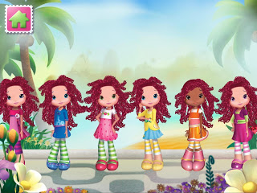
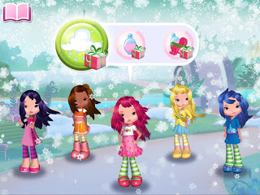

# 儿童应用入门：Budge Studios分享怎样创造更具吸引力的家庭式体验

原标题：App onboarding for kids: how Budge Studios creates a more engaging experience for families  
链接：[https://android-developers.googleblog.com/2017/04/app-onboarding-for-kids-how-budge.html](https://android-developers.googleblog.com/2017/04/app-onboarding-for-kids-how-budge.html)  
作者：Josh Solt (Google Play儿童app技术支持经理)， Noemie Dupuy (Budge Studios创始人兼联合首席执行官)  
翻译：[arjinmc](https://github.com/arjinmc)  

开发人员花费大量资源驱使用户下载应用程序，但接下来发生的事情通常最关键就是用户之旅。用户入场在孩子们的空间中特别细微，因为开发人员必须考虑两个观众：父母和孩子。正确的做法是，引人入胜的体验将满足父母和孩子的需求，同时也会考虑到孩子注意力的独特考虑。

[Budge Studios](https://g.co/play/budge)已经成功地增加了他们的孩子们的头衔的目录，使其成为他们的业务焦点。他们的目标人口是三至八岁,代表作包括Strawberry Shortcake, Hello Kitty, Crayola, Caillou and The Smurfs（蓝精灵）。

>“第一印象重要，因为这样做用户第一次体验你的应用程序。事实上，70％（1原作者注释）的用户会在下载应用程序一日之内就删除它，留下第二次机会很少的时间。作为孩子的内容专家，Budge带领孩子们知识，以改善和优化入职体验，从而增加初始游戏循环的完成和保留。” - Noemie，Budge Studios创始人兼联合首席执行官

<b>Budge Studios设计更好的入门经验的三个关键方面：</b>

1. <b>确保你的游戏是为孩子量身定做的</b>

当Budge发布他们的应用程序[Crayola Colorful Creatures](https://play.google.com/store/apps/details?id=com.budgestudios.CrayolaColorfulCreatures_google&hl=en&e=-EnableAppDetailsPageRedesign)时，他们查看了数据，找出机会，为孩子们创造更平滑的入场流程。在推出时，只有25％的初次使用者完成了最初的游戏循环。Budge分析数据反对游戏，并意识到最新的活动导致大幅下降。它需要孩子使用设备的麦克风，这对于太小的孩子来说太过挑战了。Budge能够调整初始游戏循环，以便最年轻的玩家可以使用所有功能。这些调整几乎使初始循环完成增加了三倍，导致74％的初次用户进行了进一步的活动。

2. <b>通过 提供真正的价值 获得父母的信任</b>

Budge拥有大量的应用程序组合。通过为孩子提供有价值和有吸引力的经验来获得父母的信任对于保持用户在生态系统中取得长期成功至关重要。

随着每个新的应用程序，Budgefe区分了什么内容可以免费播放，什么内容必须购买。早期，Budge限制了他们提供的很多免费内容的数量，但随着时间的推移，实现了提供高品质的免费内容，增强了首次使用体验。如果孩子对一个标题有真正的兴趣，父母更愿意花在一个应用程序上。

与顶级孩子品牌合作意味着Budge可以利用流行的小孩角色的品牌忠诚度来提供价值。为了推出[Strawberry Shortcake Dreams](https://play.google.com/store/apps/details?id=com.budgestudios.StrawberryShortcakeDressUpDreams&hl=en&e=-EnableAppDetailsPageRedesign)，Budge决定提供这系列中最流行的角色Strawberry Shortcake，是一个自由的角色。Dress Up Dreams是Budge投资组合中最高的转换应用程序之一，表明免费提供最受欢迎的角色，帮助转化而不是伤害转化。 

3. <b>与真实用户进行测试</b>

Budge知道无法替代最终用户的直接反馈，所以Budge在每一步都涉及到孩子。Budge Playgroup是一个游戏测试程序，邀请家庭在Alpha，Beta和第一个可玩的开发阶段尝试应用程序。

早期测试的好处可以是了解孩子们的大小和协调程度， 孩子们的手响他们完成某些动作的能力，甚至可以握住设备，并且具体指向一个不太有效的按钮。 

在Strawberry Shortcake Holiday Hair的测试阶段，Budge遇到了应用程序主菜单的问题，如果孩子没有观察使用该应用程序，菜单式不明显的。

玩测试前：

  

玩测试后：

  

在原始设计中，用户通过音频提示开始游戏。在测试中，很明显，配音不足以引导孩子们而发挥作用，而额外的视觉线索将显着改善体验。简单的设计更改导致用户体验大大增强。

入门体验只是应用程序的一个组成部分，但是就像第一印象一样，它对用户对你的应用程序的感知具有不成比例的影响。正如Budge所经历的，涉及用户测试你的应用程序，使用数据来标记问题并为你的用户提供真正的价值，创造更平滑，更易于访问的板载经验，并带来更好的结果。

有关开发家庭应用和游戏的更多最佳实践，请查阅[家庭手册](https://play.google.com/store/books/details/Google_Inc_The_Family_Playbook_for_developers?id=-mi5CgAAQBAJ&hl=en)给开发人员。请访问Android Developers网站，了解最新的功能和最佳做法，帮助你在[Google Play上发展成功的业务](https://developer.android.com/distribute/best-practices/index.html)。

<small>作者注释</small>
1. [http://www.cmswire.com/customer-experience/mobile-app-retention-5-key-strategies-to-keep-your-customers/](http://www.cmswire.com/customer-experience/mobile-app-retention-5-key-strategies-to-keep-your-customers/)

