# Google Play颁奖典礼重返Google I/O大会

原标题：The Google Play Awards are returning to Google I/O  
链接：[https://android-developers.googleblog.com/2017/04/the-google-play-awards-are-returning-to.html](https://android-developers.googleblog.com/2017/04/the-google-play-awards-are-returning-to.html)  
作者：Purnima Kochikar，Google Play app和游戏事业部总监  
翻译: [arjinmc](https://github.com/arjinmc)  

[视频介绍](https://youtu.be/zkrlFy57WAA)

鼓声请响起！今年的Google Play奖将于5月18日星期四下午6:30（太平洋时间）举行，Google I / O大会是我们的年度开发者节。

年度仪式是行业认可优秀开发商的绝佳机会，这些开发商继续为优质应用和游戏设定条件，显示出对推动创新和采用新平台和用户体验的热情。

今年，我们将荣获12个奖项类别的合作伙伴，一些熟悉的和一些新的。被提名人选择与去年一样，跨越Google的跨职能团队，与相关类别和产品领域携手合作。虽然类别具体标准可以在下面找到，但所有类别的共同要求都集中在高星级评级上，技术性能和新鲜度，需要从2016年4月开始推出或重大更新。每个类别的获奖者将于5月在Google I / O上公布。
类别和提名人的完整列表如下，也可以在[g.co/play/GPA2017](https://g.co/play/gpa2017)找到：

### 独立开发商奖

来自独立开发商的游戏，专注于艺术设计，游戏机制和整体抛光。被提名人...... 

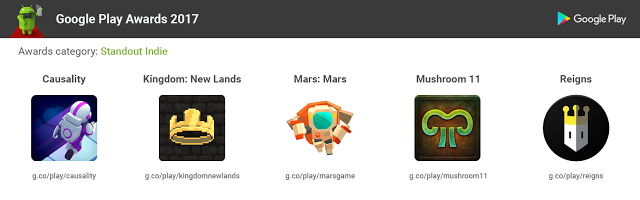  

* [Causality](https://play.google.com/store/apps/details?id=com.lojugames.android.Causality) by Loju
* [Kingdom: New Lands](https://play.google.com/store/apps/details?id=nl.noio.kingdom) by Raw Fury
* [Mars: Mars](https://play.google.com/store/apps/details?id=com.pomelogames.MarsGame) by Pomelo Games
* [Mushroom 11](https://play.google.com/store/apps/details?id=com.untame.mushroom11) by Untame
* [Reigns](https://play.google.com/store/apps/details?id=com.devolver.reigns) by DevolverDigital

### 创新奖

来自新开发人员的应用程序，提供独特的体验，同时实现强大的安装增长量 被提名人......

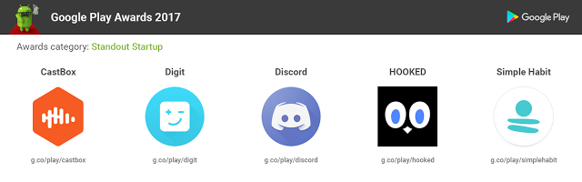  

* [CastBox](https://play.google.com/store/apps/details?id=fm.castbox.audiobook.radio.podcast&e=-EnableAppDetailsPageRedesign) by CastBox.FM
* [Digit](https://play.google.com/store/apps/details?id=digit.android&hl=en_GB&e=-EnableAppDetailsPageRedesign) by Hello Digit Inc.
* [Discord](https://play.google.com/store/apps/details?id=com.discord&e=-EnableAppDetailsPageRedesign) by Hammer & Chisel Inc.
* [HOOKED](https://play.google.com/store/apps/details?id=tv.telepathic.hooked&e=-EnableAppDetailsPageRedesign) by Telepathic
* [Simple Habit](https://play.google.com/store/apps/details?id=com.simplehabit.simplehabitapp&e=-EnableAppDetailsPageRedesign) by Simple Habit

### 最佳Android Wear体验

新的Wear 2.0应用程序提供了极好的设计，用户喜爱和功能。提名人是...

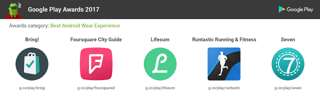  

* [Bring!](https://play.google.com/store/apps/details?id=ch.publisheria.bring&e=-EnableAppDetailsPageRedesign) by Bring! Labs AG
* [Foursquare City Guide](https://play.google.com/store/apps/details?id=com.joelapenna.foursquared&e=-EnableAppDetailsPageRedesign) by Foursquare
* [Lifesum](https://play.google.com/store/apps/details?id=com.sillens.shapeupclub&e=-EnableAppDetailsPageRedesign) by Lifesum
* [Runtastic](https://play.google.com/store/apps/details?id=com.runtastic.android&e=-EnableAppDetailsPageRedesign) by Runtastic
* [Seven](https://play.google.com/store/apps/details?id=se.perigee.android.seven&e=-EnableAppDetailsPageRedesign) by Perigee AB

### 最佳电视体验

应用程序或游戏利用大屏幕格式的创新功能，同时提供沉浸式和直观的体验。提名人是...

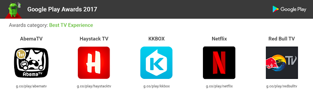  

* [AbemaTV](https://play.google.com/store/apps/dev?id=6759178670051565700&hl=en_GB&e=-EnableAppDetailsPageRedesign) by AbemaTV Inc.
* [Haystack TV](https://play.google.com/store/apps/details?id=com.haystack.android&e=-EnableAppDetailsPageRedesign) by Haystack TV
* [KKBOX](https://play.google.com/store/apps/details?id=com.skysoft.kkbox.android&hl=en&e=-EnableAppDetailsPageRedesign) by KKBOX International Ltd.
* [Netflix](https://play.google.com/store/apps/details?id=com.netflix.mediaclient&e=-EnableAppDetailsPageRedesign) by Netflix Inc.
* [Red Bull](https://play.google.com/store/apps/details?id=com.nousguide.android.rbtv&e=-EnableAppDetailsPageRedesign) TV by Red Bull

### 最佳VR体验

高度吸引力和身临其境的体验，最佳地使用Daydream UI。提名人是...

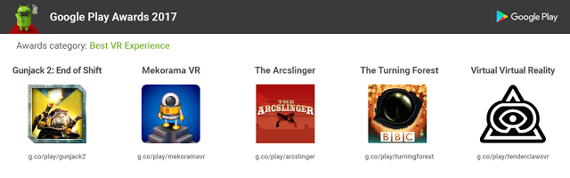  

* [Gunjack 2: End of Shift](https://play.google.com/store/apps/details?id=com.ccpgames.gunjack2&e=-EnableAppDetailsPageRedesign) by CCP Games
* [Mekorama](https://play.google.com/store/apps/details?id=com.martinmagni.mekorama.vr&e=-EnableAppDetailsPageRedesign) by Martin Magni
* [The Arcslinger](https://play.google.com/store/apps/details?id=com.brbent.thearcslinger&e=-EnableAppDetailsPageRedesign) by Big Red Button Entertainment, Inc.
* [The Turning Forest](https://play.google.com/store/apps/details?id=uk.co.bbc.turningforest&e=-EnableAppDetailsPageRedesign) by Media Applications Technologies for the BBC
* [Virtual Virtual Reality](https://play.google.com/store/apps/details?id=com.TenderClaws.VVR&e=-EnableAppDetailsPageRedesign) by Tender Claws

### 最佳AR体验

应用程序或游戏利用AR的创意和富有想象力的技术。提名人是...

  

* [Crayola Color Blaster](https://play.google.com/store/apps/details?id=com.legacygames.colorblaster&e=-EnableAppDetailsPageRedesign) by Legacy Games
* [Dinosaurs Among Us](https://play.google.com/store/apps/details?id=com.guidigo.tango.amnh&e=-EnableAppDetailsPageRedesign) by American Museum of Natural History
* [Holo](https://play.google.com/store/apps/details?id=com.eighti.tango.player&e=-EnableAppDetailsPageRedesign) by 8i LTD
* [Wayfair View](https://play.google.com/store/apps/details?id=com.wayfair.wayfairview&e=-EnableAppDetailsPageRedesign) by Wayfair, LLC
* [WOORLD](https://play.google.com/store/apps/details?id=com.Funomena.TangoWoorld&e=-EnableAppDetailsPageRedesign) by Funomena

### 儿童最佳应用程式
具有家庭友善设计的应用程序或游戏，鼓励创意，探索和教育。提名人是...

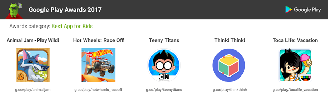  

* [Animal Jam - Play Wild!](https://play.google.com/store/apps/details?id=com.WildWorks.AnimalJamPlayWild&e=-EnableAppDetailsPageRedesign) by WildWorks
* [Hot Wheels: Race Off](https://play.google.com/store/apps/details?id=com.hutchgames.hotwheels&e=-EnableAppDetailsPageRedesign) by Hutch Games
* [Teeny Titans](https://play.google.com/store/apps/details?id=com.turner.ttgfigures&e=-EnableAppDetailsPageRedesign) by Cartoon Network
* [Think! Think!](https://play.google.com/store/apps/details?id=com.hanamarulab.thinkthinkapp&e=-EnableAppDetailsPageRedesign) by Hanamaru Lab
* [Toca Life: Vacation](https://play.google.com/store/apps/details?id=com.tocaboca.tocavacation&e=-EnableAppDetailsPageRedesign) by Toca Boca

### 最佳多人游戏

为游戏玩家建立竞争激烈的多人游戏体验。提名人是...

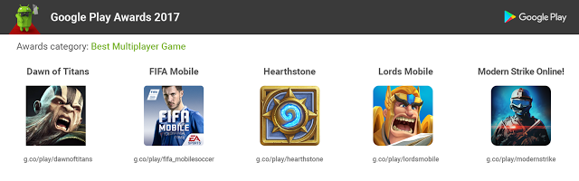  

* [Dawn of Titans](https://play.google.com/store/apps/details?id=com.naturalmotion.dawnoftitans&e=-EnableAppDetailsPageRedesign) by NaturalMotionGames Ltd
* [FIFA Mobile Soccer](https://play.google.com/store/apps/details?id=com.ea.gp.fifamobile&e=-EnableAppDetailsPageRedesign) by Electronic Arts
* [Hearthstone](https://play.google.com/store/apps/details?id=com.blizzard.wtcg.hearthstone&e=-EnableAppDetailsPageRedesign) by Blizzard Entertainment, Inc.
* [Lords Mobile](https://play.google.com/store/apps/details?id=com.igg.android.lordsmobile&e=-EnableAppDetailsPageRedesign) by IGG.com
* [Modern Strike Online](https://play.google.com/store/apps/details?id=com.gamedevltd.modernstrike&e=-EnableAppDetailsPageRedesign) by Game Development Ltd.

### 最佳应用

真正代表美观的设计，直观的用户体验和高用户吸引力。提名人是...

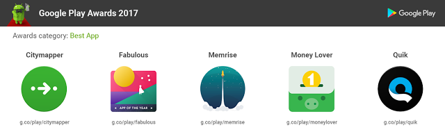  

* [Citymapper](https://play.google.com/store/apps/details?id=com.citymapper.app.release&e=-EnableAppDetailsPageRedesign) by Citymapper Limited
* [Fabulous: Motivate Me!](https://play.google.com/store/apps/details?id=co.thefabulous.app&e=-EnableAppDetailsPageRedesign) by TheFabulous
* [Memrise](https://play.google.com/store/apps/details?id=com.memrise.android.memrisecompanion&e=-EnableAppDetailsPageRedesign) by Memrise
* [Money Lover](https://play.google.com/store/apps/details?id=com.bookmark.money&e=-EnableAppDetailsPageRedesign) by Finsify
* [Quik](https://play.google.com/store/apps/details?id=com.stupeflix.replay&e=-EnableAppDetailsPageRedesign) by GoPro

### 最佳游戏

强大的力量，强大的图形和强大的参与和保留策略的游戏。提名人是...

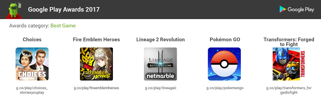  

* [Choices](https://play.google.com/store/apps/details?id=com.pixelberrystudios.choices&e=-EnableAppDetailsPageRedesign) by Pixelberry
* [Fire Emblem Heroes](https://play.google.com/store/apps/details?id=com.nintendo.zaba&e=-EnableAppDetailsPageRedesign) by Nintendo Co. Ltd.
* [Lineage 2 Revolution](https://play.google.com/store/apps/details?id=com.wetribe.a12962) by Netmarble Games
* [Pokémon GO](https://play.google.com/store/apps/details?id=com.nianticlabs.pokemongo&e=-EnableAppDetailsPageRedesign) by Niantic Inc
* [Transformers: Forged to Fight](https://play.google.com/store/apps/details?id=com.kabam.bigrobot&e=-EnableAppDetailsPageRedesign) by Kabam

### 最佳辅助功能体验

应用程序或游戏，以创新的方式进行设备交互，为残疾人或特殊需求服务。提名人是...

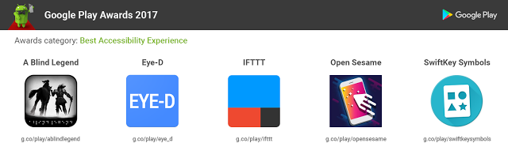  

* [A Blind Legend](https://play.google.com/store/apps/details?id=com.dowino.ABlindLegend&e=-EnableAppDetailsPageRedesign) by DOWINO
* [Eye-D](https://play.google.com/store/apps/details?id=in.gingermind.eyed&e=-EnableAppDetailsPageRedesign) by GingerMind Technologies
* [IFTTT](https://play.google.com/store/apps/details?id=com.ifttt.ifttt) by IFTTT
* [Open Sesame](https://play.google.com/store/apps/details?id=com.sesame.phone_nougat&e=-EnableAppDetailsPageRedesign) by Sesame Enable
* [SwiftKey Symbols](https://play.google.com/store/apps/details?id=com.swiftkey.symbols) by SwiftKey Greenhouse

### 最佳社会影响

为世界各地广泛的人造成有意义的社会影响的应用程序。提名人是...

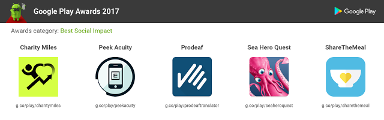  

* [Charity Miles](https://play.google.com/store/apps/details?id=com.charitymilescm.android&e=-EnableAppDetailsPageRedesign) by Charity Miles
* [Peek Acuity](https://play.google.com/store/apps/details?id=org.peekvision.public.android&e=-EnableAppDetailsPageRedesign) by Peak Vision
* [Prodeaf Translator](https://play.google.com/store/apps/details?id=com.Proativa.ProDeafMovel) by ProDeaf Tecnologias Assistivas
* [Sea Hero Quest](https://play.google.com/store/apps/details?id=com.glitchers.catchhero&e=-EnableAppDetailsPageRedesign) by GLITCHERS
* [ShareTheMeal](https://play.google.com/store/apps/details?id=org.sharethemeal.app&e=-EnableAppDetailsPageRedesign) by United Nations

5月18日下午6:30在Google I / O的PDT上，或通过live stream直播观看谁会赢得奖项。

