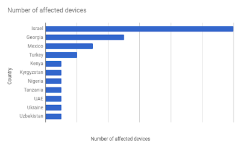

# Android上的一个侦查的恶意软件Chrysaor

原标题：An investigation of Chrysaor Malware on Android
链接：[https://android-developers.googleblog.com/2017/04/an-investigation-of-chrysaor-malware-on.html](https://android-developers.googleblog.com/2017/04/an-investigation-of-chrysaor-malware-on.html)  
作者：Rich Cannings, Jason Woloz, Neel Mehta, Ken Bodzak, Wentao Chang, Megan Ruthven 
翻译：[arjingmc](https:/github.com/arjinmc)  

Google不断致力于改进我们的系统，保护用户免受[潜在有害应用](http://static.googleusercontent.com/media/source.android.com/en//security/reports/Google_Android_Security_PHA_classifications.pdf)（PHAs）的影响。通常，PHA作者试图将尽可能多的设备安装有害应用程序。然而，一些PHA作者花费大量的精力，时间和金钱在一个或少量的设备上创建和安装其有害的应用程序。这被称为[有针对性的攻击](https://en.wikipedia.org/wiki/Targeted_threat)。

在这篇博文中，我们描述了Chrysaor，一个新发现家族的间谍软件，用于对少量Android设备进行有针对性的攻击，以及这样的调查如何帮助Google保护Android用户免受各种威胁。

## 什么是Chrysaor？

Chrysaor是由[NSO Group Technologies](https://en.wikipedia.org/wiki/NSO_Group)创建的可信任间谍软件，专门从事针对性攻击的软件和基础设施的创建和销售。Chrysaor被认为是与Pegasus间谍软件相关的，[首次是在iOS上识别](https://info.lookout.com/rs/051-ESQ-475/images/lookout-pegasus-technical-analysis.pdf)，由[Citizen Lab](https://citizenlab.org/2016/08/million-dollar-dissident-iphone-zero-day-nso-group-uae/)和[Lookout](http://blog.lookout.com/)分析。

去年年底，从Lookout收到可疑包名单后，我们发现有几十个Android设备可能已经安装了与Pegasus相关的应用程序，我们将其命名为Chrysaor。虽然Google Play中的应用程式从不可用，但我们立即通过使用验证应用程式来确定问题的范围。我们从受影响的设备收集信息，同时， 尝试获取Chrysaor应用程序，以更好地了解其对用户的影响。我们联系了潜在受影响的用户，禁用受影响设备上的应用程序，并在验证应用程序中实施了更改以保护所有用户。

## Chrysaor的范围是甚么？

Chrysaor从未在Google Play上架，而且在Google Play之外的安装量很少。在由Verify Apps保护的超过14亿台设备中，我们在受害设备上观察到少于3打安装的Chrysaor。这些设备位于以下国家/地区：

  

## 我们如何保护你

为了保护Android设备和用户，Google Play提供了一套完整的安全服务，可在平台版本之外更新。用户不必安装任何额外的安全服务来保护设备的安全。在2016年，这些服务保护了超过14亿台设备，使Google成为世界上最大的设备安全服务提供商之一：

* 使用人员，云中的系统和从设备发送给我们的数据 [识别PHA](http://googlemobile.blogspot.com/2012/02/android-and-security.html)
* [警告用户关于或阻止用户安装PHA](https://support.google.com/accounts/answer/2812853)
* [持续扫描PHA和其他有害威胁的设备](https://android.googleblog.com/2014/04/expanding-googles-security-services-for.html)

此外，我们正在提供详细的技术信息，以帮助安全行业反对PHA的集体工作。

## 我需要做什么？

你或你认识的人极不可能受到Chrysaor恶意软件的影响。通过我们的调查，我们确定了受Chrysaor影响的不到3打的设备，我们在这些设备上禁用了Chrysaor，并通知了所有已知受影响设备的用户。此外，我们为我们的安全服务的所有用户启用了对我们的保护措施的改进。

为确保你完全受到PHA和其他威胁的保护，我们建议以下5个基本步骤：

* 仅从信誉来源安装应用程序：从信誉良好的来源（如[Google Play](http://play.google.com/)）安装应用程序。Google Play上没有Chrysaor应用。
* [启用安全锁定屏幕](https://support.google.com/nexus/answer/2819522)：选择一个PIN，模式或密码，方便你记住，难以让别人猜测。
* [更新设备](https://support.google.com/nexus/answer/4457705)：使你的设备与最新的安全修补程序保持同步。
* [验证应用程序](https://support.google.com/accounts/answer/2812853)：确保验证应用程序已启用。
* <b>查找你的设备</b>：使用[Android设备管理器](https://www.google.com/android/devicemanager)来查找你的设备， 因为比安装PHA更有可能丢失设备。

## Chrysaor如何工作？

要安装Chrysaor，我们相信攻击者哄骗专门针对的个人将恶意软件下载到设备上。一旦安装了Chrysaor，远程操作员就可以监控受害者在设备上和附近的活动，利用麦克风，相机，数据收集，以及在诸如手机和短信等通信应用程序上记录和跟踪应用程序活动。

我们分析的一个代表性样本Chrysaor应用程序是针对运行Jellybean（4.3）或更早版本的设备量身定制的。以下是com.network.android针对三星设备目标定制的Chrysaor应用程序的范围和影响的回顾，其中包括SHA256摘要：
```java
ade8bef0ac29fa363fc9afd958af0074478aef650adeb0318517b48bd996d5d5
```
安装后，应用程序会使用已知的故障破坏程序来升级权限，并破坏Android的应用程序沙箱。如果目标设备不容易受到这些攻击，应用程序会尝试使用预定位的超级用户二进制/system/csk来提升权限。

特权升级后，应用程序立即保护自己并开始收集数据，方法如下：

* 在分区上安装自己， /system以便在恢复厂设置时持续
* 删除三星的系统更新应用程序（com.sec.android.fotaclient）和禁用自动更新以维持持久性（设置Settings.System.SOFTWARE_UPDATE_AUTO_UPDATE为0）
* 删除WAP推送消息和更改WAP消息设置，可能用于反强制目的。
* 启动内容观察者和主任务循环以接收远程命令和exfiltrate数据

该应用程序使用六种技术来收集用户数据：

* <b>重复的命令</b>：使用告警来定期重复设备上的操作以公开数据，包括收集位置数据。
* <b>数据收集器</b>：将设备上的所有现有内容转储成队列。数据收集器与重复的命令一起使用，用于收集用户数据，包括短信设置，短信，呼叫记录，浏览器历史记录，日历，联系人，电子邮件和所选消息应用程序的消息，包括WhatsApp，Twitter，Facebook，Kakoa，Viber ，和Skype通过制作/data/data目录的应用程序世界可读。
* <b>内容观察员</b>：使用Android的[ContentObserver](https://developer.android.com/reference/android/database/ContentObserver.html)框架收集SMS，日历，联系人，单元格信息，电子邮件，WhatsApp，Facebook，Twitter，Kakao，Viber和Skype中的更改。
* <b>截图</b>：通过原始帧缓冲区捕获当前屏幕的图像。
* <b>键盘记录</b>：记录输入事件挂钩 IPCThreadState::Transact的 /system/lib/libbinder.so，和用com.android.internal.view.IInputContext拦截 android::parcel。
* <b>RoomTap</b>：静音地接听电话并在后台保持连接，允许来电者听到手机麦克风范围内的对话。如果用户解锁他们的设备，那么在应用程序删除呼叫时，他们会看到一个黑屏，重置呼叫设置，并准备用户正常与设备进行交互。

最后，应用程序可以通过三种方式来删除自己：

* 通过服务器的命令
* 如果设备在60天后无法登录服务器，则自动删除
* 通过解毒剂文件。如果/sdcard/MemosForNotes设备上存在，Chrysaor应用程序会将其自身从设备中删除。

## 样本上传到VirusTotal

为了鼓励在安全社区进一步研究，我们将这些示例Chrysaor应用程序上传到Virus Total。

包名称 | SHA256摘要 | SHA1证书
---|---|---
com.network.android | ade8bef0ac29fa363fc9afd958af0074478aef650adeb0318517b48bd996d5d5 | 44f6d1caa257799e57f0ecaf4e2e216178f4cb3d
com.network.android | 3474625e63d0893fc8f83034e835472d95195254e1e4bdf99153b7c74eb44d86 | 516f8f516cc0fd8db53785a48c0a86554f75c3ba

## 附加消息与链接到Chrysaor 

由于我们的调查结果，我们已经确定了这些额外的Chrysaor相关应用程序。

 包名称 |SHA256摘要|SHA1证书
 ---|---|---
com.network.android | 98ca5f94638768e7b58889bb5df4584bf5b6af56b188da48c10a02648791b30c | 516f8f516cc0fd8db53785a48c0a86554f75c3ba
com.network.android | 5353212b70aa096d918e4eb6b49eb5ad8f59d9bec02d089e88802c01e707c3a1 | 44f6d1caa257799e57f0ecaf4e2e216178f4cb3d
com.binary.sms.receiver | 9fae5d148b89001555132c896879652fe1ca633d35271db34622248e048c78ae | 7771af1ad3a3d9c0b4d9b55260bb47c2692722cf
com.android.copy | e384694d3d17cd88ec3a66c740c6398e07b8ee401320ca61e26bdf96c20485b4 | 7771af1ad3a3d9c0b4d9b55260bb47c2692722cf
com.android.copy | 12e085ab85db887438655feebd249127d813e31df766f8c7b009f9519916e389 | 7771af1ad3a3d9c0b4d9b55260bb47c2692722cf
com.android.copy | 6348104f8ef22eba5ac8ee737b192887629de987badbb1642e347d0dd01420f8 | 31a8633c2cd67ae965524d0b2192e9f14d04d016

Lookout已经完成了自己对我们获得的样品的独立分析，他们的报告可以在[这里](https://info.lookout.com/rs/051-ESQ-475/images/lookout-pegasus-android-technical-analysis.pdf)查看。