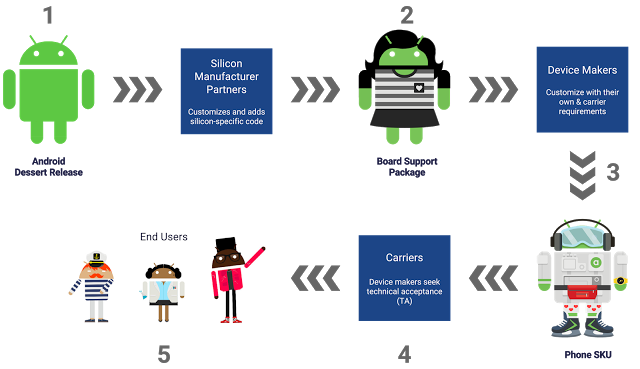
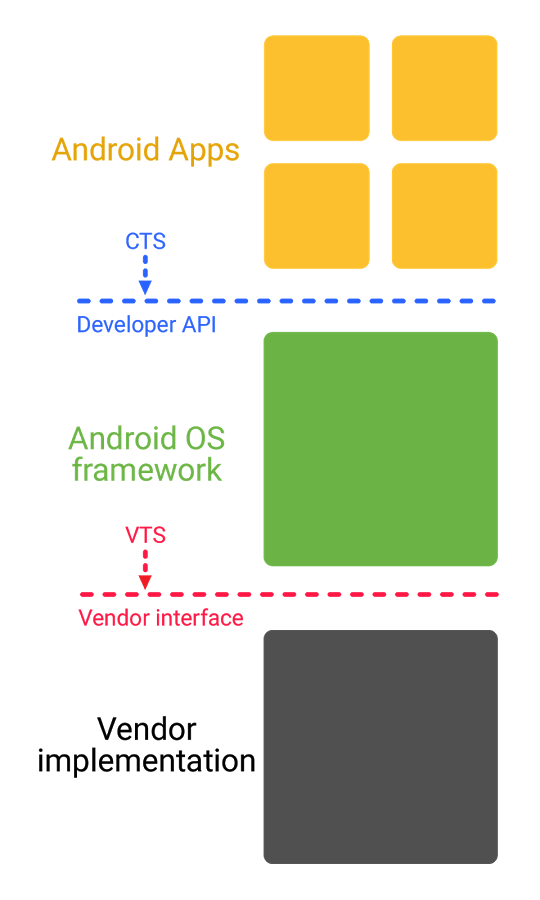
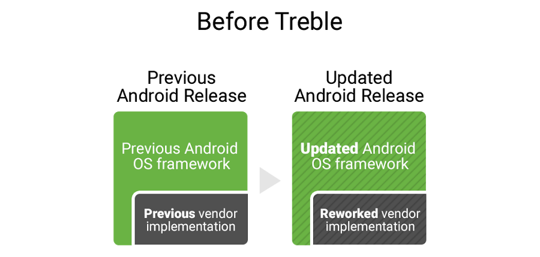
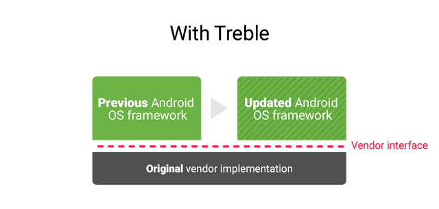

# Treble到来：一个Android的基础模块
原标题：Here comes Treble: A modular base for Android  
链接：[https://android-developers.googleblog.com/2017/05/here-comes-treble-modular-base-for.html](https://android-developers.googleblog.com/2017/05/here-comes-treble-modular-base-for.html)  
作者：Iliyan Malchev，Treble团队主管  
翻译: [arjinmc](https://github.com/arjinmc)  

在Android团队，我们看到每一个点心（系统版本）的发布都是一个良机为我们的用户和生态合作伙伴把Android做得更好。有一件事我们一直了解到合作伙伴设备生产商更新现有的设备到新的版本极其消耗时间和费用。
在Android O,我们和设备生产商和硅胶生产商更加密切地合作，按部就班地解决这这个问题，我们很兴奋给你们一个抢先版本的Treble, 可以实现从低版本结构到最新版本的巨变。

## Android发布版本的生命周期  

首先，有助于理解Android发布版本的生命周期。这里有几个步骤，在到用户手里之前经过了这些步骤才能发布一个Android的新版本。  
  
1. Android团队向世界发布了最新版本的源码。
2. 硅胶生产商，公司做出加强Android的芯片，修改为特定的硬件修改最新版本。
3. 硅胶生产商将最新版本的芯片交给设备生产商——设计和大量生产Android设备的公司。设备生产商为他们的设备修改成最新的版本。
4. 设备生产商和运营公司测试和认证这些版本。
5. 设备生产商和运营公司发布版本给用户。
在Treble下，对于制造商新重新设计Android会变得更简单，快捷，更低的成本去更新Android的新版本。

## 供应商接口

Android是2007年正式揭幕的免费，开源的手机操作系统。在开始，我们想要Android可以跨越不同的制造商。我们知道Api的统一性对开发者而言非常重要，因此我们为开发Api创建了一个兼容程序，具体通过[CDD](https://source.android.com/compatibility/)(兼容定义文档)绑定了CTS（兼容测试套件），现在已经超过了百万个测试。  
结果今天app开发者可以写一个单一的程序就可以在百万个来自不同制作商不同硬件设备上跑。  
Treble目的是为了做CTS所做的事。其核心概念是分开工供应商接口——设备的特定性，低级应用被硅胶生产商大量写入——通过Android Framework。  
  
这个相当于给Android Framework和供应商实施之间实现了一个供应商接口的开场白。新的供应商接口有效于VTS，类似于CTS，保证了供应商实现的向下兼容。  

## Treble的好处
今天，没有约束的供应商实现，当设备要转移到一个新的Android版本需要更新大量代码。  
  
用一个稳定的供应商接口提供访问特定的硬件部分，设备生产商可以通过更新Android系统Framework选择传递到新的Android版本给消费者，不要加入任何硅胶制造商所要求的工作。  
  
Treble将会出现在Android O以上系统的新设备上。事实上，新的Treble已经在Pixel手机的[Android O预览版](https://developer.android.com/preview/download.html)中运行。  
除结构变化之外，我们还帮助硅胶和设备合作伙伴更改他们的代码，例如特定的国家的某个网络运营商的特性，把他们转到通用的Android源代码项目AOSP库中。例如，索尼和高通贡献了Android O大量特性和修复了过百个bug，因此他们不再需要重新给每一个新发布的Android打补丁。  

我们计划在夏季末Android O的正式发布时发布整个Treble文档在[source.android.com](https://source.android.com)。  
