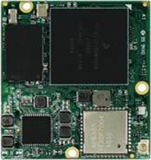

# Android Things开发者预览版4

原标题：Android Things Developer Preview 4  
链接：[https://android-developers.googleblog.com/2017/05/android-things-developer-preview-4.html](https://android-developers.googleblog.com/2017/05/android-things-developer-preview-4.html)  
作者：Wayne Piekarski,IoT团队开发者支持  
翻译: [arjinmc](https://github.com/arjinmc)  

今天我们要发布下一个Android Things版本就是开发者预览版4(DP4)，带来更新的硬件支持，特性，修改了平台的bug。Android Things的目的是让Android开发者快速地构建小设备，使用谷歌的板级支持包(BSP)可以构建出同原型有比例的设备。

## AIY和Google Assistant SDK(谷歌助手)
在这个月初，我们[宣布了](chapters/2017.5.4.things.md)和AIY项目合作，使得Android Things能支持Raspberry Pi-based [Voice Kit](http://developers.googleblog.com/2017/05/aiy-projects-voice-kit.html)。现在有了DP4,给Andorid Things认证的所有开发板提供重要的驱动来支持[Google Assistant SDK](http://developers.google.com/assistant/sdk)。更多的介绍来看这个[例子](https://github.com/androidthings/sample-googleassistant)。

## 新的硬件和驱动支持
我们现在加入了新的板级支持包[NXP i.MX7D](https://developer.android.com/things/hardware/imx7d.html)比[i.MX6UL](https://developer.android.com/things/hardware/imx6ul.html)支持更多功能，也是使用了低耗电系统模型设计(SoM)。支持Inter-IC声音总线I2S加入到[Peripheral I/O API](https://developer.android.com/things/sdk/pio/i2s.html),现在声音驱动可以通过I2S声音总线写入到用户储存。AIY Voice Kit的[例子](https://github.com/androidthings/aiyprojects-googleassistant/blob/master/app/src/main/java/com/example/androidthings/assistant/VoiceHatDriver.java)示范了怎么使用I2S支持音频。我们也在运行时提供了蓝牙开关给开发者。

  
NXP i.MX7D

## 产品硬件例子
Android Things非常专注和帮助开发者创建可以带到市场的准产品设备。这意味着创建自定义硬件，还要在Android Things的系统模型(SoM)上运行软件。在这方面努力，我们发布了Edison Candle版，这个第一个这个系列的产品例子展示软硬件共同工作。源码放在[GitHub](https://github.com/androidthings/edison-candle)，硬件设计文件在[CircuitHub](https://circuithub.com/projects/androidthings/edison-candle)，很容被第三方公司仿造。

  
<small>Edison Candle</small>

感谢给我们反馈之前版本的开发者们。请继续通过写的[bug报告](https://code.google.com/p/android/issues/entry?template=Android%20Things%20bug%20report)和[特性需求](https://code.google.com/p/android/issues/entry?template=Android%20Things%20feature%20request)反馈给我们，如果你有什么问题可以在[stackoverflow](http://stackoverflow.com/questions/tagged/android-things)提问。下载DP4的镜像文件到Android Things的[下载](https://developer.android.com/things/preview/download.html)页面,可以找到[发布更新日志](https://developer.android.com/things/preview/releases.html)。你也可以加入我们Google+的[交流组IoT](https://plus.google.com/communities/107507328426910012281),获取很棒的源代码和最新资讯，还有和超过4900会员一起参与讨论话题。我们也会在Google I/O 大会([在线直播](https://events.google.com/io/extended/)或看录影）上介绍Android Things 和 IoT。

