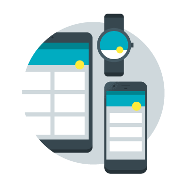
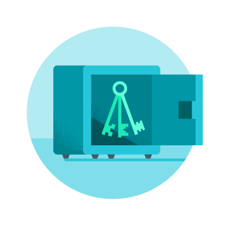

# 2017 年 I/O 大会：Google Play 管理中心新功能大集合

原标题：2017 年 I/O 大会：Google Play 管理中心新功能大集合  
链接：[https://docs.google.com/document/d/1cnUg2FE92gRjsN1ZCZoH75J1XqpesI6xPfWaPJonQT4/pub](https://docs.google.com/document/d/1cnUg2FE92gRjsN1ZCZoH75J1XqpesI6xPfWaPJonQT4/pub)  
作者：Vineet Buch，Google Play应用和游戏产品总监  
翻译：Google团队

Google Play能够延续在全球快速稳健的成长，要归功于为其打造高品质应用而不懈努力的开发者，是他们营造了健康和充满活力的开发者生态系统。现在，每月活跃的Android设备数量达到了20亿。去年，来自190个国家或地区的用户从Play商店下载了820 亿次应用；单月应用安装量超过100万次的开发者数量持续增加，年增长率达到35%。为了提升用户的支付体验，我们与140家运营商合作，提供运营商直接代扣服务，现在每月可覆盖9亿台设备。经过我们的工作和努力，去年Google Play上的买家人数加了将近 30%。
 
自2012年[Google Play 管理中心](https://www.google.com/url?q=http://g.co/play/console&sa=D&ust=1495077878864000&usg=AFQjCNHfQ0Dy8zDAhTAlvKB0T1Rh303Bcg)推出以来，我们不断提升产品用户体验，增加新功能，希望您除了发布应用，还能执行更多任务。应用和游戏公司中的不同团队可通过管理中心执行各种操作，例如进行 Beta 测试、分析应用崩溃情况、回复用户评价、评估商品详情的A/ B测试效果、获取财务报告等。
 
这次在 Google I/O 大会上，我们[公布](https://www.google.com/url?q=https://g.co/WhatsNewInPlayIO2017&sa=D&ust=1495077878867000&usg=AFQjCNH5GDJerX3f27AUviPVHa9Sij79Fw)了管理中心的一些改进功能和新功能，希望与您一道利用这些功能提升应用品质，让您的应用在 Google Play 上获得更大成功。

  

## 统计信息
<b>更新</b> 现在，通过您应用的统计信息页面，您可以更快速、更灵活地查看有关您业务的重要数据。您可以比较两项不同的指标，还可以按一个维度对它们进行细分。此外，您还可以任意选择所需的日期范围、查看经过细分的数据，甚至可以查看每小时统计信息。

## Android Vitals
  

* <b>新功能</b> 您可以了解自己应用的 Android Vitals，据此修正不当行为、改善应用体验，从而提高应用的星级评分。您可以查看从用户已选择分享信息的设备收集的匿名汇总设备数据，以了解应用性能的三个重要方面：稳定性（崩溃率和应用无响应 [ANR] 发生率）、耗电量（唤醒锁定操作停滞和唤醒次数过多）以及加载时间（加载过于缓慢或界面帧冻结）。详细了解[Android Vitals](https://www.google.com/url?q=https://support.google.com/googleplay/android-developer/answer/7385505&sa=D&ust=1495077878885000&usg=AFQjCNEY7ErEW4VCKBat9TqY63dXXP-tYg)。

* <b>更新</b> ANR和崩溃次数页面已经过更新，能够检测的崩溃问题范围更广，收集的数据更多，因此作用越大。

## 版本管理
  
* <b>新功能</b> 您可以使用全新的版本信息中心在某个版本推出后对其进行跟踪。通过监控您的版本对重要指标的影响，您可以确保一切都按计划顺利进展，在发生异常情况时也能及时暂停分阶段发布。
  
* <b>新功能</b> 您可以发布Android免安装应用，其版本管理流程与您所熟悉的在Google Play上发布应用的流程一样。您可以通过开发版发布渠道快速反复改进，在预发布版发布渠道上收集来自受信任的测试人员的反馈，待一切准备就绪后发布正式版。开始使用[Android 免安装应用](https://www.google.com/url?q=http://g.co/InstantApps&sa=D&ust=1495077878898000&usg=AFQjCNF_RNJj1eUFotKmQZIxUuS17v6VZQ)。
  
* <b>新功能</b> 您可以参考最新的设备兼容目录，确保您在各式各样的设备上都能提供出色的用户体验。设备目录中收录了数千种经过Google认证的设备，您可以对丰富的设备数据进行搜索和过滤。该目录甚至还能按设备类型向您显示应用的安装量、评分和收入，从而帮助您做出正确的决策。现在，您还可以按 RAM 和系统芯片等性能指标设置设备排除规则。通过更准确的控制设置，您可以设置排除少数设备，并在您的应用支持的所有设备上提供最出色的体验。[详细了解设备目录](https://www.google.com/url?q=https://support.google.com/googleplay/android-developer/answer/7353455&sa=D&ust=1495077878904000&usg=AFQjCNGBGbVnY8QKTg8maKLX_PFdlDAZAQ)。
  
* <b>新功能</b> 应用签名密钥极为重要，不允许出现任何差错。如今借助Play管理中心内的应用签名服务，您可以选择将密钥安全转移给Google，让其代为管理。Google可为您提供业内领先的安全保护，而您还可以选择启用我们即将推出的各种辅助服务，如优化应用的 APK 大小。选择启用此项服务后，Play商店就能根据目标设备类型提供针对屏幕密度和原生架构进行优化的 APK 版本，为您的用户节省数据流量和设备存储空间。[详细了解应用签名](https://www.google.com/url?q=https://support.google.com/googleplay/android-developer/answer/7384423&sa=D&ust=1495077878909000&usg=AFQjCNHQ3SyNlVi9G1EhUES_Ywa9dBPMQg)。
* <b>更新</b> 发布前测试报告（由Firebase Test Lab提供技术支持）会向您显示在实验室中使用真实设备测试您的Alpha/Beta版应用得出的结果，让您在正式发布前可以先找出问题并加以修正，以免这些问题影响您的评分。该报告功能已经过更新，已将更多设备（包括 Android O设备）纳入测试范围，并且加入了新的控制选项（例如，能够提供凭据以便测试需要登录的应用）。

## 用户获取情况
  
<b>新功能</b> 用户获取情况报告有助于您了解查看您商品详情的访问者的来源，以及这些访问者是否在查看之后安装您的应用以及是否在您的应用内购买内容。现在，该报告中包含保留应用的安装用户数据。这类数据显示最有价值的用户（保留您的应用超过30天的用户）来自哪些渠道和地理位置，从而帮助您优化自己的营销活动。

## 财务报告
  
<b>新功能</b> 订阅服务是Google Play上增长速度最快的业务 - 活跃订阅者数量在去年翻了一番。通过订阅信息中心，您可以查看订阅项目的效果，并做出更明智的业务拓展决策。您还可以从多个维度了解和分析订阅者总数、收入、留存率和用户流失率。

## 用户反馈
<b>更新</b> 评价是一种可让您与安装了您应用的用户直接互动的重要渠道。现在，评价分析功能支持更多语言，借助此功能，您可以收集关于评价的数据分析信息来改进应用。评分更新会汇总用户对其评分和评价的更新情况，其中包括您的回复对这些更新的影响。评价历史记录会显示您与用户对话的历史记录。最后，我们还将推出评论举报功能，用来举报不符合发布政策准则的评价。

<b>观看我们在 2017 年 I/O 大会上对 Google Play 管理中心新功能的介绍。</b>

欢迎观看[2017年I/O大会的Google Play新变化](https://www.google.com/url?q=https://events.google.com/io/schedule/?section%3Dmay-18%26sid%3D57f475f0-370f-4a7c-9ec4-10168e8d1a1f&sa=D&ust=1495077878935000&usg=AFQjCNES1dgwoFjGgCGnQCa2dZq13KvCdw)讲座，该讲座将于太平洋时间5月18日星期四下午 12:30 开始Google Play团队很期待跟大家分享我们开发的所有新功能。
 
我们还会深入介绍所有新功能的用法，并分享可助力您在 Google Play 上取得成功的最佳做法。欢迎在 YouTube 上观看 Google Play I/O 大会所有讲座的直播，也可以在之后观看相应的录制视频：
 
* 第 1 天（5 月 17 日）
    * [Play 管理中心推出全新版本管理工具和设备定位工具：了解如何摆脱顾虑，爱上 Android 的多元化平台！](https://www.google.com/url?q=https://events.google.com/io/schedule/?section%3Dmay-17%26sid%3Df22e0afc-34e5-4ad3-9677-7a30b8c733d4%26track%3Dplay%26type%3Dsessions&sa=D&ust=1495077878939000&usg=AFQjCNHxgYhAC4i3-LzNMJubcO6LShh2wg)
    * [每个人都对会崩溃或品质低劣的应用避之不及！了解 Android 和 Google Play 的最新工具如何协助工程师打造高性能体验](https://www.google.com/url?q=https://events.google.com/io/schedule/?section%3Dmay-17%26sid%3Da3bec051-b37b-4bca-a3bf-1a45a7e9bba2%26track%3Dplay%26type%3Dsessions&sa=D&ust=1495077878940000&usg=AFQjCNFiC7MXKAPwi9f-l7yh17mUZRMUaQ)
* 第 2 天（5 月 18 日）
    * [精简应用大小的最佳实践](https://www.google.com/url?q=https://events.google.com/io/schedule/?section%3Dmay-18%26sid%3D58f2935f-03f8-4ea7-a9a2-99b0227b70f1%26track%3Dplay%26type%3Dsessions&sa=D&ust=1495077878942000&usg=AFQjCNEufFLoIqrAY7ZJo6ysOWjA2ZqZYA)
    * [让Google Play上的数据为您效劳](https://www.google.com/url?q=https://events.google.com/io/schedule/?section%3Dmay-18%26sid%3D9b1a0c76-c84a-4777-9396-1020e1618b1c%26track%3Dplay%26type%3Dsessions&sa=D&ust=1495077878943000&usg=AFQjCNGyR5xATSZo-gWm-ZYfs37qQltx1Q)
    * [如何运用Google Play应用签名保护和优化应用](https://www.google.com/url?q=https://events.google.com/io/schedule/?section%3Dmay-18%26sid%3Db6ceb38b-a3fb-45ca-8b6c-d456ff4a72b4%26track%3Dplay%26type%3Dsessions&sa=D&ust=1495077878944000&usg=AFQjCNFCBtY7IdSDrA4W4wAGgPB8-Tmqng)
    * [运用Google Play管理中心优化Android 应用，提高用户留存率的10大秘诀](https://www.google.com/url?q=https://events.google.com/io/schedule/?section%3Dmay-18%26sid%3D25215e2d-57b4-42a7-baed-902e0e736518%26track%3Dplay%26type%3Dsessions&sa=D&ust=1495077878945000&usg=AFQjCNElFMoq-yC3VjEOS0m2mk_OyddvGg)
* 第 3 天（5 月 19 日）
    * [运用行为数据分析提高用户留存率](https://www.google.com/url?q=https://events.google.com/io/schedule/?section%3Dmay-19%26sid%3Db187c653-5143-4b2d-addc-103e1f04fbc2%26track%3Dplay%26type%3Dsessions&sa=D&ust=1495077878947000&usg=AFQjCNH8GWjj0WdRAc2ACN-9JPsdow71vA)
    * [利用Google Play上的订阅服务获得更多收益](https://www.google.com/url?q=https://events.google.com/io/schedule/?section%3Dmay-19%26sid%3D9e98e824-4ffc-4a6a-9121-12fa7ece15ff%26track%3Dplay%26type%3Dsessions&sa=D&ust=1495077878948000&usg=AFQjCNGf-bljDZkEJLE2N5ldUiFthyWAAQ)
    * [适合Chromebook和大屏设备的Android应用](https://www.google.com/url?q=https://events.google.com/io/schedule/?section%3Dmay-19%26sid%3Dd9700c16-fa43-44b9-afaa-c25224f0e336%26track%3Dplay%26type%3Dsessions&sa=D&ust=1495077878949000&usg=AFQjCNFbmkGrZRe7tgHwxzNwLWGoOoRtxA)
    * [提升用户交互和留存的工具和秘诀](https://www.google.com/url?q=https://events.google.com/io/schedule/?section%3Dmay-19%26sid%3D92f6fc03-f42b-4353-b7eb-852fea6c419f%26track%3Dplay%26type%3Dsessions&sa=D&ust=1495077878950000&usg=AFQjCNFq6iOsivmjr_R11HID1yLKbtWcQQ)  
    * [Android TV：如何吸引更多用户并获得更多收益](https://www.google.com/url?q=https://events.google.com/io/schedule/?section%3Dmay-19%26sid%3D5fe09b17-e014-4d36-a38e-b986ad340194%26track%3Dplay%26type%3Dsessions&sa=D&ust=1495077878952000&usg=AFQjCNGrYyfBWokAnLS102gUWCKnDNDh-Q)
 
别忘了观看大会第2天举行的Google Play奖项颁奖典礼，我们将再次表彰那些一直努力为打造优质应用和游戏树立品质典范的杰出开发者。
 

