# Android Studio 3.0 Canary 1

原标题：Android Studio 3.0 Canary 1  
链接：[https://android-developers.googleblog.com/2017/05/android-studio-3-0-canary1.html](https://android-developers.googleblog.com/2017/05/android-studio-3-0-canary1.html)  
作者：Jamal Eason，Android产品经理  
翻译: [arjinmc](https://github.com/arjinmc)  

正好赶上谷歌I / O 2017，我们提供了一个Android Studio 3.0的抢先版，今天可以在我们的canary发行频道上[下载](https://developer.android.com/studio/preview/index.html)。Android Studio是我们的官方IDE，专为Android设计，我们不断增加投资。Android Studio中的功能集中在加速你的应用程序开发流程，并提供为Android平台构建的最新工具。

为了加速你的开发流程，Android Studio 3.0包括三个主要功能：一套新的应用程序性能分析工具，用于快速诊断性能问题，支持Kotlin编程语言，以及增加大型应用程序的Gradle构建速度。Android Studio 3.0还与Android平台开发紧密联系，具有以下附加的主要功能：支持即时应用开发，在Android O模拟器系统映像中包含Google Play商店，以及用于Android O开发的新向导。总的来说，这款Android Studio 3.0的第一款Canary版本具有20多种新功能。

作为Android Studio 2.4 Canaries的一部分，我们一直在静静地迭代这些功能。今天，我们在认识到我们添加了许多重要功能之后，重新编号了Android Studio 3.0的发行版，而且我们必须在Android Gradle插件中引入一个罕见的变化，以提高可扩展性和构建时间。如果你想在[Android O](http://android-developers.googleblog.com/2017/05/whats-new-in-android-o-developer.html)上，创建[即时应用程序](http://android-developers.googleblog.com/2017/05/android-instant-apps-is-open-to-all.html)，开始使用[Kotlin语言](http://android-developers.googleblog.com/2017/05/android-announces-support-for-kotlin.html)开发，或用最新的Android开发工具来改进你的app的质量，然而你英国在今天下载Acnndroid Studio 3.0 Canary 1。

视频链接：[https://youtu.be/rHiA66zUv8c](https://youtu.be/rHiA66zUv8c)  
<small>Android DevByte - Android Studio 3.0中的新功能Canary 1</small>

请查看下面的列表，将组织开发人者了解Android Studio 3.0的这个第一个Canary版本的新功能的详细信息。

## 开发

* <b>Kotlin编程语言</b> - 根据受欢迎的要求，Android Studio 3.0现在包括对[Kotlin](http://android-developers.googleblog.com/2017/05/android-announces-support-for-kotlin.html)的支持。通过这种新的语言支持，你可以将现有Android应用程序代码旁边的Kotlin代码无缝添加，并可以访问Android Studio中发现的所有优秀开发工具。你可以加入Kotlin到你的项目中，选择使用“ 代码 → 将Java文件转换为Kotlin文件”中的内置转换工具转化，或者选择使用“新建项目向导”创建启用Kotlin的项目。在[Android](https://developer.android.com/kotlin)和[Android Studio](https://d.android.com/kotlin/get-started.html) 中更多地关注Kotlin语言支持。

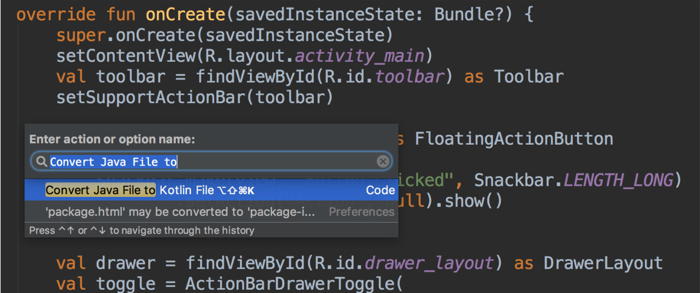  
<small>Android Studio中的Kotlin语言转换</small>

* <b>Java 8语言特性</b> - 我们正在不断发展对Java 8语言特性和API的支持。随着[Jack toolchain工具链](https://android-developers.googleblog.com/2017/03/future-of-java-8-language-feature.html)的最近弃用和迁移到基于javac的工具链，你可以直接使用Android Studio中的Java 8支持工具链即时运行。要更新你的项目支持新的Java 8工具链，只需 在项目结构对话框中将“src”和“target”兼容级别更新为1.8。[了解详情](https://developer.android.com/studio/preview/features/java8-support.html)。

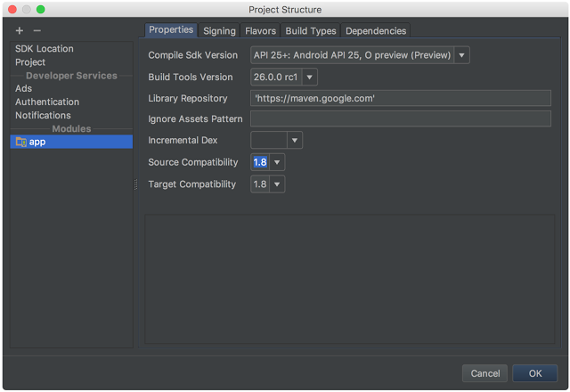  
<small>更新Java 8语言的项目结构对话</small>

* <b>布局编辑器</b> - 使用此Android Studio版本，你可以找到布局编辑器的其他增强功能。我们已经使用更好的拖放视图插入和新的错误面板。与更新配合ConstraintLayout，布局编辑器还支持创建视图障碍，创建组，并增强链创建。[了解详情](https://developer.android.com/studio/write/layout-editor.html)。

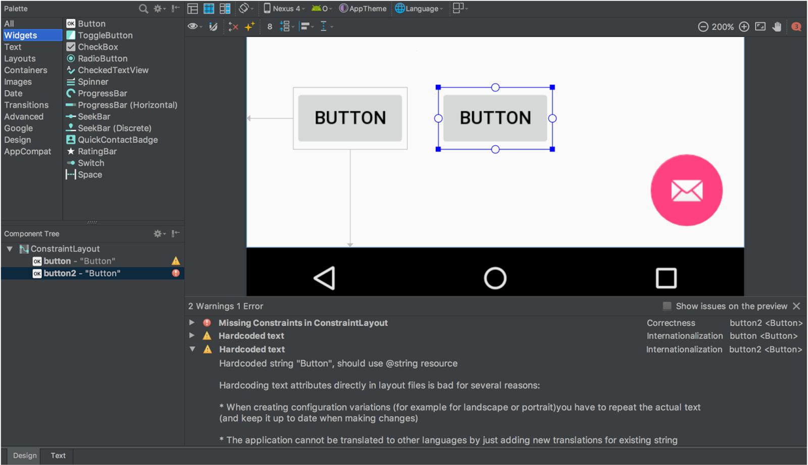  
<small>布局编辑器组件树和警告面板</small>

* <b>自适应图标向导</b> - Android O引入了自适应启动器图标，可以在不同的Android设备上显示不同的形状。新的自适应启动器图标向导创建新的和遗留的启动器图标资源，并提供你的自适应图标如何在不同的启动器屏幕图标蒙版上的预览。通过右键单击项目中的/res文件夹创建一个新的资源，然后navigate to → New → Image Asset → Launcher Icons (Adaptive and Legacy) [了解更多](https://developer.android.com/preview/features/adaptive-icons.html)。

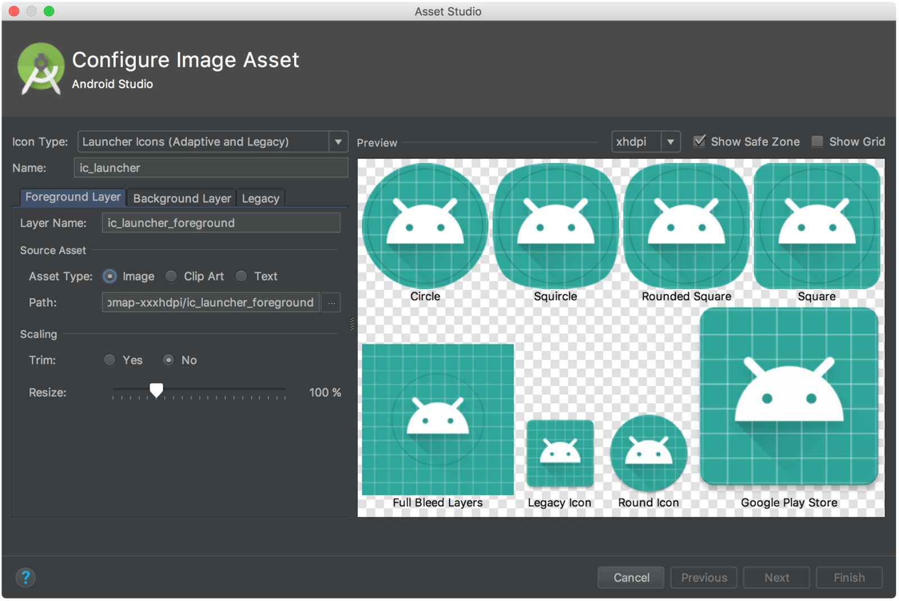  
<small>自适应图标向导</small>

* <b>XML字体和可下载的字体</b> - 在Android Studio中使用XML字体预览和字体选择工具，现在可以轻松地将自定义字体添加到应用程序（可用于Android O）。你还可以为你的应用创建可下载的字体资源。使用可下载的字体，你可以在应用程序中使用自定义字体，同时避免将字体资源捆绑到你的APK中。要使用可下载的字体，请确保你的设备或模拟器正在运行Google Play Services v11.2.63或更高版本。[了解详情](https://developer.android.com/preview/features/working-with-fonts.html)。

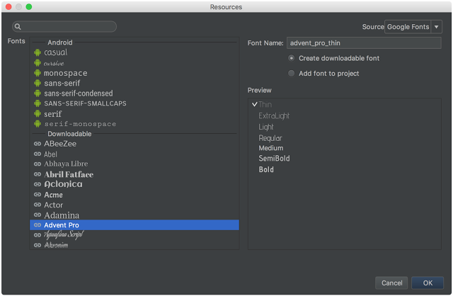  
<small>可下载的字体资源选择器</small>

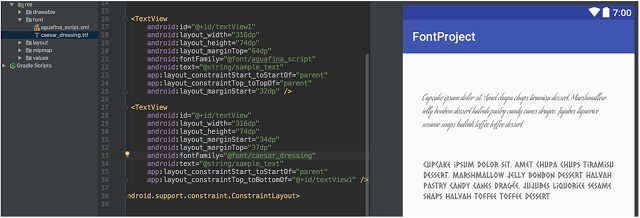  
<small>XML字体预览</small>

* <b>Android Things的支持</b> - 通过Android Studio 3.0，你可以在新的项目向导和新建模块向导，使用新的模板开发Android Things。Android Things可让你将Android开发知识扩展到物联网（IoT）设备类别。[了解详情](https://developer.android.com/things/index.html)。

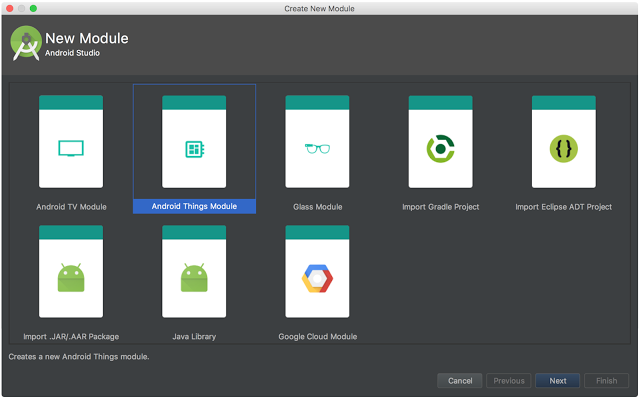  
<small>Android Things的新模块创建</small>

* <b>IntelliJ平台更新</b>：Android Studio 3.0 Canary 1包括IntelliJ 2017.1版本，它具有Java 8语言重构，参数提示，语义突出显示，可拖动断点，增强版本控制搜索等功能。[了解详情](https://www.jetbrains.com/idea/whatsnew/#v2017-1)。

## 创建

* <b>即时应用程序支持</b> - 通过Android Studio 3.0，你可以在项目中创建[即时应用程序](https://developer.android.com/topic/instant-apps/index.html)。Instant Apps是你的用户可以立即运行而不安装的轻量级Android应用。为了支持这一点，Android Studio引入了两种新的模块类型：即时应用和功能。结合新的“模块化”重构操作和[App Links Assistant(app关联助手）](https://developer.android.com/studio/write/app-link-indexing.html)，Android Studio可以帮助你将应用程序扩展到即时应用程序。要使用，你可以使用新建模块向导或右键单击一个类，并导航到：Refactor → Modularize [了解更多](http://android-developers.googleblog.com/2017/05/android-instant-apps-is-open-to-all.html)。

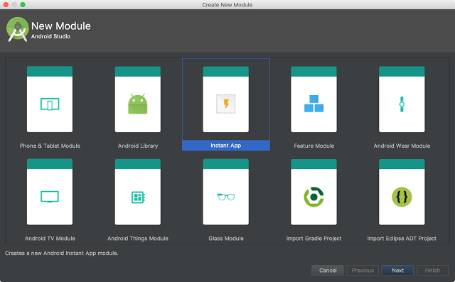  
<small>即时应用模块向导</small>

* <b>构建速度改进</b> - 我们正在继续研究，使构建速度更快。对于此版本，我们专注于提高具有多个模块的项目的速度。为了实现这些速度改进并支持未来的增强功能，我们对 Android Studio使用的Android Gradle插件进行了更改。如果你依赖于以前插件提供的API，则应验证与新插件的兼容性并迁移适用的API。要测试，更新你的 build.gradle文件中的插件版本。[了解详情](https://developer.android.com/studio/preview/features/new-android-plugin.html)。

build.gradle  
```java
dependencies {
   classpath 'com.android.tools.build:gradle:3.0.0-alpha1'
}
```

* <b>Google的Maven存储库</b> - 另外，根据受欢迎的要求，我们现在正在全新的Maven存储库中分发Android SDK Manager外的Android支持库maven依赖项。对于使用连续集成（CI）系统开发的用户，这将使Maven依赖关系管理变得更加容易。与最新的命令行[SDK管理器工具](https://developer.android.com/studio/intro/update.html#download-with-gradle)和[Gradle](https://developer.android.com/studio/intro/update.html#download-with-gradle)结合使用，使用Google的Maven存储库更易于管理CI构建。要使用新的Maven位置，请将以下URL添加到应用程序模块的 build.gradle文件中。 [了解详情](http://developer.android.com/studio/build/dependencies.html#google-maven)。

build.gradle  
```java
repositories {
   maven {
       url "https://maven.google.com"
   }
}
```

## 测试与调试

* <b>Google Play系统图像</b> - 随着对Android O Beta版本的更新，我们更新了Android Emulator O系统映像以包含Google Play商店。在Google Play商店中捆绑，你可以使用Google Play对应用进行端到端的测试，并提供了一种方便的方法来在Android虚拟设备（AVD）中保持最新的Google Play服务。就像Google Play服务在物理设备上进行更新一样，你可以在AVD上触发相同的更新。

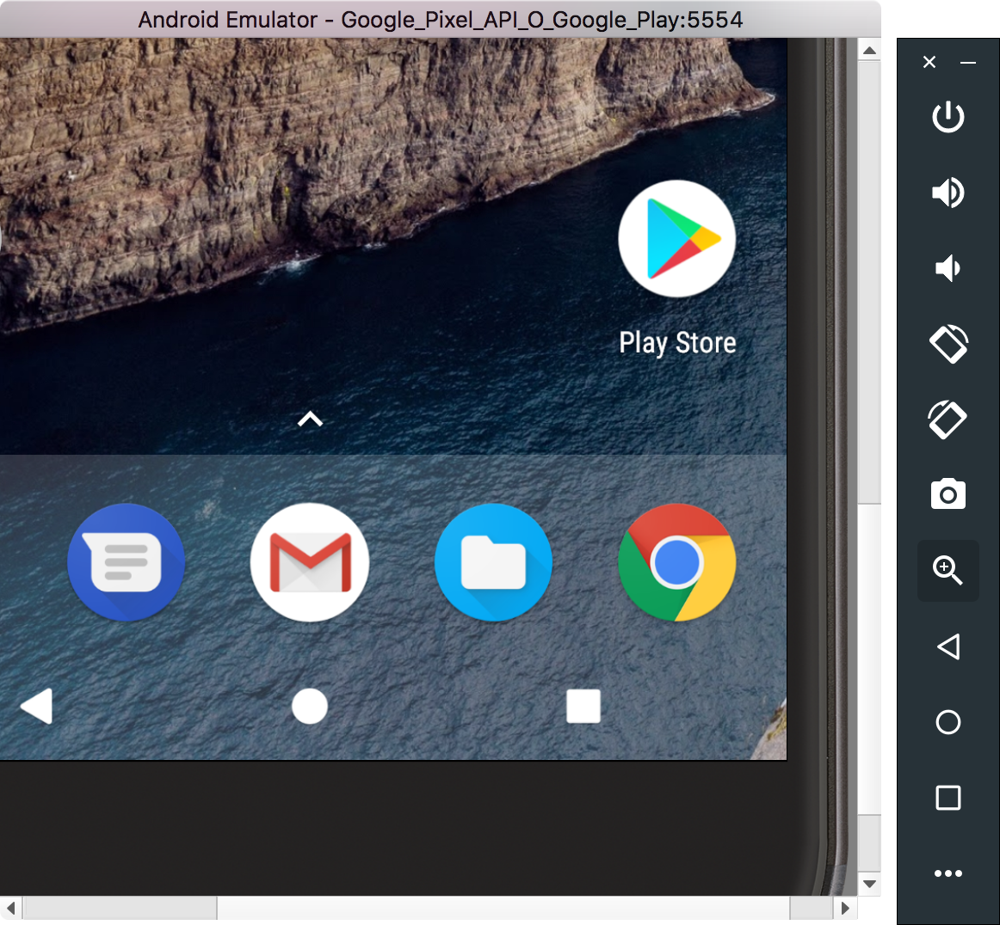  
<small>Android模拟器中的Google Play商店</small>

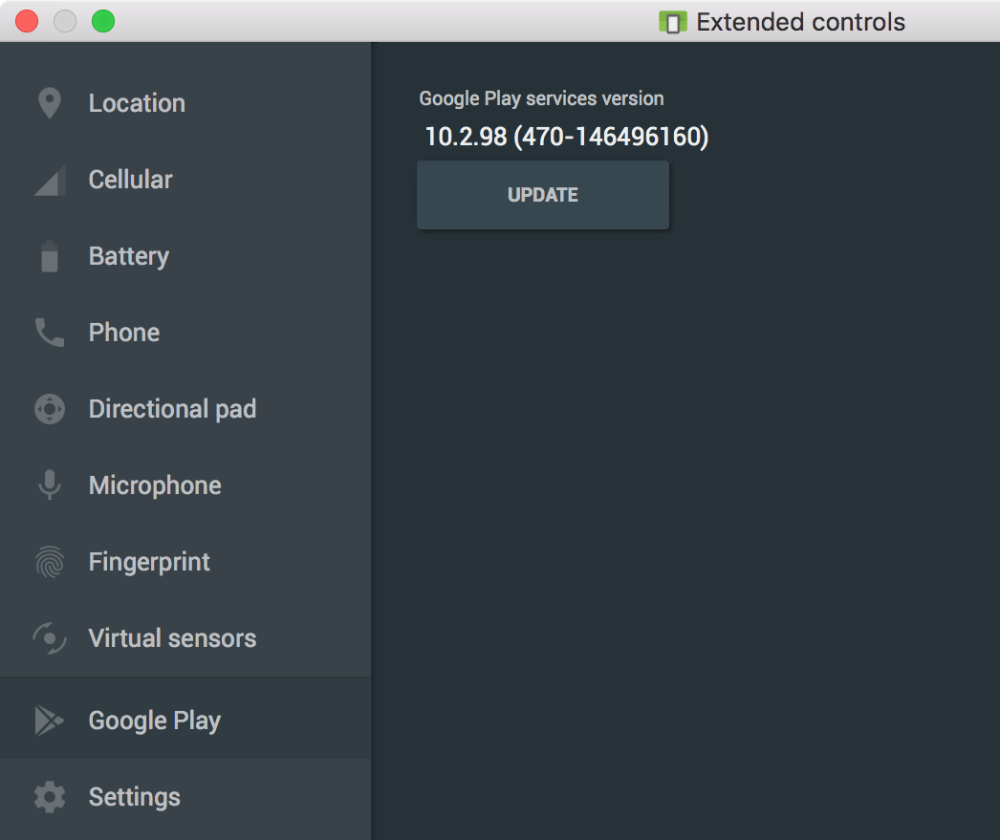  
<small>在Android模拟器中更新Google Play服务</small>

为了确保应用程序的安全性和与物理设备的一致体验，包含Google Play商店的仿真器系统映像将使用真实发布的签名。这意味着你将无法获得提升的权限。如果你需要提升的权限（root）来帮助应用程序进行故障排除，则可以使用不包括Google应用或服务的Android开源项目（AOSP）仿真器系统映像。要开始使用，请确保你使用的是Android Emulator v26.1 +，最新的系统映像API 24+，然后在设备定义旁边创建一个带有Google Play图标的新AVD。[了解详情](https://developer.android.com/studio/run/emulator.html)。

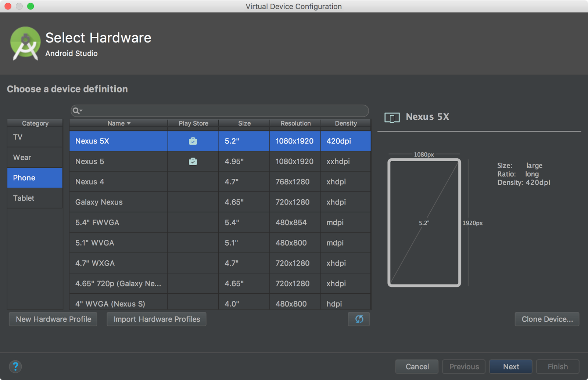  
<small>Android虚拟设备管理器，支持Google Play商店 </small>

* <b>Android模拟器支持OpenGL ES 3.0</b> - 作为我们不断投资于快速开发体验的一部分，最新版本的Android Emulator具有OpenGL ES 3.0对Android O系统映像的支持，同时显着提升了OpenGL ES 2.0图形性能较旧的模拟器系统映像。所有操作系统上的大多数现代显卡支持OpenGL ES 2.0加速。要使用OpenGL ES 3.0与Android模拟器，你的开发机器需要一个支持OpenGL 3.2或更高版本的Microsoft®Windows®或Linux（随着AppleMacOS®支持将来推出）的主机GPU显卡。[了解详情](https://developer.android.com/studio/run/emulator-acceleration.html)。

  
<small>Android模拟器中的OpenGL ES 3.0</small>

* <b>Android模拟器中的应用程序错误记录器</b> - 为了帮助记录应用程序中的错误，我们添加了一种更简单的方法来生成错误报告，其中包含所有必要的配置设置和空间来捕获重复步骤。此外，如果你想与Android团队分享一个特定的模拟器错误，我们还添加了一个链接，以便在Android问题跟踪器上快速生成错误。要使用此功能，请导航条到Emulator Tool Bar → Extended Controls → Help → Emulator Help → File a Bug。[了解详情](https://developer.android.com/studio/debug/bug-report.html)。

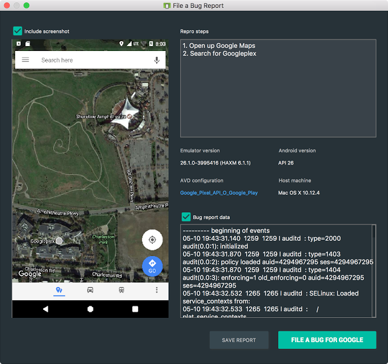  
<small>Android模拟器中的应用程序错误报告</small>

* <b>Android中的代理支持</b> - 对于那些需要使用HTTP代理访问Internet的用户，我们添加了一个用户界面来管理仿真器使用的代理设置。默认情况下，Android模拟器现在将使用Android Studio的设置，但你可以覆盖网络设置的这些设置。配置导航到 Extended Controls → Settings → Proxy。

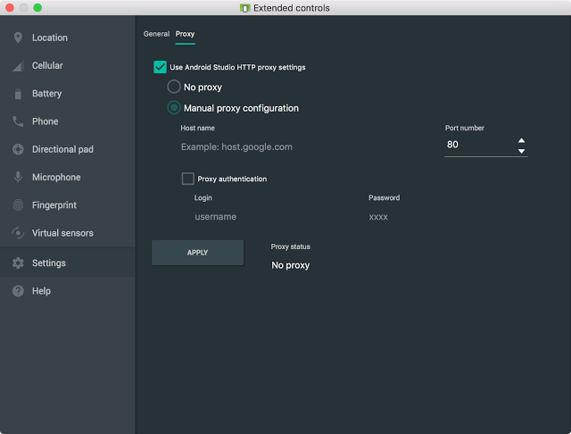  
<small>Android模拟器代理设置</small>

* <b>Android Wear模拟器中的Android Wear旋转控件</b> - Android模拟器现在支持Android Wear 2.0仿真器系统映像的旋转控制。现在，你可以更轻松地测试目标Android Wear设备（包括旋转输入滚动）的应用。要启用这个功能，请创建一个针对Android Wear的模拟器AVD，“旋转输入”面板应显示在扩展控件下。[了解详情](https://developer.android.com/training/wearables/ui/rotary-input.html#emulator)。

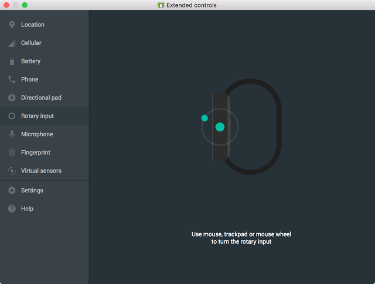   
<small>Android模拟器中的旋转输入</small>

* <b>APK调试</b> - 对于那些只想在Android Studio中构建你的项目而不需要调试APK的人，Android Studio 3.0版本现在可以调试任意的APK。特别是对于在另一个开发环境中开发Android C ++代码，但像在Android Studio的对象对APK进行调试和分析的人尤其有用。只要你有一个可调试版本的APK，你可以使用新的APK调试功能来分析，配置和调试APK。此外，如果你可以访问APK的来源，你可以将源连接到APK调试流程，以实现更高保真的调试过程。通过从Android Studio欢迎屏幕或File → Profile or debug APK。[了解更多](https://developer.android.com/studio/preview/features/apk-debugger.html)。

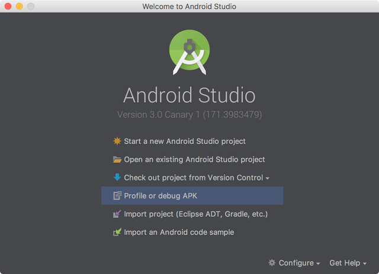   
<small>配置文件或调试APK</small>

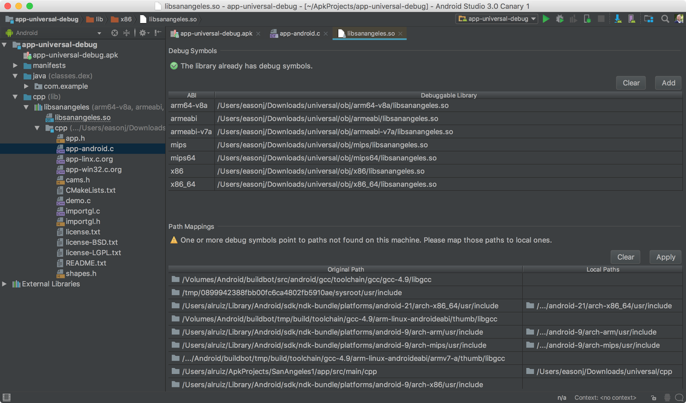   
<small>APK调试</small>

* <b>布局检查器</b> - 你会发现布局检查器在Android Studio 3.0中有一些额外的增强功能，可以更容易地调试应用程序布局中的问题。一些增强功能包括将属性更好地分组为常见类别，以及View树和属性面板中的搜索功能。当应用程序正在运行时，通过Tools → Android → Layout Inspector。[了解详情](http://tools.android.com/tech-docs/layout-inspector)。

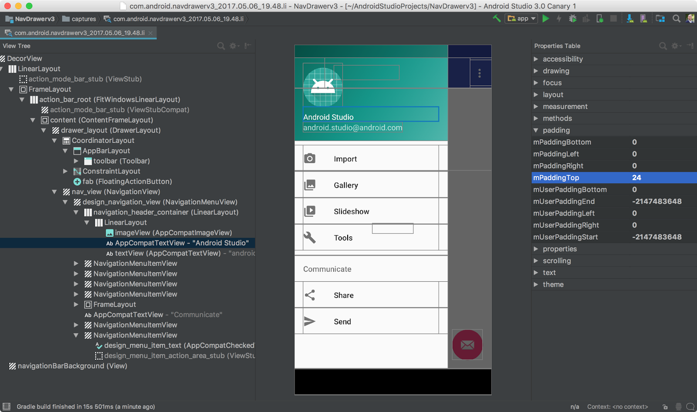  
<small>布局检查员</small>

* <b>设备文件资源管理器</b> - 因为被强烈要求从DDMS移植到Android Studio中，然而你们赢了，新的设备文件资源管理器允许你查看Android设备或模拟器的文件和目录结构。在测试你的应用程序时，你现在可以在Android Studio中直接快速预览和修改应用数据文件。

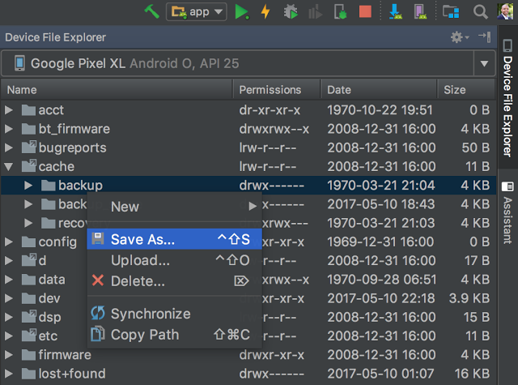  
<small>设备文件资源管理器</small>

## 优化

* <b>Android分析器</b> - Android Studio 3.0包含一套全新的工具，帮助你调试应用程序中的性能问题。我们完全重写了前一组Android监视器工具，并将其替换为Android Profiler。将应用程序部署到正在运行的设备或模拟器后，单击“ Android Profiler ”选项卡，现在可以访问你的应用程序的CPU，内存和网络活动的实时统一视图。每个性能事件都映射到UI事件时间轴，突出显示触摸事件，按键和活动更改，以便你在某个事件发生的时间和原因方面有更多的上下文。点击每个时间轴，挖掘你的应用程序的每个性能方面。[了解详情](https://developer.android.com/studio/preview/features/android-profiler.html)。 

  
<small>Android Profiler - 组合的时间轴视图。</small>

* <b>CPU分析器</b> - 不必要的CPU处理和负载峰值是应用程序性能差的症状。使用CPU Profiler，你可以通过触发采样或仪表化的CPU跟踪来分析应用程序的CPU线程使用情况。此时，你可以使用CPU Profiler中内置的各种数据视图和过滤器来解决CPU性能问题。[了解详情](https://developer.android.com/studio/profile/cpu-profiler.html)。

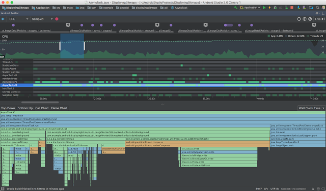  
<small>CPU分析器</small>

* <b>内存分析器</b> - 低效使用内存可能会导致许多设备问题，从janky UI到低内存事件。内存分析器将先前的堆查看器和分配跟踪器的功能集成在一个丰富的界面中，以帮助调试应用程序中的内存使用问题。你可以通过分析内存分配，堆转储等来诊断一系列内存问题。[了解详情](https://developer.android.com/studio/profile/memory-profiler.html)。

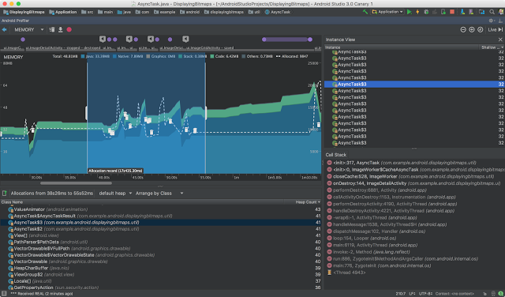  
<small>内存分析器</small>

* <b>网络分析器</b> - 优化你的应用程序中的前台和后台网络使用可以导致更高性能的应用程序和更低的应用程序数据使用率。网络分析器允许你监视应用程序的网络活动，检查每个网络请求的有效负载，并链接到生成网络请求的源代码行。目前，网络分析器与[HttpURLConnection](https://developer.android.com/reference/java/net/HttpURLConnection.html)， [OkHttp](http://square.github.io/okhttp/)和[Volley](https://developer.android.com/training/volley/index.html) 网络库协同工作。网络分析器是通过在“运行配置”框中的“分析”选项卡中选择启用高级分析功能，可以在Android O设备和仿真器之前启用的高级分析功能。除了启用网络请求和有效载荷分析外，该复选框使顶层的事件收集，内存对象计数和内存垃圾收集。对于基于Android O的设备和模拟器，只需部署你的应用程序。[了解详情](https://developer.android.com/studio/profile/network-profiler.html)。

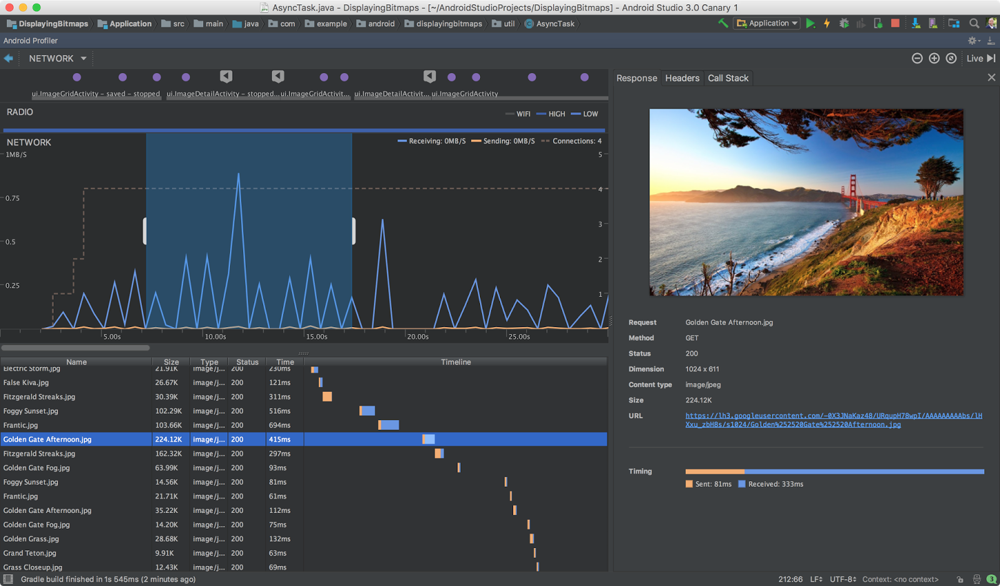  
<small>网络分析器</small>

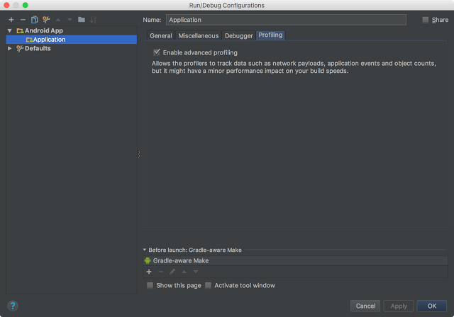  
<small>Pre-Android O设备的网络分析器设置</small>

* <b>APK分析器改进</b> - 在Android Studio 3.0中，我们为APK分析器添加了一些其他增强功能，以帮助你进一步优化APK的大小。通过此功能更新，你现在可以分析Instant App zip文件和AAR，并查看类和方法的dex字节码。你还可以生成Proguard配置规则，并在dex查看器中加载Proguard映射文件。[了解详情](https://developer.android.com/studio/build/apk-analyzer.html)。

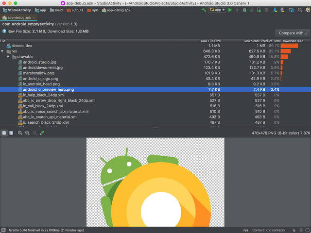  
<small>APK分析仪</small>

要介绍一下，Android Studio 3.0 Canary 1包括这些新的主要功能： 

* 开发
    * [Kotlin语言](http://android-developers.googleblog.com/2017/05/android-announces-support-for-kotlin.html)
    * [Java 8语言](https://developer.android.com/studio/preview/features/java8-support.html)
    * [布局编辑器改进](https://developer.android.com/studio/write/layout-editor.html)
    * [自适应图标向导](https://developer.android.com/preview/features/adaptive-icons.html)
    * [XML字体和可下载的字体](https://developer.android.com/preview/features/working-with-fonts.html)
    * [Android Things](https://developer.android.com/things/index.html)
    * [Intellij平台更新2017.1](https://www.jetbrains.com/idea/whatsnew/#v2017-1)
* 创建
    * [即时应用支持](http://android-developers.googleblog.com/2017/05/android-instant-apps-is-open-to-all.html)
    * [建立速度改进](https://developer.android.com/studio/preview/features/new-android-plugin.html)
    * [Google的Maven Repo更改](http://developer.android.com/studio/build/dependencies.html#google-maven)
* 测试与调试
    * [模拟器Google Play系统映像](https://developer.android.com/studio/run/emulator.html)
    * [模拟器OpenGL ES 3.0支持](https://developer.android.com/studio/run/emulator-acceleration.html)
    * 仿真代理支持
    * [应用程序Bug报告](https://developer.android.com/studio/debug/bug-report.html)
    * [Android Wear 旋转](https://developer.android.com/training/wearables/ui/rotary-input.html#emulator)
    * [APK调试](https://developer.android.com/studio/preview/features/apk-debugger.html)
    * [布局检查器](http://tools.android.com/tech-docs/layout-inspector)
    * 设备文件资源管理器
* 优化
    * [CPU分析器](https://developer.android.com/studio/preview/features/android-profiler.html)
    * [内存分析器](https://developer.android.com/studio/profile/memory-profiler.html)
    * [网络分析器](https://developer.android.com/studio/profile/network-profiler.html)
    * [PK分析仪改进](https://developer.android.com/studio/build/apk-analyzer.html)

查看发布日志[了解详情](http://developer.android.com/studio/preview/features/index.html)。

## 入门  

<b>下载</b>

如果你使用的是以前版本的Android Studio，则可以[在稳定版本旁安装](https://developer.android.com/studio/preview/install-preview.html)Android Studio 3.0 Canary 1 。你可以从官方的Android Studio Preview [下载页面](https://developer.android.com/studio/preview/index.html)下载此更新。正如本博客中提到的，有一些突破性的Gradle插件API更改来支持IDE中的新功能。因此，你还应该将当前项目中的Android Gradle插件版本更新为3.0.0-alpha1，以测试和验证你的应用程序项目设置。

我们感谢你反馈任何意见，你希望看到的问题或功能。如果你发现错误或问题，请随时提出问题。在我们的Google+专页或Twitter上与我们联系 - Android Studio开发小组。