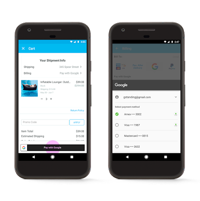
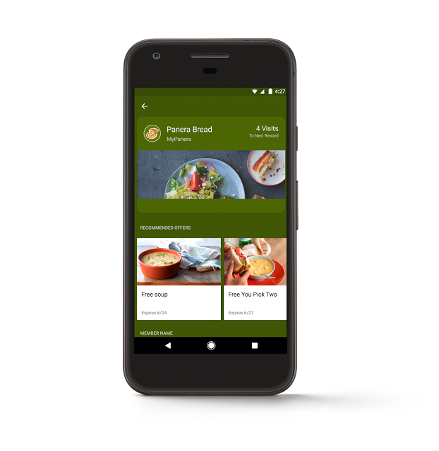

# Google 支付的下一步和忠诚度体验

原标题：What’s next for Google payment and loyalty experiences
链接：[https://android-developers.googleblog.com/2017/05/beyond-tap-whats-next-for-google.html](https://android-developers.googleblog.com/2017/05/beyond-tap-whats-next-for-google.html)  
作者：Pali Bhat，支付产品副总裁  
翻译：[arjinmc](https://github.com/arjinmc)  

成千上万的应用程序和数百万个商店接受这个简单和更安全移动支付体验的Android Pay(Android支付）。Android Pay现在已经在10个市场上推出，其中包括巴西，加拿大，俄罗斯，西班牙和台湾等。除了我们已经宣布的[Visa和Mastercard](https://blog.google/topics/shopping-payments/android-pay-partners-visa-checkout-and-masterpass/)合作伙伴关系外，我们也将为PayPal用户提供精简的移动结帐体验。

## 最新的付款方式

昨天，我们宣布了Google支付API，通过Google Play，Chrome和YouTube等产品，人们可以通过应用或在线支付任何已保存到Google帐户中的已验证信用卡或借记卡。

  
<small>在Wish应用程序中与Google付款</small>

对于用户来说，选择Google支付意味着轻而易举地完成交易，无需记住并输入多行付款明细。你只需选择你的首选卡，输入安全码或使用Android设备进行身份验证，然后交易。

采用此API的开发人员可以为其客户提供易于使用的结帐体验。注册以便[早日访使用](https://www.google.com/payments/solutions)的Google Payment API。

在接下来的几个月中，我们还将允许美国人通过Google助手发送或接收付款。在你的Google主页或Android设备上，简单的说“Ok Google，send Jane $ 10 for pizza(给珍妮10美元pizza钱）”。所有你需要的是与你的Google帐户相关联的借记卡。

  
<small>在Google Assistant上支付朋友</small>

## 在购买之前，期间和之后与客户联系

我们还宣布一些新的支付途径，让商家可以在客人进入商店之前和之后离开时参与和得到奖励。

绑卡优惠API通过提供新的渠道提供有针对性的优惠来驱动客户忠诚度，而Panera Bread是第一批在全国（美国）推出新功能的商家之一。将会员卡保存到Android Pay的MyPanera会员在店里使用Android Pay时，可以发现特价品并了解新的菜单。当你在结帐时使用MyPanera帐户时就会兑换优惠。

  
<small>适用于Android Pay应用程序中Panera Bread的卡片链接优惠</small>

我们还让Android Pay用户更轻松地添加忠诚度计划。例如，Walgreens BalanceRewards®会员将手机号码绑定Android Pay，他们使用Android pay
时手机会收到通知，方便他们将该会员卡与Android Pay连接，以便将来访问。这项体验被我们智能挖掘技术强化了，Walgreens已经在其8000多家美国店铺部署了这项体验。

还有更多的是，我们与第一数据公司的[Clover](https://www.clover.com/)合作，将我们的智能挖掘技术扩展到全国零售商以外的各种规模的企业。随着即将一体化智能挖掘[Clover的开发API](https://www.clover.com/developers)，你将能够构建Android应用程序，用于忠诚度，优惠券和礼品卡兑换以及新功能，例如提前订购，然后点按。

访问[developers.google.com/payments](http://developers.google.com/payments ，了解我们Google支付)，忠诚度和优惠API的最新信息。

