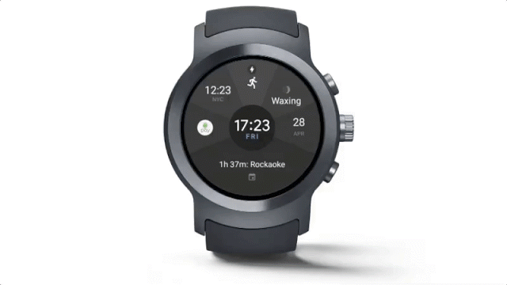

# Android Wear:全新并发工具和更友好UI库

原标题：Android Wear: New complications tools and watch friendly UI library  
链接：[https://android-developers.googleblog.com/2017/05/android-wear-new-complications-tools.html](https://android-developers.googleblog.com/2017/05/android-wear-new-complications-tools.html)  
作者：Hoi Lam，Android Wear引导开发者支持  
翻译：[arjinmc](https://github.com/arjinmc)  

  

Android Wear 2.0为用户提供了更多丰富的表盘，并为开发人员提供了创建有用应用程序的新方法。这些新机遇受到用户和开发者的好评。为了帮助开发人员充分利用这些新功能，我们发布了一套复杂的API工具，以便开发人员更轻松地为其观察面添加复杂性支持，并提供一个新的Wear UI库，以帮助开发人员构建看起来友好的用户界面。

## 新的表盘开发Complications API工具

Complications是还很小的信息碎片直接显示在表盘上。它们也可以成为您最喜欢的应用程序的快捷键。我们去年介绍了[Complications API](https://developer.android.com/training/wearables/watch-faces/complications.html)，使得表盘能接收用户所选择的app的数据，并以清晰的风格显示给用户。今天，我们正在推出四款新工具，让手表开发人员更容易与Complications API集成：

* [TextRenderer](https://developer.android.com/training/wearables/watch-faces/complications.html#rendering-text) - 自动调整文字以适应手表表盘制造商定义的界限。
* [ComplicationDrawable](https://developer.android.com/training/wearables/watch-faces/complications.html#drawing-complications) - 一个完整的复现解决方案，用于处理所有的样式，并按照你指定的大小调整布局。
* [简单的表盘例子](https://github.com/googlesamples/android-WatchFace) - 适用的示例代码，可以更轻松地构建具有丰富可用体验的Complications设置。
* [Complications测试套件](https://github.com/googlesamples/android-WearComplicationProvidersTestSuite) - 一个示例数据提供程序，用于帮助检查你的表盘是否可以处理Complications，可以构成Complications的数据。

将Complications并入您的手表表盘并不容易。

## Wear Wear开发人员的UI库

自从推出Android Wear 1.0以来，我们提供了Android视图组件，用于构建观看友好的用户界面。开发人员告诉我们，他们希望看到这些组件开源。因此，从Google I / O开始，我们开放一些组件，并在Android支持库中提供一些Android Wear UI组件。这带来了一些好处，包括与其他支持库更一致的API，更频繁的版本，以及更好地响应开发者的反馈。我们会：

* <b>迁移穿戴支持课程</b> - 将Android Wear特定视图组件（如WearableRecyclerView）从Wearable Support中的android.support.wearable.view迁移到Android支持库android.support.wear.widget中。这个新包可以作为开源。根据开发者的反映，我们期望迁移过程变得简单，更改API名称，以便与现有的Android支持库保持一致。

* <b>将一些Android Wear功能合并到Android</b> - 一些Android Wear组件与Android有很多重叠，例如[CircledImageView](https://developer.android.com/reference/android/support/wearable/view/CircledImageView.html)和[DelayedConfirmationView](https://developer.android.com/reference/android/support/wearable/view/DelayedConfirmationView.html)。我们将Android Wear特定功能与android.support.v4.widget上的Android对应合并。
* <b>弃用过时的用户界面模式</b> - Android Wear 2.0不再使用两种用户界面模式：卡模式和多方向布局。因此，我们已经弃用了所有支持类，例如[GridViewPager](https://developer.android.com/reference/android/support/wearable/view/GridViewPager.html)和[CardFragment](https://developer.android.com/reference/android/support/wearable/view/CardFragment.html)。请参阅课程参考文档进行更换。

在[这些第一波变化](https://developer.android.com/reference/android/support/wear/widget/package-summary.html)中，我们将WearableRecyclerView，BoxInsetLayout和SwipeDismissFrameLayout类迁移到新的Android Wear UI库。我们预计2017年的迁移过程将持续下去，开发人员将持续至2018年中期迁移到新的UI组件。有关其他信息，请参阅[使用Wear UI库](https://developer.android.com/training/wearables/ui/wear-ui-library.html)。

## 开始并给我们反馈！

要开始使用这些新工具，只需更新Android Studio中的Android支持库，并更新你的build.gradle构建文件以导入新的支持库。除了以上文档链接，请查看Google I / O大会季 - [Android Wear UI开发最佳实践](https://events.google.com/io/schedule/?section=may-19&sid=3c8f9b3c-2bdf-4e18-9797-1f087aff9b13) - 这些工具的引导工程师将随时为你解释技术细节。

根据你们的反馈，我们将在未来几个月内继续更新这些工具。我们越早听到你们的意见，我们越能概括，所以不要害羞！让我们为您的Android Wear应用程序和表盘做一些重要的工作。

