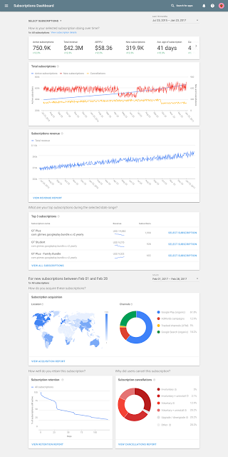
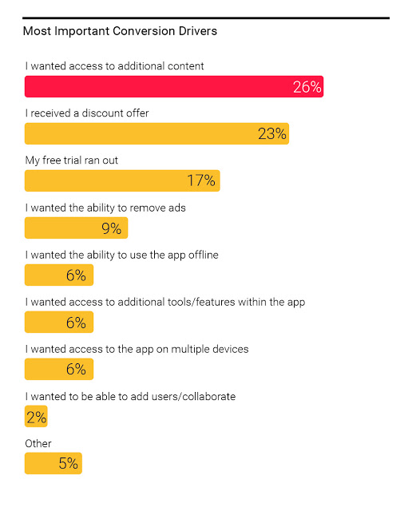

# 在Google Play上使用应用内购赚更多钱

原标题：Make more money with subscriptions on Google Play  
链接：[https://android-developers.googleblog.com/2017/05/make-more-money-with-subscriptions-on.html](https://android-developers.googleblog.com/2017/05/make-more-money-with-subscriptions-on.html)  
作者：George Audi, Tom Grinsted and Larry Yang, Google Play  
翻译：[arjinmc](https://github.com/arjinmc)  

应用内购商业模式是在Android和Google Play上获得更多定期，可靠和经常性收入的最佳方式之一。事实上，开发人员和用户都喜欢应用内购程序，过去三年来，消费者支出增长了10倍，过去一年的用户数量翻了一倍。数千名开发人员通过Google Play提供应用内购，并且已经在我们的结算平台上取得成功。这就是为什么我们一直在努力帮助你利用这个机会，并为你的业务和Android用户提供更深入的见解。

视频介绍：[链接](https://youtu.be/6bAyQvCWSlA)。

## 新功能可帮助你应用内购业务蓬勃发展

你的产品具有出色的功能和令人信服的内容，但你的业务无法获取新用户，因此无法成功。除了免费试用，试用优惠定价，灵活的结算周期等等，我们最近还推出了<b>使用Google Play余额支付应用内购费用的功能</b>。虽然人们已经使用礼品卡来支付20多个国家的Play内容，但是使用礼品卡来支付在现金是流行付款方式的地区（如拉丁美洲）的应用内购，应用内购已经高达增加15％。

但是，不仅仅是获取新客户，而是关于保留你的客户。这就是为什么我们引入<b>帐户保留</b>，如果用户的付款方式失败，我们帮助你阻止用户访问你的内容或服务。这直接将付款失败与用户无法访问你的内容和/或高级功能相关联，这足以让他们去选择新的付款方式。[Keepsafe Photo Vault](https://play.google.com/store/apps/details?id=com.kii.safe&hl=en)的开发商Keepsafe是一个照片储物柜，用于私人图片和影片，拥有超过50M的下载量，整合了帐户，Android的续费率提高了25％。我们今天早日有十几名开发商，我们将在6月底宣布公开发售。

我们知道数据对于你的业务至关重要，因此我们很高兴宣布一个在Play 控制台中<b>新的订阅仪表板</b>，以及一个关于Android应用内购者的新报告。

  

仪表板汇集应用内购数据，如新购买者，取消购买者和总购买者。它还显示每天和30天的滚动收入数据，并突出显示你的表现最好的产品。这将显示你的应用内购产品和用户，并将有助于指导你的业务决策。

## 帮助你拓展应用内购业务的洞察分析

除了产品和功能，了解人们的需求是建立成功的应用内购业务的核心。我们在美国和英国与2,000个Android应用用户进行了交谈，并询问他们如何以及为什么使用他们所做的应用。“ [Google Play上的有应用内购应用，帮助开发赢的用户洞察分析](http://services.google.com/fh/files/misc/subscription_apps_on_google_play.pdf)”报告中突出显示你增加应用内购用户群体的一些机会，设置定价策略，并学习保持用户参与，包括：

* <b>免费试用获取用户</b>。78％的用户从免费版本的应用程序开始，许多人引用免费试用的折扣或结束作为付款原因。
* <b>保持你的内容吸引力和更新，以获得和保持用户支付</b>。这是将用户从免费用户转换为付费用户以及保持用户参与和保留的最重要的驱动力。

  

* <b>有一个巨大的机会从应用内购赚钱</b>。虽然定价弹性因类别而异，但很少有用户会因为价格问题而取消应用内购，而64％的预算在每个应用程序基础上而不是全部（而不是所有应用程序应用内购的预算）。

要了解有关通过Google Play发展你的应用内购业务的更多信息，请[观看我们的I / O大会](https://events.google.com/io/schedule/?section=may-19&sid=9e98e824-4ffc-4a6a-9121-12fa7ece15ff)，[下载研究报告（PDF）](http://services.google.com/fh/files/misc/subscription_apps_on_google_play.pdf)，并开始使用[Google Play应用内结算的应用内购](https://developer.android.com/distribute/best-practices/earn/subscriptions.html)。

