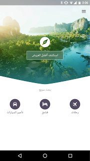
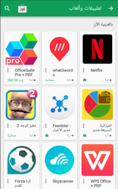

# 为什么要把你的app或游戏区分中东和北非

原标题：Why you should localize your app or game for Middle East and North Africa  
链接：[https://android-developers.googleblog.com/2017/05/why-you-should-localize-your-app-or.html](https://android-developers.googleblog.com/2017/05/why-you-should-localize-your-app-or.html)  
作者：Mohammad El-Saadi，Google Play商业开发部  
翻译: [arjinmc](https://github.com/arjinmc)  

Google Play的中东和北非地区(简称MENA)地区，app和游戏的市场是快速快速增长的，区分地区对于创造机遇非常重要。例如，沙特阿拉伯的主要盈利的app和游戏在他们的应用商店列表区分了地区，包括在Google Play。  

[Skyscanner](https://play.google.com/store/apps/details?id=net.skyscanner.android.main)旅游app的英国团队已经区域化了app超过15种语言，上线到阿拉伯是他们的一个里程碑。阿拉伯语用户真的感激这个区域化，而这个app在区域化后的平均评分从4.62星升到4.77星。用户使用这个app的时间更长，平均使用时间上升了30%。另外50%多的旅游者会被重定向到Skysanner的合作伙伴去订机票，酒店和租用汽车。

  
  
<b>对比Skysanner的英文版和阿拉伯文版</b>  

但是要正确的识别你的app和游戏在阿拉伯🈶️多难呢？

Skysanner团队在两周内完成支持开发使用从右到左(RTL)的阿拉伯语言的版本：“我们首次担心的是我们需要耗费大量精力去写这些布局。然而，Android布局系统把握这些案例非常好。我们已经在导航栏使用 *Start 和 *End 外间距和内边距，Android Studio也支持关联检查修复这些自动布局所产生的问题。”，Mate Herber(软件工程师)说。

更多其他排名前列的app和游戏的开发者都在开发MENA地区用户上取得成功。例如，游戏开发商Pocket Gems区域化了[War Dragons](https://play.google.com/store/apps/details?id=com.pocketgems.android.dragon&hl=en_GB),阿拉巴语言用户的安装量达到了3倍。他们来自阿拉巴地区的收入百分比从0%增加到1.5%。

我们刚过刷新了一下[阿拉伯地区合集（MENA地区）](https://play.google.com/store/apps/collection/promotion_30028eb_Apps_MENA_NowInArabic_Apps?clp=So0BCjIKLHByb21vdGlvbl8zMDAyOGViX0FwcHNfTUVOQV9Ob3dJbkFyYWJpY19BcHBzEAcYAxpXClFuZXdfaG9tZV9kZXZpY2VfZmVhdHVyZWRfcmVjczJfdG9waWNfdjFfbGF1bmNoX2FwcHNfQUVfXzEwX3Byb21vXzE0OTMzMDIyMzE3MTEwMDAQDBgD%3AS%3AANO1ljLNctw&hl=en)又有16的新的app或游戏加入，包括Netflix，Periscope和Transformers。Google Play将在5月11日陆续开发这些国家地区：阿尔及利亚，巴林，埃及，约旦，科威特，黎巴嫩，摩洛哥，阿曼，卡塔尔，沙特阿拉伯，突尼斯，阿拉伯联合酋长国。

  
  

看我们的[地区检查表](https://developer.android.com/distribute/best-practices/launch/localization-checklist.html)来更好的练习如何地区化任何语言，在我们的[全球商店指南](https://play.google.com/store/books/details/Google_Inc_The_Going_Global_Playbook_for_developer?id=RHqKDQAAQBAJ)都可以学习到。如果你的app或游戏已经准备好了支持阿拉伯语言，你可以自行填写[表格](https://docs.google.com/a/google.com/forms/d/e/1FAIpQLSfuqUnnrY4a9XUsKlqrfow_7v9p1jMX_ae7DLnshk30pqOVZQ/viewform)申请提名到阿拉伯地区合集app中。

