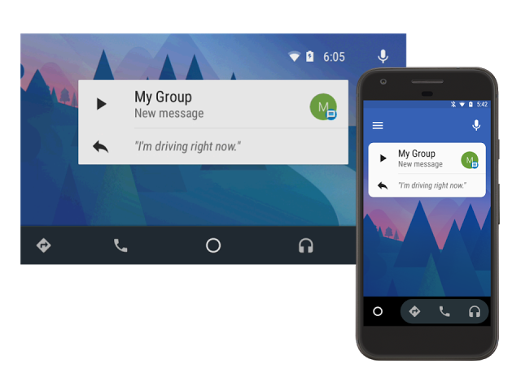

# Android Auto的群消息

原标题：Group Messaging in Android Auto  
链接：[https://android-developers.googleblog.com/2017/05/group-messaging-in-android-auto.html](https://android-developers.googleblog.com/2017/05/group-messaging-in-android-auto.html)  
作者：David Nelloms (软件工程师)
翻译：[arjinmc](https://github.com/arjinmc)  

  

与一群人沟通是许多消息应用程序的常见用例。但是，可能很难知道[Android Auto](https://developer.android.com/training/auto/messaging/index.html)消息API如何应用于组对话。以下是Android Auto中开始群组讯息的一些提示：

## 对话名称

构建UnreadConversation构建器时，需要传入一个名称。这是当消息到达时向用户显示的会话的名称。

```java
UnreadConversation.Builder unreadConvBuilder =
    new UnreadConversation.Builder(conversationName)
        .setReadPendingIntent(msgHeardPendingIntent)
        .setReplyAction(msgReplyPendingIntent, remoteInput);
```

对于一对一的对话，这只是另一个参与者的名字。对于群组对话，最好选择以下两个选项之一：

1. 对话标题：如果您的应用程序支持在群组对话中添加标题，请使用name参数的标题与您的应用内体验一致。该字段与[NotificationCompat.MessagingStyle＃setConversationTitle](https://developer.android.com/reference/android/support/v4/app/NotificationCompat.MessagingStyle.html#setConversationTitle(java.lang.CharSequence)类似。
2. 参与者列表：为名称参数构建逗号分隔的参与者列表以标识组。请注意，这是由文本到语音系统朗读，因此您可能需要缩写大型组的列表。您应该平衡允许用户使用收听消息所需的时间来唯一标识该组。

## 文字到语音格式

使用TTS系统获取文本自然是一个具有挑战性的问题。有一些团队努力改进这一点，但是您可以采取一些步骤来创建更好的用户体验与当前的功能。Android Auto messaging(自动消息传递)API还没有选项可以将参与者与组对话中的单个消息进行配对。当群组对话中的多个参与者有多个未读消息时，驱动程序无法看到哪个组成员发送了哪个消息，这对于驱动程序是有问题的。一个解决方案是在发件人更改时将发件人的姓名添加到消息中，以便将名称大声朗读给驱动程序。

```java
CharSequence currentSender = null;
for (Message message : myMessages) {
    StringBuilder messageText = new StringBuilder();
    CharSequence sender = message.getSender();
    // Maybe append sender to indicate who is speaking.
    if (!TextUtils.isEmpty(sender) && !sender.equals(currentSender)) {
        if (currentSender != null) {
            // Punctuation will briefly pause TTS readout between senders.
            messageText.append(". ");
        }
        currentSender = sender;
        messageText.append(sender.toString().toLowerCase(Locale.getDefault()));
        // Punctuation will separate sender from message in TTS readout.
        messageText.append(": ");
    }
    messageText.append(message.getText());
    unreadConvBuilder.addMessage(messageText.toString());
}
```
    
有关上述示例代码的注意事项：

* 添加标点符号并不是绝对必要的，而是可以产生更自然的声音结果。
* 发件人姓名将转换为小写。这是一个奇怪的解决方案，其中TTS实现在“某些设备上的大写字母之前”发音为“点”。

## 获得参与者

在搜索如何处理组消息传递时，您可能已经注意到了[UnreadConversation＃getParticipants](https://developer.android.com/reference/android/support/v4/app/NotificationCompat.CarExtender.UnreadConversation.html#getParticipants()) 。这可能令人困惑，因为没有机制在构建器中添加多个参与者。构建器实现使用传递给其构造函数的会话名称填充数组。在内部，Android Auto使用单一的[UnreadConversation＃getParticipant](https://developer.android.com/reference/android/support/v4/app/NotificationCompat.CarExtender.UnreadConversation.html#getParticipant())，它返回参与者数组的第一个元素，以在通知视图中填充标题。

## 敬请关注

Android Auto团队正在致力于为应用程序开发人员简化和更直观的使用驱动程序的消息传递。敬请关注未来的更新，以便您可以继续提供卓越的用户体验！

  

