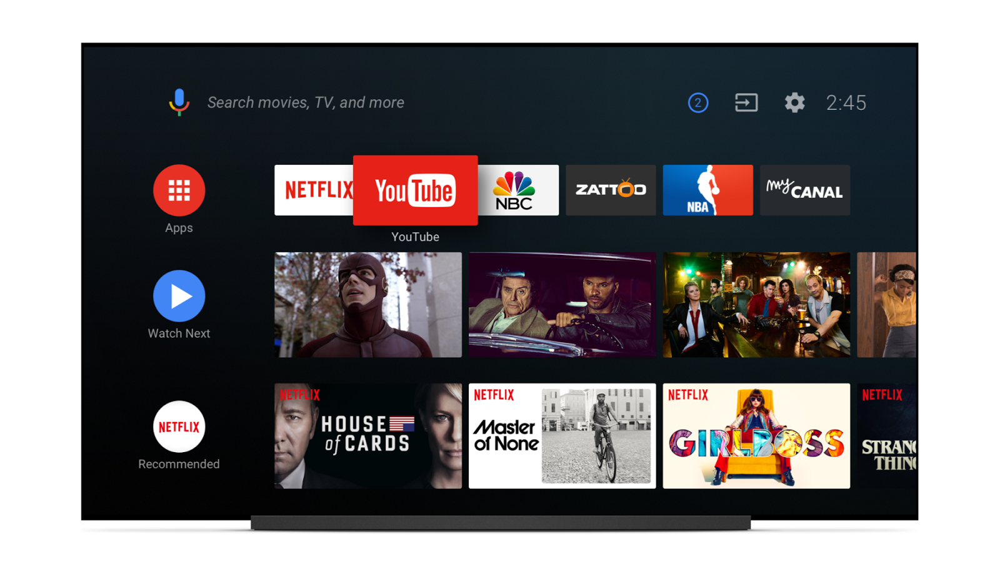

# 欢迎来到你的新家Android TV

原标题：Welcome to your New Home on Android TV  
链接：[https://android-developers.googleblog.com/2017/05/welcome-to-your-new-home-on-android-tv.html](https://android-developers.googleblog.com/2017/05/welcome-to-your-new-home-on-android-tv.html)  
作者：Paul Saxman (Android设备和多媒体开发者关系负责人)  
翻译：[arjinmc](https://github.com/arjinmc)  

  

Android TV为你家中最大的屏幕提供了丰富的应用体验和娱乐功能，而通过Android O，我们可以更轻松地访问自己喜欢的应用中的内容。我们为Android TV制作了一个新的，以内容为中心的主屏幕体验，同时我们也将Google Assistant引入平台。这些功能将用户想要访问的内容，或者语音说出。

## 新的Android TV主屏幕

新的Android TV主屏幕以电视观众熟悉的方式将视频内容组织成频道和节目。每个Android TV应用都可以发布多个频道，这些频道在主屏幕上表示为程序。应用程序在每个频道上添加相关程序，并在用户访问内容时或新内容可用时更新这些程序和频道。为了帮助用户参与，节目可以包括视频预览，当用户专注于节目时，该预览将自动播放。用户可以配置他们希望在主屏幕上看到哪些频道，以及频道的排序，因此他们感兴趣的主题和节目可以快速方便地访问。

除了为你的应用程序的渠道，新的Android TV主屏幕的顶部包括一个用户喜爱的应用程序的快速启动栏和一个特殊的Watch Next（观看下一个）频道。该频道包含基于用户观看习惯的节目。

用于创建和维护通道和程序的API是[TvProvider API](https://developer.android.com/reference/android/support/media/tv/package-summary.html)的一部分，它们作为Android O的Android支持库模块分发。要开始使用这些API，请访问[Android O Developer Preview站点](https://developer.android.com/preview/features/tvlauncher.html)以了解概述，并尝试在[Android的电视频道和节目代码实验室](https://codelabs.developers.google.com/codelabs/tv-channels-programs/index.html)的第一手经验，建立一个Android TV的应用为Android O.

今年晚些时候，Nexus播放器将获得新的Android TV家庭体验作为OTA更新。如果你希望今天为新界面构建和测试应用程序，则可以使用Android TV模拟器或Nexus Player设备图像作为最新[Android O Developer Preview](https://developer.android.com/preview/index.html)的一部分。

## Android电视上的Google Assistant

今年晚些时候在Android TV上使用的Google助手将允许用户使用他们的声音快速查找和访问内容。因为助理是上下文感知的，它可以帮助用户缩小播放的内容。即使在播放视频或音乐时，用户也可以访问助手来控制播放。由于助手可以控制兼容的智能家居设备，简单的语音请求可以使灯光昏暗来营造理想的电影观看环境。当Google助手来到Android TV时，它将在美国推出运行M，N和O的Android设备。

我们期待看到开发人员如何利用新的Android TV主屏幕。我们欢迎反馈，请访问[G+上的Android TV开发者社区](https://plus.google.com/communities/112881895888889393129)，分享你的想法和想法！

