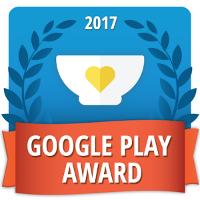
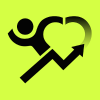
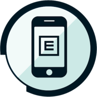
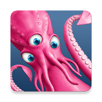

# 认识5个Android开发商，致力于改善世界各地的生活

原标题：Meet 5 Android developers working to improve lives around the world
链接：[https://android-developers.googleblog.com/2017/05/meet-5-android-developers-working-to.html](https://android-developers.googleblog.com/2017/05/meet-5-android-developers-working-to.html)  
作者：Maxim Mai (Google Play app合作伙伴关系）  
翻译：[arjinmc](https://github.com/arjinmc)  

上周四在Google I / O 2017大会上，我们宣布了[今年Google Play奖的获奖者](https://g.co/play/gpa2017)。抓住一些爆米花并观看[颁奖典礼](https://www.youtube.com/watch?v=ayXMtOmXXhw)，我们认为这与奥斯卡奖一样有趣。今年，我们包括一个类别，以庆祝发布具有积极社会影响的优秀应用程序的开发商的成就。

在介绍这个奖项类别时，我们受到联合国[17个可持续发展目标](https://sustainabledevelopment.un.org/sdgs)的启发。我们认为应用开发者有能力在全球范围内覆盖超过10亿个活跃的Android设备，因此我们认为应用开发人员有巨大的机会来影响零饥饿（[SDG＃2](https://sustainabledevelopment.un.org/sdg2)），健康和福祉（[SDG＃3](https://sustainabledevelopment.un.org/sdg3)）和质量教育（[SDG＃4](https://sustainabledevelopment.un.org/sdg4)）等等。继续阅读，了解今年的获奖者和决赛入围者以及影响这些目标的更多信息。

## 联系你的社交影响应用程序或游戏

我们在Android和Google Play上支持开发者在这方面取得成功的工作刚刚开始。我们希望鼓励Android开发者关注社交影响，以便在Google Play与我们取得联系，并告诉我们有关他们的应用或游戏。你所在的位置，您正在解决的问题，以及你所针对的国家，我们希望听到你的故事，也许我们可以帮助你更快地发展，并提高应用质量，这并不重要。

## 2017年Google Play奖的社会影响力获胜者和决赛入围者

  
🏆  [ShareTheMeal](https://play.google.com/store/apps/details?id=org.sharethemeal.app&e=-EnableAppDetailsPageRedesign) by United Nations 🏆

Google Play奖获得者ShareTheMeal在全球范围内经历食物不安全的情况下，为世界粮食计划署提供的“零饥饿”及其用户的学校用餐捐款大量提供全球意识。自推出以来，通过该应用程序捐赠了1300多万份膳食.

  
[Charity Miles](https://play.google.com/store/apps/details?id=com.charitymilescm.android&e=-EnableAppDetailsPageRedesign) by Charity Miles

这是一个跑步，骑自行车和步行跟踪应用程序，具有社会影响力。慈善里程通过品牌健身运动赞助者，为你的每一英里移动赚取您的慈善金钱！用户已经通过录制超过4000万英里捐赠了200万美元给慈善机构！

  
[Peek Acuity](https://play.google.com/store/apps/details?id=org.peekvision.public.android&e=-EnableAppDetailsPageRedesign) by Peak Vision

Peek Acuity允许任何拥有Android手机的人轻松测量视力，这是视力的组成部分之一。它是由眼科专家设计的，用于帮助识别需要进一步检查的人，例如验光师或眼科医生。在发展中国家，超过XM [与Peek Vision的确认数字]与视力障碍斗争，许多人不容易获得眼科护理专业人员。

  
[Prodeaf Translator](https://play.google.com/store/apps/details?id=com.Proativa.ProDeafMovel) by ProDeaf Tecnologias Assistivas

这个应用程序可以让任何人翻译来自葡萄牙语的巴西手语（Libras）或从英语到美国手语（ASL）的短语和单词。这大大减少了数以百万计的依靠Libras或ASL作为通用语言的人之间的交流障碍，以及没有机会学习这种沟通形式的人。

  
[Sea Hero Quest](https://play.google.com/store/apps/details?id=com.glitchers.catchhero&e=-EnableAppDetailsPageRedesign) by GLITCHERS

这不仅仅是一场游戏，而是帮助科学家痴呆症的追求！听起来真的太好了，但这真的是一场游戏，只要在魔法海和沼泽周围追逐生物，你就可以帮助打击目前影响全球4500万人的疾病。事实上玩SEA HERO QUEST只需2分钟就会产生相当于5个小时的实验室研究数据。

如果集正在开发具有积极社会影响力的应用或游戏，请勿忘记[通过此表联系](https://goo.gl/ZXXGx5)，并勾选“社交影响应用”复选框。