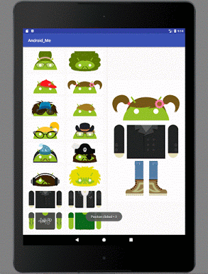
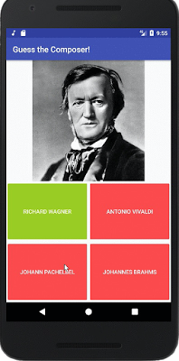
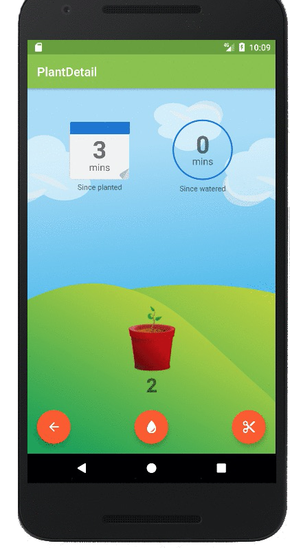

# 学习高级Android课程做一个你自己的app合集，提高你的开发技能(5月8日)

原标题：Build a portfolio of apps as you improve your Android dev skills with the new Advanced Android course   
链接：[https://android-developers.googleblog.com/2017/05/build-portfolio-of-apps-as-you-improve.html](https://android-developers.googleblog.com/2017/05/build-portfolio-of-apps-as-you-improve.html)  
作者：Jocelyn Becker，Android指导资深项目经理  
翻译: [arjinmc](https://github.com/arjinmc)  

[高级Android开发课程](https://cn.udacity.com/course/advanced-android-app-development--ud855/)在线课程已经更新并进一步扩展，通过学习不同的高级部分的app开发，带领你开发更宽阔的app例子。  
      
最新的自定进度课程，你将会学到使用Fragment创建混合和匹配游戏章节。  

  

你可以创建一个音乐测试app去学习多媒体播放器，然后创建一个app试用widgets去让用户给虚拟的植物浇水。  

  

你将会学习到怎样使用代码库，使用谷歌手机图像api创建识别你在笑还是皱眉的app。学习怎么让你的app得到它的地址（也就是手机的位置），如果有大声的通知毁掉心情，你就会用到含有地理围栏的Google Places API（谷歌地方API，得到地方的详细信息）远程控制让你的手机安静下来。  

当你学习完这个课程，你就会知道怎么使用Firebase的Cloud Message(云信息)在服务端给Android客户端发送通知，怎么使用Android Studio的工具Espresso测试你的用户界面。最后，这个课程还包括怎么发布app到Google Play.  

在谷歌工作的开发课程研究专家们在Udacity(优达学城)开设课程。这个课程下一个阶段旅程会让你成为叱咤风云的Android开发者，我们期望你在学习高级课程之前已经学完了[中级课程](https://cn.udacity.com/course/new-android-fundamentals--ud851/)。  

这个课程已经在Udacity上线；你可以随时随地学习它。这是免费的，它是优达学城纳米学位的一部分。  

来创建好玩的app吧！现在就来学习[https://www.udacity.com/course/ud855](https://www.udacity.com/course/ud855)