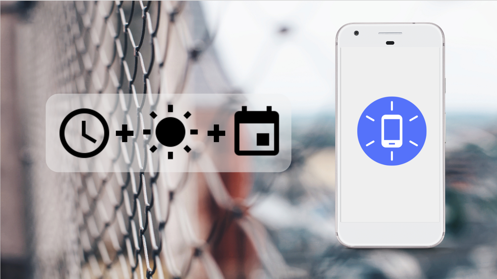

# Awareness APIs支持语义时间啦

原标题：Semantic Time support now available on the Awareness APIs  
链接：[https://android-developers.googleblog.com/2017/06/semantic-time-support-now-available-on.html](https://android-developers.googleblog.com/2017/06/semantic-time-support-now-available-on.html)  
作者：Ritesh Nayak M (产品经理)  
翻译：[arjinmc](https://github.com/arjinmc)  

  

去年在I / O，我们推出了[Awareness API](https://developers.google.com/awareness/)，这是一个简单而强大的API，让开发者使用位置，天气，时间和用户活动等信号来构建内容相关的应用体验。

Awareness API可通过Google Play服务提供两种方式来利用应用程序中的上下文信号。该[快照API(Snapshot API)](https://developers.google.com/awareness/android-api/snapshot-api-overview)允许对用户的当前情境你的应用程序请求信息，而[围栏API(Fence API)](https://developers.google.com/awareness/android-api/fence-api-overview)可以让你的应用程序对变化做出反应的用户的情况下，当它一组特定的条件相匹配。例如，“告诉我什么时候用户在走路并且耳机插入时”。

到目前为止，你可以在Awareness API上指定一个时间屏障，但限于使用绝对/规范的时间表示。基于开发者的反馈意见，我们意识到API在构建时间栅栏方面的灵活性不支持人们在思考和讨论时间时使用的更高层次的抽象。“这个周末 ”，“下一个假期 ”，“日落之后 ”，都是非常普遍和口语的表达方式。这就是为什么我们今天从这些API开始添加语义时间支持

例如，如果你正在建立一个健身应用程序，并希望每天早晨提示用户启动他们的例行程序，或者如果你是在黄昏后打开夜间模式的阅读应用程序; 你将必须在用户位置查询3p API的日出/日落信息，然后用这些规范时间值写入一个意识围栏。通过我们最新的更新，你可以使用我们的[TIME_INSTANT_SUNRISE](https://developers.google.com/android/reference/com/google/android/gms/awareness/fence/TimeFence.html#TIME_INSTANT_SUNRISE)和[TIME_INSTANT_SUNSET](https://developers.google.com/android/reference/com/google/android/gms/awareness/fence/TimeFence.html#TIME_INSTANT_SUNSET)常量，让平台为你管理所有的复杂性。

我们来看一个例子。假设你正在建立一个健身应用程序，周二提醒用户，周四在日出时开始他们的早晨工作。你可以使用以下代码行设置此触发。

```java
// A sun-state-based fence that is TRUE only on Tuesday and Thursday during Sunrise 
AwarenessFence.and(
    TimeFence.aroundTimeInstant(TimeFence.TIME_INSTANT_SUNRISE,
            -10 * ONE_MINUTE_MILLIS, 5 * ONE_MINUTE_MILLIS),
    AwarenessFence.or(
        TimeFence.inIntervalOfDay(TimeFence.DAY_OF_WEEK_TUESDAY,
                0, ONE_DAY_MILLIS),
        TimeFence.inIntervalOfDay(TimeFence.DAY_OF_WEEK_THURSDAY,
                0, ONE_DAY_MILLIS)));
```

我们最喜欢的语义时间功能之一是公众假期。其中每个国家和地区都有不同的假期。假设你是一个当地的徒步旅行和冒险应用程序，想要向用户展示他们可以在星期五或星期一的假期中从容这些活动。你可以使用“天”和“假日”标志的组合来为全球所有用户识别此状态。你可以使用3行代码来完成此操作，并在世界任何地方进行此操作。

```java
// A local-time fence that is TRUE only on public holidays in the
// device locale that fall on Fridays or Mondays.
AwarenessFence.and(
    TimeFence.inTimeInterval(TimeFence.TIME_INTERVAL_HOLIDAY),
    AwarenessFence.or(
        TimeFence.inIntervalOfDay(TimeFence.DAY_OF_WEEK_FRIDAY,
                9 * ONE_HOUR_MILLIS, 11 * ONE_HOUR_MILLIS),
        TimeFence.inIntervalOfDay(TimeFence.DAY_OF_WEEK_MONDAY,
                9 * ONE_HOUR_MILLIS, 11 * ONE_HOUR_MILLIS)));
```             

在这两种情况下，Awareness都会根据设备区域设置大大提升本地化时间和假期。

我们很高兴看到你将使用这个强大的API解决什么问题。请加入我们的[邮件订阅](https://groups.google.com/forum/#!forum/google-context-apis/join)，以获取有关Google和其他Context API的更新。