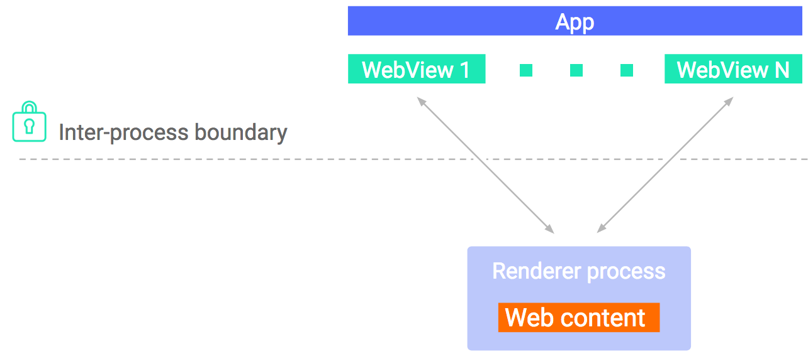
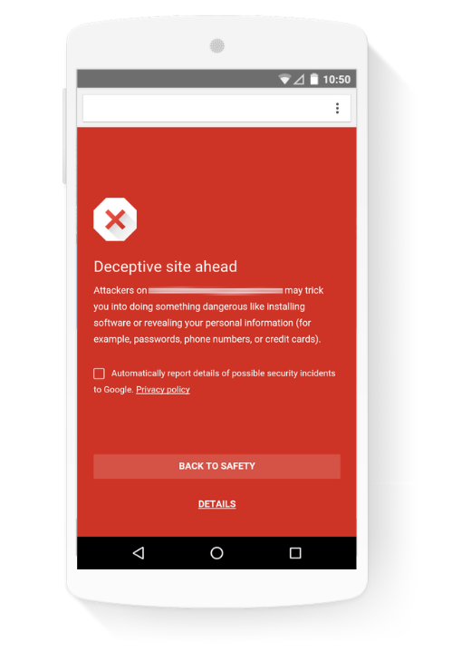

# WebView安全新特性

原标题：What’s new in WebView security  
链接：[https://android-developers.googleblog.com/2017/06/whats-new-in-webview-security.html](https://android-developers.googleblog.com/2017/06/whats-new-in-webview-security.html)  
作者：Xiaowen Xin and Renu Chaudhary （Android安全团队)  
翻译：[arjinmc](https://github.com/arjinmc)  

外部和不可信内容的处理通常是应用程序最重要的功能之一。新闻阅读器显示最新消息文章，购物应用显示出售物品目录。这带来相关风险，因为处理不受信任的内容也是攻击者可能会损害你的应用程序的主要方式之一，即传递格式不正确的内容。

许多应用程序使用[WebView](https://developer.android.com/reference/android/webkit/WebView.html)处理不受信任的内容，多年来我们对Android进行了许多改进，以保护它和你的应用免受妥协。使用Android Lollipop，我们开始提供WebView作为独立的APK，每隔六周从Play商店更新，以便我们能够快速获得用户重要的修复。使用最新的WebView，我们添加了一些更重要的安全增强功能。

## 在Android O中隔离渲染器进程

从Android O开始，WebView将使渲染器与主机应用程序分离运行，并利用Android提供的进程与其他应用程序之间的隔离。

  

与Chrome类似，WebView现在提供了两个级别的隔离：

1. 渲染引擎已被拆分成一个单独的过程。这将主机应用程序与渲染器进程中的错误或崩溃进行隔离，并使恶意网站更难以利用渲染器来利用主机应用程序。
2. 为了进一步包含它，渲染器进程在一个隔离的进程沙箱中运行，将其限制为一组有限的资源。例如，渲染引擎不能自己写入磁盘或与网络通话。它也绑定到Android上使用的相同的seccomp过滤器（即seccomp即将推出的博客）。seccomp过滤器可以减少渲染器进程可以访问的系统调用次数，也可以限制系统调用的允许参数。

  

## 纳入安全浏览

WebView的最新版本采用了Google的[安全浏览](https://safebrowsing.google.com/)保护措施，以检测和警告用户有关潜在危险的网站。当正确配置WebView时，WebView会根据安全浏览的恶意软件和网络钓鱼数据库检查URL，并在用户访问危险站点之前显示警告消息。在Chrome上，这个有用的信息每月显示超过2.5亿次，现在可以在Android上的WebView中使用。

## 启用安全浏览

要为应用程序中的所有WebView启用安全浏览，请在manifiest中添加标签：

```java
<manifest>
     <meta-data android:name="android.webkit.WebView.EnableSafeBrowsing"
                android:value="true" />
      . . .
     <application> . . . </application>
</manifest>
```
因为WebView是作为单独的APK分发的，因此WebView的安全浏览可用于运行Android 5.0及更高版本的设备。你的清单中只添加一行，你可以立即更新应用程序并提高大多数用户的安全性。

