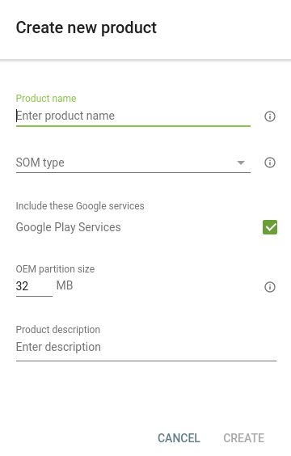
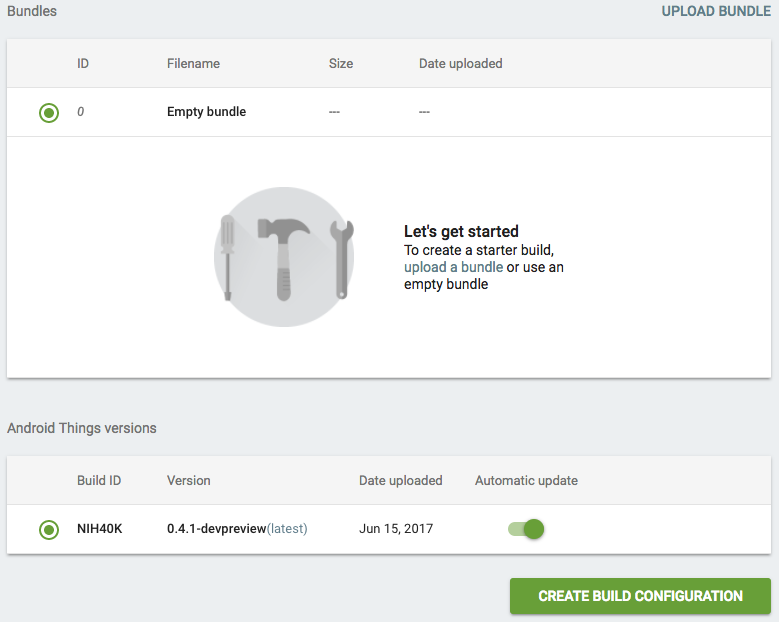
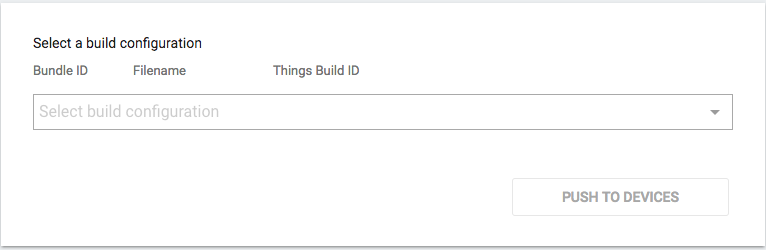

# Android Things控制台开发者预览

原标题：Android Things Console developer preview  
链接：[https://android-developers.googleblog.com/2017/06/android-things-console-developer-preview.html](https://android-developers.googleblog.com/2017/06/android-things-console-developer-preview.html)  
作者：Wayne Piekarski (IoT开发者倡导者)  
翻译：[arjinmc](https://github.com/arjinmc)  

今天我们推出了[Android Thing控制台的预览](https://partner.android.com/things/console)。该控制台允许开发者管理在他们的Android Things IoT设备上运行的软件，包括创建工厂映像，以及更新操作系统和开发者提供的APK。设备需要运行通过Android Things 控制台下载的系统映像，以便接收未来的更新，例如即将推出的开发者预览5. Google提供了所有基础设施（OTA）的更新，因此开发人员可以专注于他们的具体应用并不一定要建立自己的实现 - 让他们的IoT设备比以前更快更安全地进入市场。

让我们来看看控制台，看看它提供的功能。

## 产品创建和产品设置

开发者首先定义了一个产品，其中包括选择设备所基于的名称和系统对模块（SoM）的类型。许多开发者在构建IoT设备时希望使用Google Play服务，并将其配置为可选功能。还配置了OEM分区的大小，并且必须足够大以包含任何未来APK增长的大小。

  

## 工厂图片

设备需要初始的基本固件才能从控制台接收正确产品的未来更新。对于初学者，你可以简单地使用“创建构建配置（Create Build Configuration）”来构建具有为你的产品配置的空包的默认工厂映像。然后可以将此工厂图像下载并闪存到你的设备，你可以通过侧键加载APK开始开发。

之后，一旦你准备好要部署到产品中的所有设备的应用程序，就可以将软件包上传到控制台。此捆绑包是ZIP文件，其中包含主APK文件，用户空间驱动程序作为APK中的服务，以及由主APK启动的任何其他APK。一个[bootanimation.zip](https://source.android.com/devices/tech/ota/device_code#boot-animation)文件也支持，这将在引导过程中显示。然后，上传的捆绑ZIP文件用于生成可部署到设备的完整系统映像。有关捆绑ZIP文件内容的更多信息，请参见[文档](https://developer.android.com/things/console/app_bundle.html)。

  

## OTA更新

此选项卡允许开发人员选择应将哪个系统映像推送到产品设备的队列。开发者选择一个，然后“推送到设备（Push to Devices）”启动该程序。然后将更新安全推送到安装到其中一个A / B分区的所有设备，并在设备重新启动时激活。如果检测到任何故障，设备将自动回滚到之前已知的工作版本，因此未来的更新仍然可能。开发者可以提前测试Android的新版本，并决定是否自动更新设备。

  

## 反馈

Android Thing控制台目前是一个预览，我们正在开发更多功能和定制。我们鼓励所有Android Things开发人员查看Android Things控制台并提供反馈。你可以通过提交[bug报告](https://code.google.com/p/android/issues/entry?template=Android%20Things%20bug%20report)和[功能请求](https://code.google.com/p/android/issues/entry?template=Android%20Things%20feature%20request)，并在[Stack Overflow](http://stackoverflow.com/questions/tagged/android-things)上提出任何问题。要了解有关Android Things控制台的更多信息，请阅读详细的 [文档](https://developer.android.com/things/console/index.html)。我们也鼓励大家在Google+上加入[Google的IoT Developers社区](https://g.co/iotdev)，这是获取更新和讨论想法的绝佳资源。

