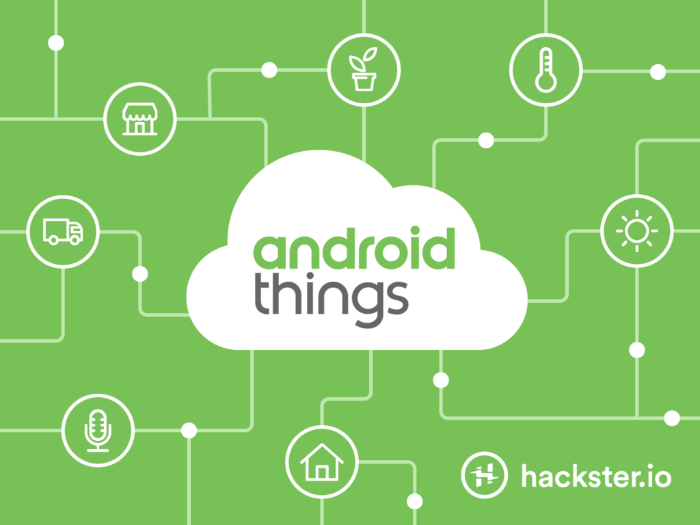

# Android Things的Hackster社区

原标题：Android Things Hackster Community  
链接：[https://android-developers.googleblog.com/2017/06/android-things-hackster-community.html](https://android-developers.googleblog.com/2017/06/android-things-hackster-community.html)  
作者：Dave Smith (IoT开发者支持)  
翻译：[arjinmc](https://github.com/arjinmc)  

[Android Things](https://developer.android.com/things/index.html)通过提供相同的Android开发工具，一流的Android框架和Google API，使开发人员在移动设备上取得成功，使建立连接的嵌入式设备变得容易。自从12月份推出的初步预览之后，社区已经将一些惊人的想法转化为使用该平台的令人兴奋的原型。

为了让这些制造商和开发人员能够使用Android的东西分享和相互学习，我们与[Hackster.io](https://hackster.io/)合作，创建一个有志愿的物联网开发人员可以展示他们的项目并受到他人工作的启发的社区。Hackster.io是一个拥有20万名工程师和开发人员的社区，致力于构建互联网连接的硬件项目。他们还设法通过现场讲习班和设计比赛来教育和挑战成员。

我们渴望看到你想出的项目。更重要的是，我们很高兴看到你的工作如何能激发其他开发者使用Android Things创造出一些不错的东西。访问我们的[Hackster.io社区](https://hackster.io/google)，查看其他人已经建成的惊人项目，并加入社区！

## Android Things网络研讨会

<strong>2017年7月7日上午10点</strong>，我们将与Hackster.io合作举办一次网络研讨会，标题为<strong>Android Things上的Bootstrapping IoT产品</strong>。在此期间，你将了解到我们如何设计Android Things，以解决开发人员尝试构建IoT产品所遇到的许多困难。你还将有机会发送有关平台和生态系统的问题。[今天注册](https://attendee.gotowebinar.com/register/3772499545049167107)参加我们这个激动人心的活动！

  

