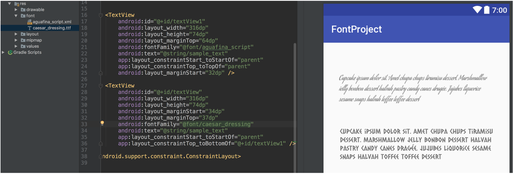

# Android O API最终版发布，你的app准备好了吗

原标题：Android O APIs are final, get your apps ready!  
链接：[https://android-developers.googleblog.com/2017/06/android-o-apis-are-final-get-your-apps.html](https://android-developers.googleblog.com/2017/06/android-o-apis-are-final-get-your-apps.html)  
作者：Dave Burke (工程师副总裁)  
翻译：[arjinmc](https://github.com/arjinmc)  

三周前在Google I / O上，我们[宣布了](https://android-developers.googleblog.com/2017/05/whats-new-in-android-o-developer.html)Android O的第二次开发人员预览，以及关键主题<strong>Fluid Experiences</strong>和<strong>Vitals</strong>，并强调了我们通过[Project Treble](https://android-developers.googleblog.com/2017/05/here-comes-treble-modular-base-for.html)实现模块化基础的工作。我们发布第一个测试版本也是我们的重要里程碑。我们谈了很多关于什么在主题演讲和分组在Android的新会话，如果你错过了视频直播时，查看会谈的完整存档[这里](https://www.youtube.com/user/androiddevelopers/playlists?sort=dd&view=50&shelf_id=14)。

今天我们推出开发者预览版3之后的最终的Android O API，最新的系统映像以及Android Studio的更新，在夏季末帮助你准备好app发布的。观看7月份的另一个预览更新，将为你带来近乎最终的系统映像。

如果你已经在[Android测试版程序](http://android.com/beta)中注册了你的设备，那么你将很快收到Developer Preview 3的更新。

## 使你的应用程序与Android O兼容

随着消费者[在未来几个月](https://developer.android.com/preview/migration.html)的推出即将到来，关键的第一步是使你当前的应用程序与Android O兼容。这将使 你的用户在到达其设备时无缝过渡到新平台。

如果你尚未测试你的应用程序的兼容性，开始使用很简单 - 只需在Android测试版中注册受支持的设备，然后直接获取最新更新，然后从Google Play安装你当前的应用程序并进行测试。应用程序应该运行和看起来不错，它应该适当地处理Android O的[表现变化](https://developer.android.com/preview/behavior-changes.html) - 特别要注意[后台限制](https://developer.android.com/preview/behavior-changes.html#abll)和[网络](https://developer.android.com/preview/behavior-changes.html#networking-all)， [安全性](https://developer.android.com/preview/behavior-changes.html#security-all)和[标识符](https://developer.android.com/preview/behavior-changes.html#privacy-all)的变化。

完成任何必要的更新后，我们建议你将应用的兼容版本立即发布到Google Play，而无需更改应用的平台定位。

## 使用Android O功能和API来增强你的应用程序

通过Android O功能扩展你的应用程序可以帮助你更多地参与互动，提供新的互动，为用户提供更多的控制和安全性，甚至提高应用的性能。

[通知渠道](https://developer.android.com/preview/features/notification-channels.html)和[点](https://developer.android.com/preview/features/notification-badges.html) 提供了更多的方法来向用户展示新内容，并将其重新带入你的应用。画中画可让你的应用程序在屏幕上保持屏幕上的同时，用户可以进行多任务处理，而[自动填充功能](https://developer.android.com/preview/features/autofill.html#optimizing_your_app_for_autofill)使他们能够轻松地输入表单数据并帮助保持数据的安全。还检查了[自适应图标](https://developer.android.com/preview/features/adaptive-icons.html)，[XML字体资源](https://developer.android.com/preview/features/fonts-in-xml.html)，[可下载字体](https://developer.android.com/preview/features/downloadable-fonts.html)和[emoji表情符](https://developer.android.com/preview/features/emoji-compat.html)， [自动调整大小的TextView](https://developer.android.com/preview/features/autosizing-textview.html)，[A音频API](https://developer.android.com/ndk/guides/audio/aaudio/aaudio.html)，和[其他许多内容](https://developer.android.com/preview/api-overview.html)。你还需要计划支持[后台执行限制](https://developer.android.com/preview/features/background.html)以及[O应用程序重要系统行为](https://developer.android.com/preview/behavior-changes.html#o-apps)的其他重要更改。

访问[O开发者预览网站](https://developer.android.com/preview/index.html)，了解所有新功能和API以及如何将其构建到应用程序中。

  

<small>画中画模式可让用户在多任务时保持使用（左）。通知点让用户在你的应用程序中处于活动状态，并让他们直接跳转应用程序的核心功能（右）。</small>

## 开始使用Developer Preview 3

今天的预览更新包括最新版本的Android O平台，最终的API级别26以及数百个错误修正和优化。你可以从[Android Studio](https://developer.android.com/studio/index.html?utm_campaign=android_launch_npreview_061516&utm_source=anddev&utm_medium=blog)中的SDK Manager下载最终的API 26 SDK ，并从[Google的Maven存储库](https://developer.android.com/studio/build/dependencies.html#google-maven)下载[Android支持库](https://developer.android.com/topic/libraries/support-library/revisions.html?utm_campaign=android_launch_npreview_061516&utm_source=anddev&utm_medium=blog) 26.0.0 beta 2 。

通过这些官方Android O API，你可以一起为你开发和测试应用程序所需的一切。安装最终SDK后，你可以将项目更新<small>compileSdkVersion</small>为API 26，以便根据官方的Android O API进行编译。我们还建议你将应用程序更新<small>targetSdkVersion</small>为API 26，以便选择使用Android O特定[行为更改](https://developer.android.com/preview/behavior-changes.html?utm_campaign=android_launch_npreview_061516&utm_source=anddev&utm_medium=blog)来测试应用程序。有关如何设置使用Android O构建环境的详细信息，请参阅[迁移指南](https://developer.android.com/preview/migration.html#bfa)。

自第二次开发人员预览后，API已经发生变化，因此如果你现有的代码使用Android O预览API，请查看[差异报告](https://developer.android.com/sdk/api_diff/26-incr/changes.html)以查看代码可能受到的影响。

如果你正在开发Android O，我们建议你更新到最新版本的[Android Studio 3.0](https://android-developers.googleblog.com/2017/05/android-studio-3-0-canary1.html)，现在可以在canary频道中使用。除了强大的新功能，如改进应用性能分析工具，用于支持[Kotlin编程语言](http://android-developers.googleblog.com/2017/05/android-announces-support-for-kotlin.html)，并Gradle建立优化的Android Studio 3.0包括建立支持[即时应用程序](https://android-developers.googleblog.com/2017/05/android-instant-apps-is-open-to-all.html)，一个[自适应图标向导](https://developer.android.com/preview/features/adaptive-icons.html)，并支持[XML的字体](https://developer.android.com/preview/features/working-with-fonts.html)和[可下载字体](https://developer.android.com/preview/features/downloadable-fonts.html)。

  
<small>Android Studio 3.0包括使用Android O功能开发的工具，可让你在应用程序中预览XML字体资源。</small>

如果你不打算使用这些功能，你现在可以选择使用stable通道的[Android Studio 2.3.3](https://developer.android.com/studio/index.html)开发Android O。请注意，使用自适应图标和可下载字体的工具以及XML字体在Android Studio 2.3.3中不可用。

## 将你的应用发布到Google Play中的Alpha，Beta或制作频道

现在，API是最终版，你可以发布APK更新，并将API 26进行编译，并可选择将其定位到Google Play的alpha，beta或甚至制作频道。在预览过程中发布O目标应用程序可让你测试现有设备的兼容性，并将更新推送到运行API 26的设备，例如注册Android测试版的用户。

为了确保你更新的应用在Android O以及旧版本上运行良好，通常的策略是使用[Google Play的测试版测试功能](https://developer.android.com/distribute/engage/beta.html?utm_campaign=android_launch_npreview_061516&utm_source=anddev&utm_medium=blog)，从一小群用户（包括开发者预览用户）获取早期反馈，然后执行当你将更新的应用程序发布给所有用户时，你将分阶段推出。

## 如何获得预览更新

通过[Android Beta程序](https://android.com/beta)，全球开发人员和早期采用者将很快在其设备上获得Developer Preview 3。如果你尚未注册，只需访问[android.com/beta](https://android.com/beta)并选择符合条件的Android手机或平板电脑。一如以往，你也可以[手动下载更新](https://developer.android.com/preview/download.html?utm_campaign=android_launch_npreview_061516&utm_source=anddev&utm_medium=blog#flash)。O开发者预览版可用于Pixel，Pixel XL，Pixel C，Nexus 5X，Nexus 6P和Nexus Player。

非常感谢你的所有反馈。我们今年夏天将在消费者发布工作中继续分享[反馈或请求](https://developer.android.com/preview/feedback.html)。我们期待在Android O上看到你的应用程序！