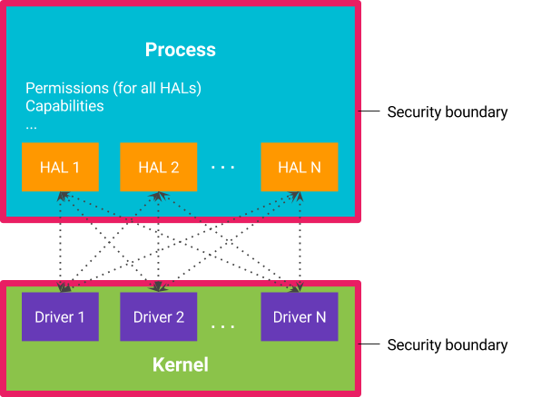
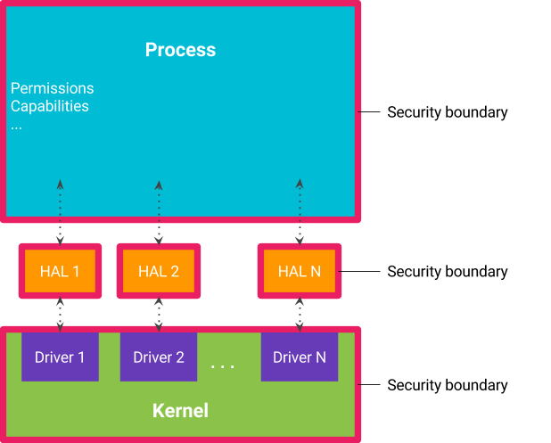
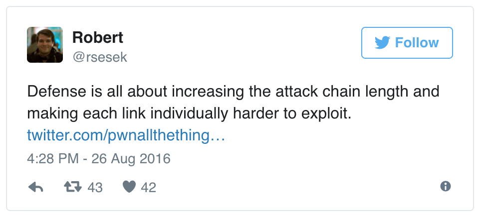

# 关闭HAL

原标题：Shut the HAL Up  
链接：[https://android-developers.googleblog.com/2017/07/shut-hal-up.html](https://android-developers.googleblog.com/2017/07/shut-hal-up.html)  
作者：Jeff Vander Stoep （Android 安全高级软件工程师)  
翻译：[arjinmc](https://github.com/arjinmc)  

更新对于安全性至关重要，但对于设备制造商而言，这些更新将是困难和昂贵的。[Project Treble](https://android-developers.googleblog.com/2017/05/here-comes-treble-modular-base-for.html)通过将底层供应商实现与核心Android框架分开来更轻松地进行更新。该模块化允许平台和供应商提供的组件彼此独立地更新。虽然更容易和更快速的更新是令人敬畏，但Treble的增加的模块化设计也旨在提高安全性。

## Isolating HALs

一个[硬件抽象层](https://en.wikipedia.org/wiki/Hardware_abstraction)（HAL）提供设备无关的代码和设备特定的硬件实现之间的接口。HAL通常打包为共享库，直接加载到需要硬件交互的进程中。安全边界在流程级执行。因此，将HAL加载到进程中意味着HAL正在与加载进程相同的安全上下文中运行。

在进程中运行HAL的传统方法意味着该进程需要每个进程中的HAL所需的所有权限，包括直接访问内核驱动程序。同样，进程中的所有HAL都可以访问与进程其余部分相同的一组权限，包括其他进程中的HAL所需的权限。这导致过度特权进程和HAL可以访问他们不应该拥有的权限和硬件。

  
<strong>图1</strong>在一个过程中多个HAL的传统方法。

将HAL移动到自己的进程中更好地遵守[最低权限的原则](https://en.wikipedia.org/wiki/Principle_of_least_privilege)。这提供了两个无疑的优势：

1. 每个HAL都运行在自己的沙箱中，并允许访问其所控制的硬件驱动程序，并且授予进程的权限仅限于执行其所需的权限。
2. 类似地，该程序失去对硬件驱动程序的访问以及HAL所需的其他权限和功能。

  
<strong>图2</strong>.每个HAL都在自己的进程中运行。

将HAL移植到自己的进程中对于安全性来说是非常好的，但是以客户端进程和HAL之间的IPC开销增加为代价。[改进粘合剂驱动程序](https://lkml.org/lkml/2016/10/24/335)使得HAL和客户端之间的IPC成为可行。将scatter-gather引入到binder中，通过消除对序列化/反序列化步骤的需求，减少对三倍数据执行的复制操作的数量变成一倍，从而提高了每个事务的性能。Android O还引入了binder域，为供应商和平台组件提供单独的通信流。应用程序和Android框架继续使用/ dev / binder，但是供应商提供的组件现在使用/ dev / vndbinder。平台和供应商组件之间的通信必须使用/ dev / hwbinder。

## 案例研究：系统服务器

核心Android操作系统提供给应用程序的许多服务都由系统服务器提供。随着Android的发展，系统服务器的职责和权限也一样，使其成为[攻击者](https://googleprojectzero.blogspot.com/2016/09/return-to-libstagefright-exploiting.html)的有吸引力的目标。作为Treble项目的一部分，大约20个HAL被移出系统服务器，包括用于传感器，GPS，指纹，Wi-Fi等的HAL。以前，任何这些HAL中的妥协将获得特权的系统权限，但在Android O中，权限仅限于特定HAL所需的子集。

## 案例研究：媒体框架

继Android O之后继续努力[加强Android Nougat的媒体堆栈](https://android-developers.googleblog.com/2016/05/hardening-media-stack.html)。在Nougat中，mediaserver分为多个组件，以更好地遵守最低权限的原则，音频硬件访问仅限于音频服务器，摄像机硬件访问仅限于摄像机等上。在Android O中，大多数直接硬件访问已经从媒体框架中完全删除。例如，音频，照相机和DRM的HAL已分别从音响服务器，摄像机和drmserver移出。

## 减少和隔离内核的攻击面

  
Linux内核是Android上安全模型的主要执行者。逃脱沙箱机制的尝试往往涉及攻击内核。 对内核漏洞的[分析](https://events.linuxfoundation.org/sites/events/files/slides/Android-%20protecting%20the%20kernel.pdf),Android表明，它们绝大多数发生在硬件驱动程序中并达到。

特权系统服务器和媒体框架很重要，因为它们与安装的应用程序直接交互。删除直接访问硬件驱动程序会d难以导致bug出现，并为Android的安全模型添加了另一层防御。

