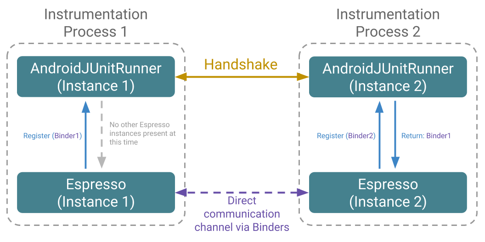
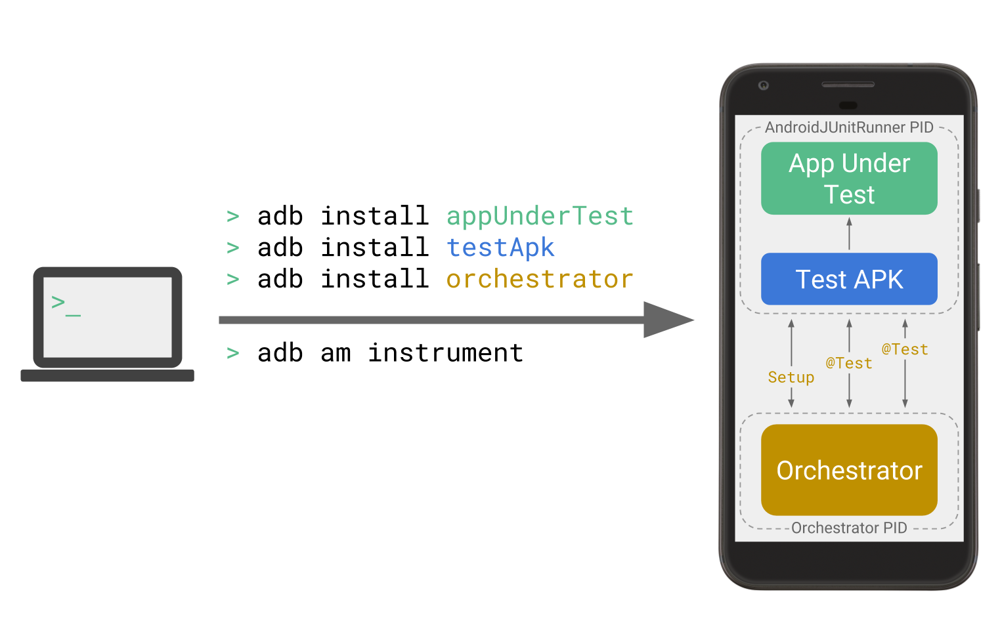

# Android测试支持库1.0

原标题：Android Testing Support Library 1.0 is here!  
链接：[https://android-developers.googleblog.com/2017/07/android-testing-support-library-10-is.html](https://android-developers.googleblog.com/2017/07/android-testing-support-library-10-is.html)  
作者：Michael Amygdalidis，Stephan Linzner，Nick Korostelev (Google移动忍着团队)  
翻译：[arjinmc](https://github.com/arjinmc)  

  

我们很高兴地宣布Android测试支持库（ATSL）的1.0版本。

ATSL 1.0版是我们现有测试API的一个主要更新，具有许多新功能，改进的性能，稳定性和bug修复。它提供与现在已弃用的Android平台测试API的完全API奇偶校验。此版本还增加了我们在[Google I / O 2017](https://www.youtube.com/watch?v=pK7W5npkhho)谈话中讨论的一些功能，例如对本机支持的[多进程Espresso](https://developer.android.com/training/testing/espresso/multiprocess.html)和[Android测试Orchestrator](https://developer.android.com/training/testing/junit-runner.html#using-android-test-orchestrator)。

我们也很高兴地宣布，从1.0版开始，我们在Google的Maven资源库中发布版本，这使得在你的构建中使用ATSL变得更加容易。要了解有关使用此存储库的更多信息，请参阅[Google Maven存储库入门](https://developer.android.com/topic/libraries/support-library/setup.html#add-library)指南。请注意，我们已经不再通过平台更新将测试基础设施的未来更新与之结合在一起。如果你还没有将测试升级为ATSL，这是非常好的时机。

最后，我们要宣布我们的Android测试文档的更新。我们已将我们的旧测试文档从我们的[GitHub网站](https://google.github.io/android-testing-support-library/)迁移到[developers.android.com/testing](https://developer.android.com/training/testing/index.html)。所有的测试文档现在都显示在一个单一的地方，使得更容易学习如何在Android上编写和执行测试。

我们继续介绍这篇文章的有趣部分，概述我们在此版本中提供的新API和工具。

## Espresso的改进

<strong>Espresso 3.0.0</strong>具有惊人的新功能和整体性能的提升。其中一些亮点包括：多进程Espresso，空闲注册表和新的闲置资源。让我们进一步深入了解这些新功能：

### 多进程Espresso

从[Android O](https://developer.android.com/preview/api-overview.html#test)开始，该平台支持在应用程序的默认进程之外进行测试测试。（在Android O之前，你只能在应用程序的默认进程中测试应用程序组件。）多进程Espresso使此支持成为可能。它允许你无缝测试你的应用程序的UI交互过程边界，同时仍然保持Espresso的同步保证。

好消息是，Espresso做了所有的工作; 你不必在多个进程中使用UI更改任何设置。你可以继续编写你的Espresso测试，就像你对单进程应用程序一样，Espresso自动处理进程IPC和进程之间的同步。

下图显示了Espresso的多个实例如何相互通信：

  

如果你想了解更多关于多进程Espresso以及如何使用它，请查看我们的[文档](https://developer.android.com/training/testing/espresso/multiprocess.html) 和我们的[多进程示例](https://github.com/googlesamples/android-testing/tree/master/ui/espresso/MultiProcessSample)。

### 空闲注册表
一些应用程序使用Gradle中的构建风格或依赖注入框架（如Dagger）来生成注册空闲资源的测试构建配置。其他的只是通过他们的活动暴露空闲的资源。所有这些方法的问题是它们增加了开发工作流的复杂性，其中一些甚至打破了封装。通过最新版本的Espresso，通过引入新的[IdlingRegistry](https://developer.android.com/reference/android/support/test/espresso/IdlingRegistry.html)API ，我们可以更轻松地从你的应用程序代码中注册空闲资源。 IdlingRegistry是一个轻量级的注册表，不会带来整个Espresso库，因此你可以更轻松地从应用程序代码注册资源。当将此API与多处理Espresso相结合时，你可以从应用程序代码中的任何进程注册空闲资源。

Espresso类的注册现已弃用。

### 空闲资源
编写自定义空闲资源可能很耗时，所以Espresso 3.0.0现在有更多的空闲资源开箱即可同步你的线程。新资源包括：[IdlingThreadPoolExecutor](https://developer.android.com/reference/android/support/test/espresso/idling/concurrent/IdlingThreadPoolExecutor.html)和[IdlingScheduledThreadPoolExecutor](https://developer.android.com/reference/android/support/test/espresso/idling/concurrent/IdlingScheduledThreadPoolExecutor.html)。会有更多的来！

要利用新的空闲资源，请将这些新的依赖项添加到你的build.gradle文件中：

```code
androidTestCompile "com.android.support.test.espresso.idling:idling-concurrent:3.0.0"
```

此外，[CountingIdlingResource](https://developer.android.com/reference/android/support/test/espresso/idling/CountingIdlingResource.html)以前在Espresso contrib中已经弃用，已经在此版本中删除。因此，你需要更新测试以使用[CountingIdlingResource](https://developer.android.com/reference/android/support/test/espresso/idling/CountingIdlingResource.html)位于Espresso空闲资源中的新软件包。有关完整的迁移详细信息，请参阅我们的[发布说明](https://developer.android.com/topic/libraries/testing-support-library/release-notes.html)。

## ProviderTestRule

当你测试[ContentProvider](https://developer.android.com/reference/android/content/ContentProvider.html)对象时，现在可以使用<i>ProviderTestRule</i>而不是[ProviderTestCase2](https://developer.android.com/reference/android/test/ProviderTestCase2.html)。 <i>ProviderTestRule</i>提供了一种更简单的方法来处理目前可用于AndroidJUnit4的其他测试规则。

<i>ProviderTestRule</i>包括用于初始化的API，以及针对<i>ContentProvider</i>未被测试的命令。如果你的<i>ContentProvider</i>是基于SQLite数据库，则可以使用<i>ProviderTestRule</i>命令设置数据库文件和初始化命令。

要了解更多信息，请参阅[ProviderTestRule](https://developer.android.com/reference/android/support/test/rule/provider/ProviderTestRule.html)文档。

## 授予权限规则

Android M（API级别23）允许应用程序在运行时请求权限。但是，请求运行时权限的对话框会将测试置于无法继续的状态，导致失败。通过使用[GrantPermissionRule](https://developer.android.com/reference/android/support/test/rule/GrantPermissionRule.html)，你可以完全跳过对话框弹出窗口，并模拟一个用户为你的应用程序授予运行时权限。

## Android测试协调器

通常情况下，AndroidJUnitRunner会在相同的测试过程中运行所有测试，这可能会导致许多问题。例如，测试在内存中共享其状态，如果一个测试崩溃，则会阻止测试套件的其余部分运行。

虽然可以通过发出顺序<i>adb</i>命令隔离测试，但这个过程增加了主机端的处理负载。通过使用新的Android测试代理程序，你可以在设备上完全实现测试隔离，如图所示：

  

请注意，如果你的测试需要共享状态通过，则协调者会导致它们失败。此行为是设计使然。在这篇文章中，Android测试Orchestrator是试用版可以通过命令行使用。我们将为Firebase测试实验室和Android Studio计划进行整合。

有关更多信息，请参阅[Android Testing Orchestrator开发者指南](https://developer.android.com/training/testing/junit-runner.html#using-android-test-orchestrator)。

## AndroidJUnitRunner

AndroidJUnitRunner现在包含了许多其他功能：

* 你可以使用[JUnitParams](https://github.com/Pragmatists/JUnitParams)。
* 你可以使用转换器参数来配置类加载器和自定义JUnit测试筛选器

有时你想测试一下你在测试工作流程中作为动态创建和配置的activity。现在，你可以使用[MonitoringInstrumentation](https://developer.android.com/reference/android/support/test/runner/MonitoringInstrumentation.html)（和扩展[AndroidJUnitRunner](https://developer.android.com/reference/android/support/test/runner/AndroidJUnitRunner.html)）配置[InterceptingActivityFactory](https://developer.android.com/reference/android/support/test/runner/intercepting/InterceptingActivityFactory.html)。你可以使用特定于测试的配置创建你的测试activity，而无需依赖编译时注入。

本概述只显示了我们对ATSL进行的一些最重要的更改。他们还有更多值得探索的变化。有关完整版本的详细信息，请参阅我们的[发布说明](https://google.github.io/android-testing-support-library/downloads/release-notes/index.html)。

最后但并非最不重要的是，我们要感谢所有为此版本贡献功能的开发者。我们还要感谢美国运通，Slack和GDE Chiu-Ki Chan的移动工程团队的Android测试专家与我们合作，并提供有关Android测试支持库预发布版本的宝贵意见。

从ATSL团队愉快地测试吧！