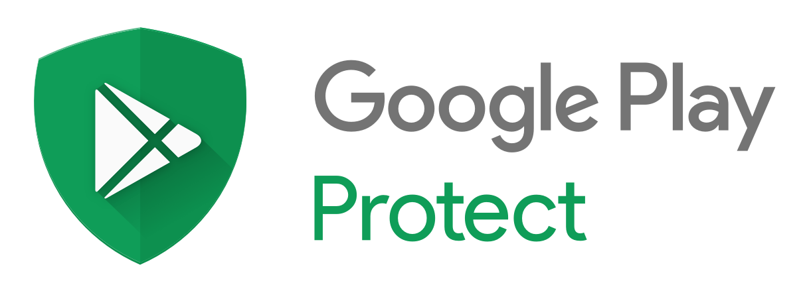

# 从Chrysaor到Lipizzan：阻止一个新的目标间谍软件家族

原标题：From Chrysaor to Lipizzan: Blocking a new targeted spyware family  
链接：[https://android-developers.googleblog.com/2017/07/from-chrysaor-to-lipizzan-blocking-new.html](https://android-developers.googleblog.com/2017/07/from-chrysaor-to-lipizzan-blocking-new.html)  
作者：Megan Ruthven (Android安全）, Ken Bodzak, Neel Mehta（威胁分析组）  
翻译：[arjinmc](https://github.com/arjinmc)  

Android安全一直在开发新的方法来使用数据来查找和阻止潜在有害的应用（PHA）进入你的设备。今年早些时候，[我们宣布](https://android-developers.googleblog.com/2017/04/an-investigation-of-chrysaor-malware-on.html)我们已经阻止了Chrysaor针对性的间谍软件，相信是由NSO Group（一家网络武器公司）撰写的。在我们的Chrysaor调查过程中，我们使用类似的技术来发现一个名叫Lipizzan的新的和不相干的间谍软件家族。Lipizzan的代码包含了一个网络武器公司Equus Technologies的引用。

Lipizzan是一种多阶段的间谍软件产品，可以监控和渗透用户的电子邮件，短信，位置，语音电话和媒体。我们已经发现20个Lipizzan应用程序以有针对性的方式分发到总共少于100个设备，并阻止了Android生态系统的开发人员和应用程序。Google Play Protect(保护）已通知所有受影响的设备，并移除了Lipizzan应用。

我们增强了Google Play保护的功能，以检测此处使用的有针对性的间谍软件，并将继续使用此框架来阻止更有针对性的间谍软件。要详细了解Google用于查找像Chrysaor和Lipizzan这样的针对性移动间谍软件的方法，请参加我们的BlackHat讲座，[在移动生态系统中对抗目标恶意软件](https://www.blackhat.com/us-17/briefings/schedule/index.html#fighting-targeted-malware-in-the-mobile-ecosystem-7555)。

## Lipizzan如何工作？

### 进入目标设备

Lipizzan是一个复杂的两阶段间谍软件工具。Google Play Protect发现的第一个阶段是通过包括Google Play在内的多个渠道进行分发的，通常会冒充一个无害的“App”或“清洁器”应用程序。安装后，Lipizzan将下载并加载第二个“许可证验证”阶段，该阶段将对受感染设备进行检测并验证某些中止标准。如果给出了全面的清晰度，则第二阶段将使用已知的漏洞利用设备，并开始将设备数据渗透到Command（命令）＆Control（控制）服务器。

### 一旦植入到目标设备上

Lipizzan第二阶段能够执行和完善以下任务的结果：

* 通话记录
* VOIP录音
* 从设备麦克风录制
* 位置监控
* 截图
* 使用设备相机拍摄照片
* 获取设备信息和文件
* 获取用户信息（联系人，通话记录，短信，应用程序特定数据）

PHA有特定的例程从每个以下应用程序检索数据：

* Gmail
* Hangouts
* KakaoTalk
* LinkedIn
* Messager
* Skype
* Snapchat
* StockEmail
* Telegram
* Threema
* Viber
* WhatsApp

我们在独立的第2阶段app，com.android.mediaserver（与[Android MediaServer](https://source.android.com/devices/media/framework-hardening)无关）中看到所有这些行为。该应用程序与第一阶段应用程序之一共享一个签名证书，com.app.instantbackup，表示同一作者写了两个。我们可以使用第二阶段（com.android.mediaserver）中的以下代码片段来绘制阶段1应用程序的连接。

```java
public void uninstallParent() { 
    android.util.Log.d("ApplicationsManager", "Removing parent application!");
    com.android.mediaserver.shell.Shell$SU.run(new StringBuilder().append("").append("echo u:r:system_server:s0 > /proc/$$/attr/current; pm uninstall").append("com.app.instantbackup").toString());
    com.android.mediaserver.shell.Shell$SU.run(new StringBuilder().append("").append("rm -rf /data/data/").append("com.app.instantbackup").toString());
    com.android.mediaserver.shell.Shell$SU.run(new StringBuilder().append("").append("rm -Rf /data/data/").append("com.app.instantbackup").toString());
    return;
}
```
    
### 变形第一阶段

我们在Google Play上封锁了第一批应用程式后，新版应用程式以相似的格式上传，但有所不同。

* 应用程序从“备份”应用程序更改为“清洁器”，“记事本”，“录音机”和“闹钟管理器”应用程序。新的应用程序在移除的一个星期内上传，显示作者有一种方法可以轻松更改植入物应用程序的品牌。
* 该应用从下载未加密的阶段2更改为包括第2阶段作为加密的Blob。如果接收到AES密钥和IV的意图，则新的第1阶段将仅解密并加载第2阶段。

尽管改变了应用程序的类型和下载第二阶段的方法，但是我们可以在上传后立即抓住新的植入物应用程序。

### 有多少台设备受到影响？

使用下面列出的应用程序，少于100个设备检入Google Play保护。这意味着家庭仅影响Android设备的0.000007％。由于我们发现了Lipizzan，Google Play Protect会从受影响的设备中移除Lipizzan，并主动阻止在新设备上安装。

### 你能做些什么来保护自己？

  

* 确保你[已选择加入Google Play保护](https://www.android.com/play-protect/)。
* 独家使用Google Play商店。与使用其他安装机制相比，你在Google Play上安装PHA的机会要低得多。
* 在不使用“未知来源”时禁用。
* 保持您的手机修补最新的Android安全更新。

## 例子列表：
### 阶段1
#### 旧版本


包名称 | 最新App SHA 256
------|------
com.safe.datasaver | 5d6a8c9c335edaf0b5d010f30e9fc9cea1e7a19d8c4e888079d6a6a4bae5aaef  
com.and.goldbackup | 3a9f25b2ba38974b0eb8de76ad37abc77f7eb068e6880305cc1faaba4467d5cf  
com.star.backupstar | ed4f693ea491ab0c455499fbaeddec70652b506f778130b43101b2496669fe59  
com.veramon.backupit | 27971324142ae23aad3f7e95e7eb1b85a7f08b39b4a4d27aab177669e875791b  
com.copanga.backupplus | 726b91193469513405b95f0c20cb0ec94396ce317ac0f763e98af949186630f8  
com.app.thunderbackup | 99282aa2d17a341d88a6e1944149639bcc8f711cdcd134a455b0c25951111712  
com.kopos.nowbackup | 48305da03403990395afb159c56370d204b0e32343f3b0790b640653ee79e5c9  
com.appnow.backupdroid | 35896010e204b064e313204d525185586924b31a0804d0512ba5467fc95cb35e  
com.apptimus.androidbackuppro | b615936270d9dab3c29d7b0a3c1fc846f1f5d82570fb917849769f578cfaeb01  
com.app.backupfast | 9efa83579e769f73793e138d79d15aa5b96e42c58b568eab00edece6219e2322  
com.app.instantbackup | a5f266864b341f8558aacdee1a38fe4b95a9035bf9c0c1d7761e23de2181dcf2  

#### 较新版本

包名称 | 最新App SHA 256
------|------
com.sd.sdbackup | 8ebe42ce2c03e56cb97bb2dc1be47a4226899d6f648c30eecb19e32a7867657a  
com.app.procleaner | affc95a6db70b62b4252fe5da4016ae873b33e645147f06f12a33c9dc5305ae4  
com.app.alarmmanager | fe121da2a53632ba2b617eae26c72b685ed4853a6b3f9fd223af11a1042c3541  
com.app.soundrecorder | aa4445023df7b203e8078858b502d1082647c815b24c3335a58347bc98b79c74  
com.mem.notesplus | 24aa8a2f2fbbbe82b89076bf1981bdedb7ecb4baa9e036993504e8309269b373  
com.app.processcleaner | b2eca848730d41c2e8001ec7316352343b84327d59e193aacdcd0d01aceb79f2  
com.kobm.devicecleaner | 6ddad8d049fd25e06b84de013dfec7e1bb09abca78604305b9ae1df6c4145e5c  
com.yonni.deviceoptimizer | 2f8fab18374080ac42422e5e79a693438b81f95f76de5f2f34cd2a0c882f06ef  
com.haima.ultracleaner | af7f90809d4e3bf160ccf4a219012f9dac283657f57b812733022f4a966428ea  

###独立阶段2

包名称 | 最新App SHA 256
------|------
com.android.mediaserver | 1ba8d5f45e8cd545cc3b919bea80e7bd5c6c85fc822f52edc0669191536d43da  

