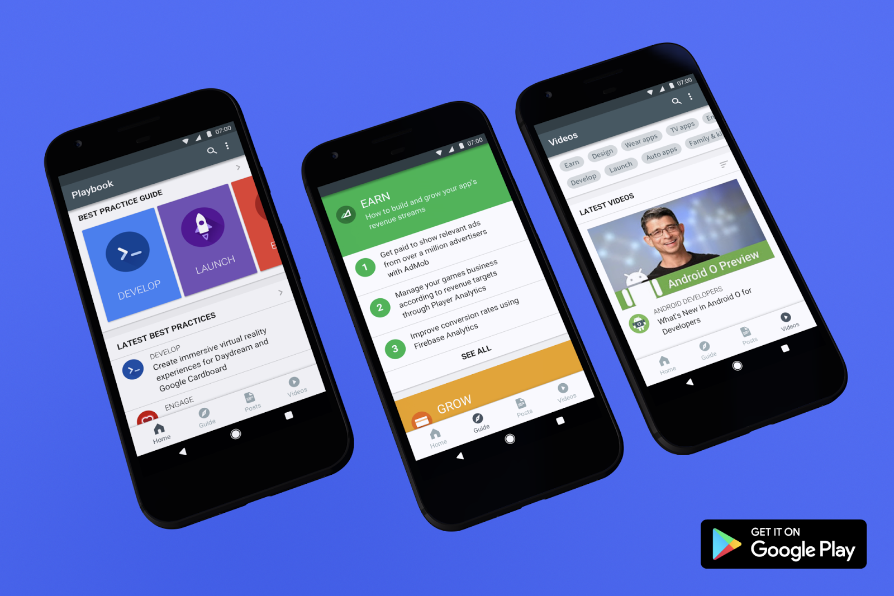
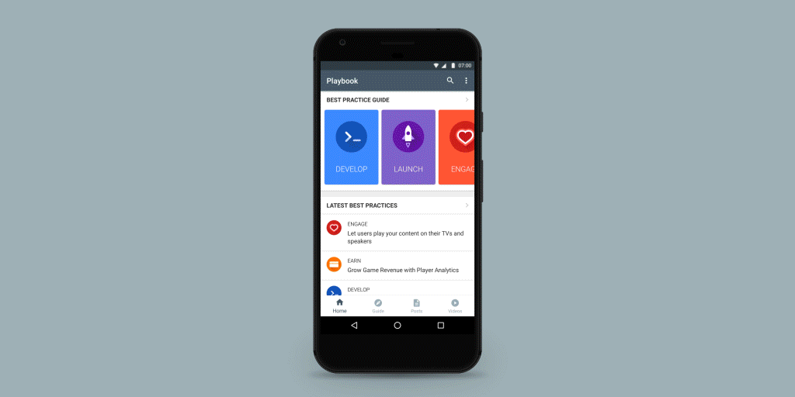

# 获取更新的Playbook应用程序的新资讯和技巧，以帮助你在Google Play拓展业务

原标题：Get the updated Playbook app for news and tips to help you grow your business on Google Play  
链接：[https://android-developers.googleblog.com/2017/07/get-updated-playbook-app-for-news-and.html](https://android-developers.googleblog.com/2017/07/get-updated-playbook-app-for-news-and.html)  
作者：Dom Elliott (Google Play开发者营销总监)  
翻译：[arjinmc](https://github.com/arjinmc)  

  

获取最新的Playbook应用程序，让开发者了解在Google Play上获得成功的捷径，最佳做法和策略。发掘Google的见解，帮助你开发和推出你的应用，吸引和扩大观众，并获得更多收益。通过本地化的内容，开发者的Playbook应用程序有14种语言（[英文](https://g.co/play/playbookv2-androiddevs-blog-launch)，[印度尼西亚语](https://play.google.com/store/apps/details?id=com.google.android.apps.secrets&hl=id&utm_source=androiddevelopers&utm_medium=blog&utm_campaign=id)，[Deutsch](https://play.google.com/store/apps/details?id=com.google.android.apps.secrets&hl=de&&utm_source=androiddevelopers&utm_medium=blog&utm_campaign=de)， [español（Latinoamérica）](https://play.google.com/store/apps/details?id=com.google.android.apps.secrets&hl=es-419&&utm_source=androiddevelopers&utm_medium=blog&utm_campaign=es-419)，[lefrançais](https://play.google.com/store/apps/details?id=com.google.android.apps.secrets&hl=fr&&utm_source=androiddevelopers&utm_medium=blog&utm_campaign=fr)，[portuguêsdo Brasil](https://play.google.com/store/apps/details?id=com.google.android.apps.secrets&hl=pt-BR&&utm_source=androiddevelopers&utm_medium=blog&utm_campaign=pr-BR)，[ภาษาไทย](https://play.google.com/store/apps/details?id=com.google.android.apps.secrets&hl=TH&utm_source=androiddevelopers&utm_medium=blog&utm_campaign=TH)， [tiếngViệt](https://play.google.com/store/apps/details?id=com.google.android.apps.secrets&hl=vi&&utm_source=androiddevelopers&utm_medium=blog&utm_campaign=vi)，[Türk](https://play.google.com/store/apps/details?id=com.google.android.apps.secrets&hl=TR&utm_source=androiddevelopers&utm_medium=blog&utm_campaign=TR)，[русскийязык](https://play.google.com/store/apps/details?id=com.google.android.apps.secrets&hl=ru&&utm_source=androiddevelopers&utm_medium=blog&utm_campaign=ru)，[韩文](https://play.google.com/store/apps/details?id=com.google.android.apps.secrets&hl=ko&&utm_source=androiddevelopers&utm_medium=blog&utm_campaign=ko)， [中文(简体）](https://play.google.com/store/apps/details?id=com.google.android.apps.secrets&hl=zh-CN&&utm_source=androiddevelopers&utm_medium=blog&utm_campaign=zh-CN)，[中文（繁体）](https://play.google.com/store/apps/details?id=com.google.android.apps.secrets&hl=zh-TW&&utm_source=androiddevelopers&utm_medium=blog&utm_campaign=zh-TW)和[日文](https://play.google.com/store/apps/details?id=com.google.android.apps.secrets&hl=ja&&utm_source=androiddevelopers&utm_medium=blog&utm_campaign=ja)）。

感谢所有提供宝贵意见的Beta测试人员（随时随地！）。通过最新的更新，我们已经简化了用户体验，改进的内容发现和针对不同类型内容（可自定义）的自动通知，以帮助你保持最新状态以及其他改进。你还可以根据你的兴趣向主屏幕添加标签，以轻松查看与你相关的帖子和​​视频。

  

要开始使用，请<strong>安装更新</strong>的[开发者Playbook应用程序](https://g.co/play/playbookv2-androiddevs-blog-launch)，然后：

* 按照板载，并使用你的Google帐户登录。
* 阅读<strong>主页</strong>上的最新帖子， 并从设置屏幕添加符合你兴趣的标签。
* 探索由Google撰写的深入的最佳实践<strong>指南</strong>，并查看根据你的目标分组的热门文章：开发，推出，参与，成长和赚取收益。
* 发现Google和行业专家的<strong>最新帖子</strong>和<strong>视频</strong>，并按照兴趣标签进行过滤。
* <strong>保存</strong>内容，以便你可以在主页上查看帖子和视频，并更快地访问相关内容。
