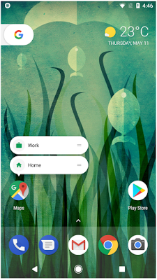
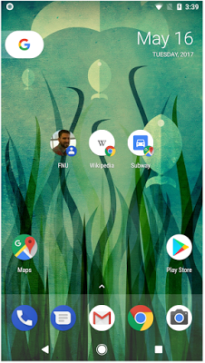
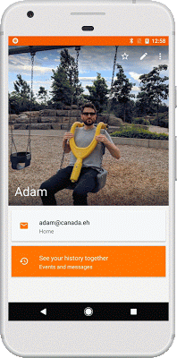
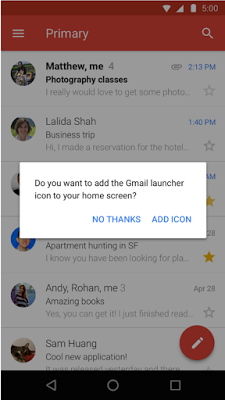

# Android O中的快捷方式和小部件的新功能

原标题：What’s new for shortcuts and widgets in Android O  
链接：[https://android-developers.googleblog.com/2017/07/whats-new-for-shortcuts-and-widgets-in.html](https://android-developers.googleblog.com/2017/07/whats-new-for-shortcuts-and-widgets-in.html)  
作者：Gloria Liou (项目副经理实习生)
翻译：[arjinmc](https://github.com/arjinmc)  

## 为什么要使用快捷键和小部件？

我们在Android O中最喜欢的功能之一是可以通过深度链接将你的应用程序的快捷方式和小部件固定在主屏幕上。

快捷方式可让用户快速启动特定任务，而小部件可让用户即时访问应用程序中的特定操作和信息。用户希望完成工作，快速完成工作 - 快捷方式和小部件是帮助他们并增加用户与内容的互动的方式。

要固定快捷方式或小部件，用户可以长时间按下应用程序的图标，将所选项目拖放到所选的位置。

  

动态/静态快捷方式

  
固定捷径

## 从你的应用程序中添加快捷方式和小部件
  

该API具有了新的流程可以从你的应用程序中添加快捷方式和小部件。新方法使用模态对话框，<strong>弃用</strong>使用广播的旧方法，这<strong>在O设备上不起作用</strong>。

这不是全部。我们改进了用户界面和体验。在以往的经验中，快捷方式上没有应用程序图标，因此用户不知道快捷方式是哪个应用程序。使用应用图标标记快捷方式可以提供更好的品牌，同时保护用户免受潜在的恶意软件攻击。

  
旧快捷式

  
新快捷式

还有一个新选项可以添加专门的Activity来帮助用户创建快捷方式。该activity完成了自定义选项和确认。

  

通过这些新的增加和改进，用户将更有可能使用你的快捷方式和小部件，从而影响产生更多用户更高兴地参与使用你的应用程序，更高效，更有意义。
要了解更多信息，请访问[Android开发者网站上的快捷方式和小部件页面](https://developer.android.com/preview/features/pinning-shortcuts-widgets.html)。
